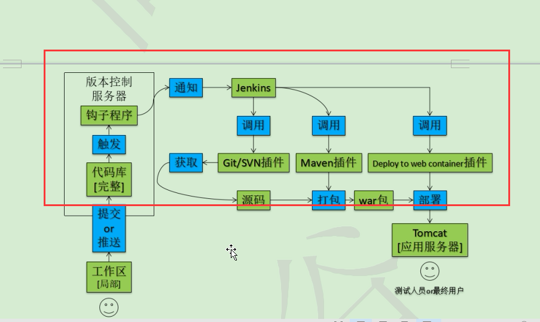
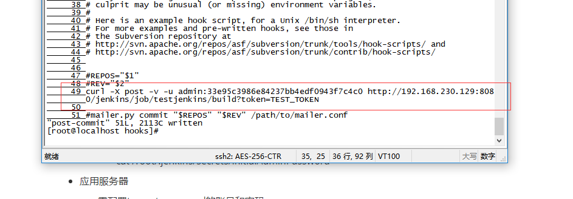
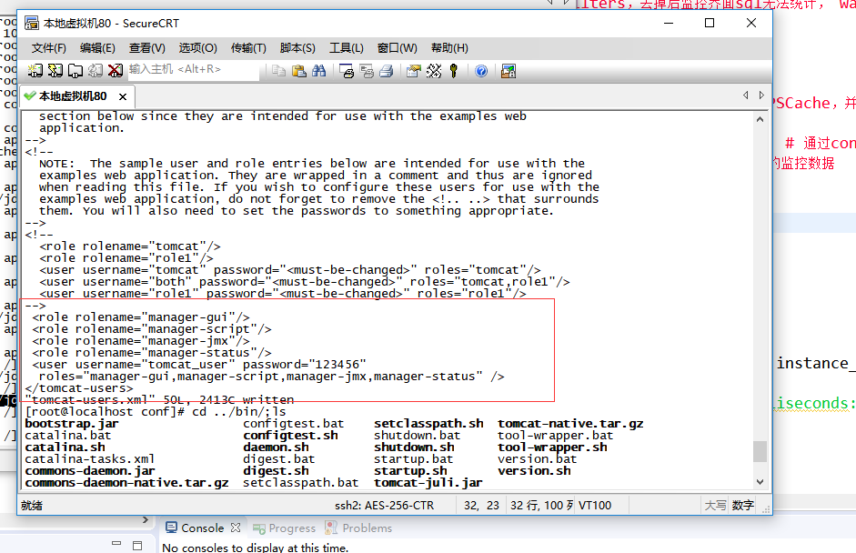
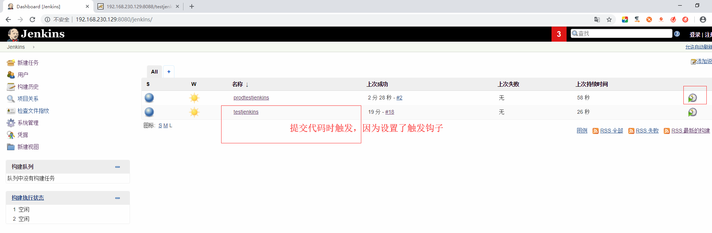
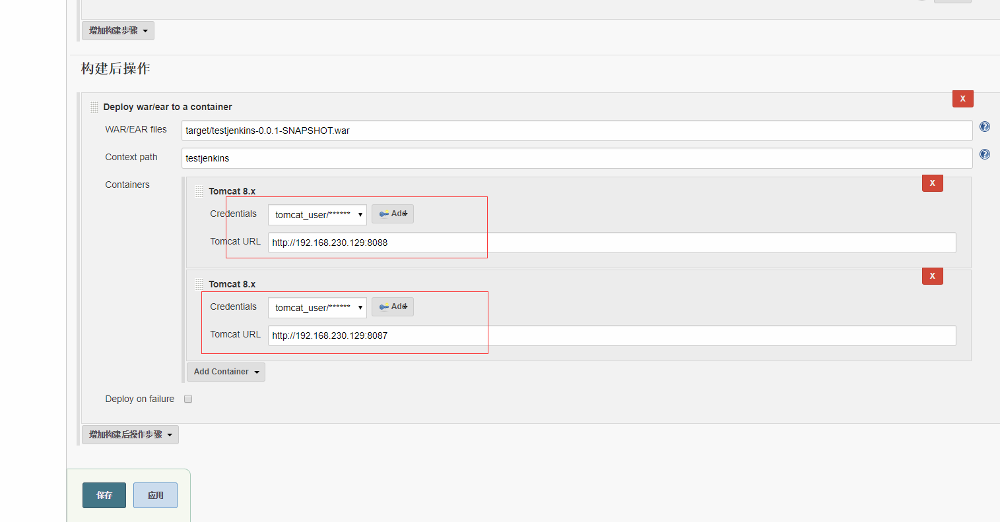
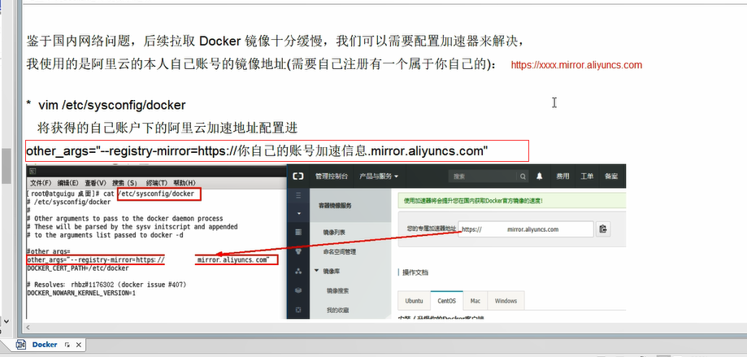
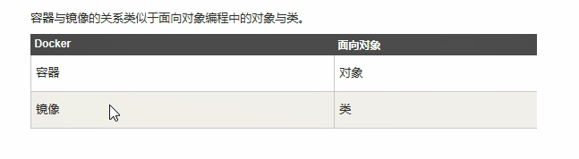
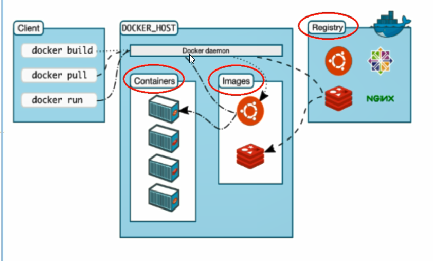

# Jenkins

- 持续部署
- 持续集成
- 持续交付

目标：

- 降低风险
  - 多次集成造成的缺陷
- 减少重复过程
  - 编译、测试、打包、部署等固定操作
- 任何时间、任何地点生成可部署的软件
- 增强项目的可见性


自动化部署：

“自动化”的具体实现：向版本库提交新的代码后，应用服务器上自动部署，用户或测试人员使用的马上就是最新的应用程序。



## Jenkins + SVN 

### 环境准备 

- svn服务器  

  - svn服务器

  - 项目对应版本库

  - 版本库中钩子程序

    

    

  - 特别注意：

    - 设置账号和密码

      subman = 123123

    - svnserve.conf文件中的anon-access一定要打开注释并设置为none

- Jenkins服务器

  - 把Jenkins.war放在tomcat解压目录/webapps目录下
  - 设置url地址的编码解码字符集
    - server.xml：URIEncoding="UTF-8"
  - 启动tomcat
    - 访问：/jenkins/login
  - 解锁
    - cat /root/.jenkins/secrets/initialAdminPassword

- 应用服务器

  - 需配置tomcat-users.xml的账号和密码

    username="",password="",rolename,roles

    

    ```xml
    <role rolename="manager-gui"/>
    <role rolename="manager-script"/>
    <role rolename="manager-jmx"/>
    <role rolename="manager-status"/>
    <user username="tomcat_user" password="123456"
    roles="manager-gui,manager-script,manager-jmx,manager-status" />
    ```

    ## 配置构建

    手动触发构建：http://192.168.230.129:8080/jenkins/job/testjenkins/build?token=TEST_TOKEN

    自动触发构建：

    curl -X post -v -u admin:33e95c3986e84237bb4edf0943f7c4c0 http://192.168.230.129:8080/jenkins/job/testjenkins/build?token=TEST_TOKEN

    chmod 755 post-commit

    

    

    

    

##  jenkins + Github 


# Docker

解决了运行环境和配置问题软件容器，方便做持续集成并有助于整体发布的容器虚拟化技术。

- 更快速的应用支付和部署
- 更便捷的升级和扩缩容
- 更简单的系统运维
- 更高效的计算资源利用

## docker安装

### 前提条件 

centos 6.5 或更高的版本，要求系统为64位、

系统内核版本为2.6.32-431或者更高版本

-> 20190617亲测：centos6.10不行，换成centos7就可以了

```java
#可通过底下命令查到系统的版本信息
uname -r
cat /ect/redhat-release
```

- ```shell
  yum install -y epel-release
  yum install -y docker-io
  安装后的配置文件：/etc/sysconfig/docker
  //vim  /lib/systemd/system/docker.service  
  启动docker后台服务：service docker start
  docker version验证
  //安装教程：https://help.aliyun.com/document_detail/60742.html?spm=a2c4g.11186623.6.548.5ebc5787F2Exja
  //https://cr.console.aliyun.com/cn-shanghai/instances/mirrors
  //docker info ：检查加速器是否生效
  ```

- vim /etc/sysconfig/docker

  - 970064184qq-->jun
  - 阿里云官方文档：https://help.aliyun.com/document_detail/60742.html?spm=a2c4g.11186623.6.548.709a1e66cXJgsY

  -  

实战：https://blog.csdn.net/tangtong1/article/details/53556129

## docker组成 

- 镜像（image）
  - docker镜像就是一个只读的模板。镜像可以用来创建docker容器，一个镜像可以创建很多容器。
  - 
- 容器（container）
  - docker利用容器（container）独立运行的一个或一组应用。容器是用镜像创建的运行实例
  - 容器的定义和镜像几乎一模一样，也是一堆层的统一视角，唯一区别在于容器的最上面那一层是可读可写的。
- 仓库（repository）
  - 仓库是集中存放镜像文件的场所
  - 仓库和仓库注册服务器是有区别的。
    - 仓库注册服务器上往往存放着多个仓库，每个仓库中又包含了多个镜像，每一个镜像有不同的标签
  - 仓库分为公开仓库和私有仓库两种形式
  - 最大的公开仓库是docker hub：https://hub.docker.com/




## docker 命令 

- docker version
- docker info
- docker --help
  - docker [options] command

### 镜像命令 

- docker images

  - 列出本地主机上的镜像
    - pepository：表示镜像的仓库源
    - tag：镜像的标签
      - 使用pepository:tag来定义不同的镜像
    - image ID：镜像ID
    - created：镜像创建时间
    - size：镜像大小
  - -a：列出本地所有的镜像（含中间映像层）
  - -q：只显示镜像ID
  - --digests：显示镜像的摘要信息
  - --no-trunc：显示完整的镜像信息

- docker search 镜像名

  - 在https://hub.docker.com网站上查找


  - docker search -s 30 tomcat：点赞数超过30的
  - --automated：只列出automated build类型的镜像

- docker pull 镜像名：下载镜像

  - 阿里云网站下下载

- docker rmi 镜像名ID：删除镜像

  - 删除单个
    - docker rmi -f 镜像名ID/唯一镜像名
  - 删除多个
    - docker rmi -f  镜像名1:TAG 镜像名2:TAG 
  - 删除全部
    - docker rmi -f $(docker images -qa)

### 容器命令 

- docker ps：查看已启动的容器
- docker ps -a：查看所有容器
- docker start 容器ID：启动一个已存在的容器
- docker attach 容器ID：进入容器
- docker stop 容器ID：停止容器
- docker rm 容器ID：删除容器，容器必须是停止状态的才可以删除，否则-f

- docker run --privileged=true -it centos:6 #--privileged是以获取系统权限的形式运行， -it是互动模式，跟本地的系统进行交互,调用的本地的终端
- 
- docker commit d83c4279f146 centos:6 #d83c4279f146是CONTAINER ID，centos:6是IMAGE，容器名
  - 保存在容器中做过的修改
- docker export 容器ID：导出容器

# 镜像 

- 从仓库获取镜像
- 管理本地主机上的镜像
- 镜像实现的基本原理

# 容器