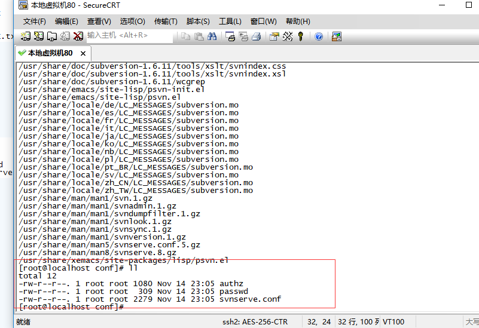
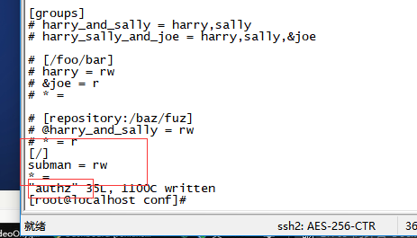
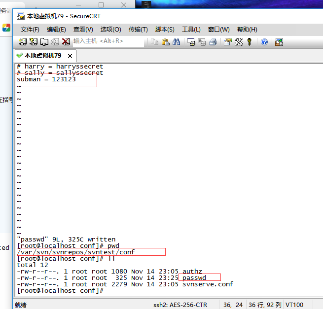

# svn 服务器搭建

- 检查是否已安装：rpm -qa subversion

- 安装svn服务器：yum -y install subversion

- 查看svn安装位置：rpm -ql subversion

- 进入到安装位置：cd /usr/bin/svn

- 列出相关命令：ls |grep svn

- 查看版本：svnserve --version

- 创建版本库目录：mkdir /var/svn/svnrepos

- 创建svn版本库：svnadmin create /var/svn/svnrepos/XXX(XXX为版本库名称)

- 查看此版本库相关文件信息：ll

- 配置修改

  

  - authz：负责账号权限的关联

    

    ​

  - passwd：负责账号和密码的用户名单关联

    

    ​

  - svnserve.conf：svn服务器配置文件

    ](images/QQ截图20181115153114.png)

- 防火墙开启

  - /sbin/iptables -I INPUT -p tcp --dport 3690 -j ACCEPT

  - /etc/init.d/iptables save

  - service iptables restart

    本地测试好像需关闭防火墙：

  - service iptables status

  - service iptables stop

- 启动svn服务器：svnserve -d -r /var/svn/svnrepos

- 客户端访问svn服务器：svn://ip地址:3690/版本库名称

