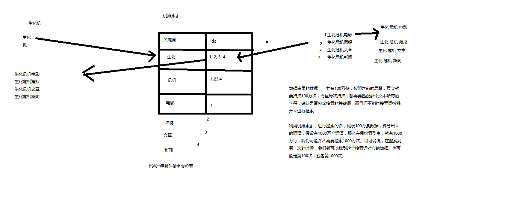
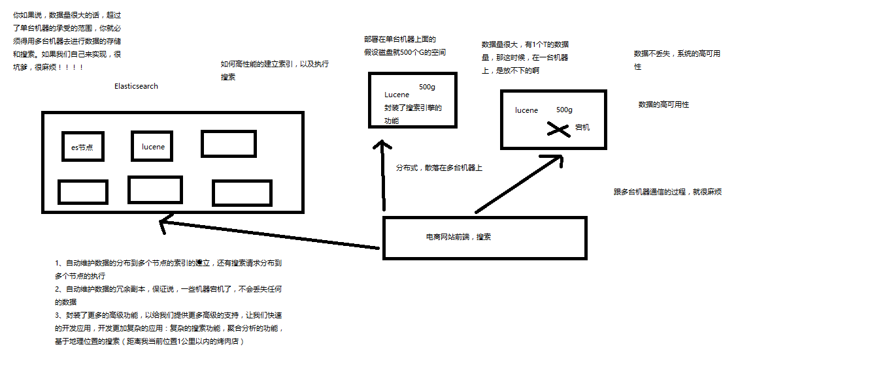

# 概念 

## 全文检索：倒排索引

- 

## lucene

- 就是一个jar包，里面包含了封装好的各种建立倒排索引，以及进行搜索的代码，包括各种算法。我们就用java开发的时候，引入Lucene jar，然后基于Lucene api进行开发就可。用Lucene，我们就可以去将已有的数据建立索引，Lucene会在本地磁盘上面，给我们组织索引的数据结构。另外的话，我们也可用Lucene提供的一些功能和api来针对磁盘上的索引数据，进行搜索

## elasticsearch

- 
- 功能
  - 分布式的搜索引擎和数据分析引擎
    - 数据分析：电商网站：分析最近7天某种商品销量排名前10的商家有哪些
  - 全文检索、结构化检索、数据分析
    - 结构化检索：搜索商品分类为某用品的商品有哪些
  - 对海量数据进行近实时的处理

- 适用场景

  - 电商、招聘、OA、数据分析、ERP等

- 特点

  - 传统数据库的补充
  - 分布式集群技术。处理PB级数据
  - 简单，开箱即用

- | elasticsearch | 数据库  |
  | ------------- | ---- |
  | document      | 行    |
  | type          | 表    |
  | index         | 数据库  |

  ​

