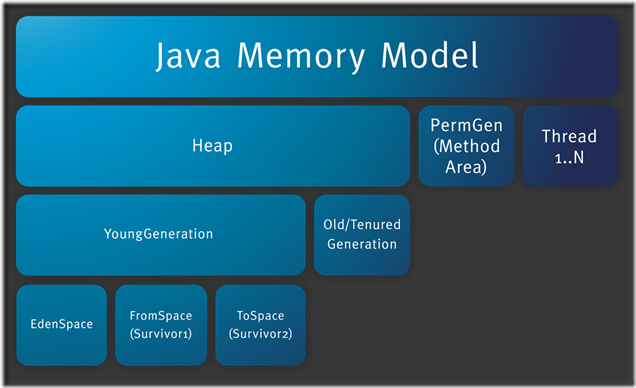

# jvm体系结构概述

## 类的加载 

- 类的加载指的是将类的.class文件中的二进制数据读入到内存中，将其放在运行时数据区的方法区内，然后在堆区创建一个**java.lang.Class**对象，用来封装类在方法区内的数据结构。类的加载的最终产品是位于堆区中的**Class** 对象，**Class** 对象封装了类在方法区内的数据结构，并且向java程序员提供了访问方法区内的数据结构的接口。

- 加载**.class** 文件的方式：

  - 从本地系统中直接加载

  - 通过网络下载.class文件

  - 从zip、jar等归档文件中加载.class文件

  - 从专有数据库中提取.class文件

  - 将java源文件动态编译为.class文件

  - > 类加载有三种方式：
    >
    > - 命令行启动应用时候由jvm初始化加载
    > - 通过Class.foName()方法动态加载
    > - 通过ClassLoader.loadClass()方法动态加载

- 类加载器

  - 启动类加载器（Bootstrap ClassLoader）
  - 扩展类加载器（ExtClassLoader）
  - 应用类加载器（Application ClassLoader）
  - 自定义加载器（User ClassLoader）

- 类加载机制
  - 全盘负责
    - 当一个类加载器负责加载某个Class时，该Class所依赖的和引用的其它Class也将由该类加载器负责载入，除非显示使用另一个类加载器来载入
  - 父类委托（双亲委派）
    - 先让父类加载器试图加载该类，只有在父类加载器无法加载该类时才尝试从自己的类路径中加载该类
  - 缓存机制
    - 将会保证所有加载过的Class都会被缓存，当程序中需要使用某个Class时，类加载器先从缓存区寻找该Class，只有缓存区不存在，系统才会读取该类对应的二进制数据，并将其转换成Class对象，存入缓存区。这就是为什么修改了Class后，必须重启jvm，程序的修改才会生效。
- 双亲委派模型
  
  - 

## 类的生命周期 

- 加载阶段
- 验证阶段

- 准备阶段：

  - **为类的静态变量分配内存，并将其初始化为默认值**

  - 是正式为类变量分配内存并设置类变量初始值的阶段，这些内存都将在方法区中分配。对于该阶段有以下几点需要注意：

    - 这时候进行内存分配的仅包括类变量（static），而不包括实例变量，实例变量会在对象实例化时随着对象一块分配在java堆中。

    - 这里所设置的初始值通常情况下是数据类型默认的值（如0，0L，null、false等），而不是被在java代码中被显式地赋予的值。

    - > 假设一个类变量的定义为：**public static final int value =3；** ，那么变量value在准备阶段过后的初始值为0，而不是3，因为这时候尚未开始执行任何java方法，而把value赋值为3的**public static** 指令是在程序编译后，存放于类构造器<clinit()>方法之中的，所以把value赋值为3的动作将在初始化阶段才会执行（可以理解为static final常量在编译期就将其结果放入了调用它的类的常量池中）

- 解析阶段：
  - **把类中的符号引用转换为直接引用**
  - 

- 初始化
  - **为类的静态变量赋予正确的初始值**
  - jvm负责对类进行初始化，主要对类变量进行初始化。在java中对类变量进行初始值设定有两种方式：
    - 声明类变量是指定初始值
    - 使用静态代码块为类变量指定初始值
  - 类初始化时机：只有当对类的主动使用的时候才会导致类的初始化，类的主动使用包括以下6种：
    - 创建类的实例，也就是new的方式
    - 访问某个类或接口的静态变量，或者对该静态变量赋值
    - 调用类的静态方法
    - 反射（如Class.forName("com.test.Test")）
    - 初始化某个类的子类，则其父类也会被初始化
    - java虚拟机启动时被注明为启动类的类（java Test，有main方法的类），直接使用java.exe命令来运行某个主类

- 结束阶段
  - 以下情况将结束生命周期
    - 执行了System.exit()方法
    - 程序正常执行结束
    - 程序在执行过程中遇到了异常或错误而异常终止
    - 由于操作系统出现错误而导致java虚拟机进程终止

## 一个类何时被实例化 

> 当初始化完成后，一个类的**静态变量**被正确赋值。如果这个对象是被new出来的，那么在初始化完成之后会进入实例化阶段。
>
> **初始化完成以后，类被存放在方法区，此时并没有存放在堆内存中。**
>
> **只有当对象实例化进入堆内存中以后才会对非静态变量进行初始化赋值** 

- 实例化的具体步骤为：

  - 父类非静态成员初始化语句（包括代码块，按照在类定义中的顺序执行）-->父类构造函数-->子类非静态成员初始化语句（包括代码块，按照在类定义中的顺序执行）-->子类构造方法()

    - > 如果这个类有父类不光是先实例化父类，整体流程如下：
      >
      > - 加载父类
      >   - 为静态属性分配存储空间并赋初始值
      >   - 执行静态初始化块和静态初始化语句（从上至下）
      > - 加载子类
      >   - 为静态属性分配存储空间
      >   - 执行静态初始化块和静态初始化语句（从上至下）
      > - 加载父类构造器
      >   - 为实例属性分配存储空间并赋初始值
      >   - 执行实例初始化块和实例初始化语句
      >   - 执行构造器内容
      > - 加载子类构造器
      >   - 为实例属性分配存储空间并赋初始值
      >   - 执行实例初始化块和实例初始化语句
      >   - 执行构造器内容

## JVM内存结构 



- jvm内存结构主要有三大块：堆内存、方法区、栈。

  - 堆内存：是jvm中最大的一块由年轻代和老年代组成

    - 年轻代：就是创建和使用完之后立马就要被回收的对象放在里面
      - 对象在被实例化之后，都是属于新生代。（例如，在一个方法中创建的对象会随着方法执行完毕，栈空间的栈帧出栈后而失去引用）
    - 老年代：就是把一些会长期存活的对象放在里面。（比如被static引用的对象，这种对象不会轻易的被垃圾回收器）

    - 为什么区分新生代和老年代？
      - 因为这个垃圾回收有关，对于年轻代的对象，他们的特点是很快就会被回收，所以需要使用一种垃圾回收算法。
      - 而对于老年代而言，里面的大部分对象可能都会长期存活，那么使用新生代的回收算法放在这里就可能并不是那么的合适，需要有着自己的一套回收算法。
    - 新生代对象是如何变成老年代对象的？
      - 长期存活的对象会多次躲过垃圾回收
        - 默认，当一个对象躲过10次Minor GC而没有被回收掉，就需要被转移到老年代去。
      - 特别大的超大对象直接不经过新生代就进入老年代
      - 动态年龄判断机制
        - 年轻代内存又被分成三部分，Eden空间、From Survivor空间、To Survivor空间，默认情况下年轻代按照8:1:1的比例来分配。
        - 生成的对象默认在Eden区域。当发生一次Minor GC后，会将存活的对象复制到其中一个Survivor区域。当下一次GC后又会将存活的对象复制到另一块survivor。那么做的好处是减少内存碎片。当发现其中的1岁，2岁，3岁的对象年龄加起来内存超过survivor区域的一半，就会把4岁及4岁以上的对象转移到老年代。
      - GC后survivor区域放不下
        - ？
      - 空间担保机制
        - 在发生minor gc之前，虚拟机会检测：老年代最大可用的连续空间>新生代all对象总空间
          - 满足，minor gc是安全的，可以进行minor gc
          - 不满足，虚拟机查看HandlerPromotionFailure参数：
            - 为true，允许担保失败，会继续检测老年代最大可用的连续空间>历次晋升到老年代对象的平均大小。若大于，将尝试进行一次minor gc，若失败，则重新进行一次full gc。
            - 为false，则不允许冒险，要进行full gc（对老年代进行gc）

  - 方法区：存储类信息、常量、静态变量等数据，是线程共享的区域，为与java堆区分，方法区还有一个别名：Non-Heap（非堆），jdk1.8后，这块区域叫做“Matespace”（元数据空间）。

    - JVM里的永久区其实就是方法区
      - 所谓的永久代，可认为是存放一些类的信息，例如，生成的.class就是存放在这个区的。一般情况下，我们对jvm调优都是对新生代和老年代进行调优。一般而言永久代保持沉默配置就可以了。但因为要存储类的相关信息，所以对于动态生成类的情况比较容易出现永久代的内存溢出。最典型的场景就是，thymeleaf模板比较多的情况，容易出现永久代内存溢出。

  - 栈：分为java虚拟机栈和本地方法栈，主要用于方法的执行

     https://www.cnblogs.com/zhxiansheng/p/11185840.html

    - java虚拟机栈：（java代码在执行的时候，一定是某个线程来执行某个方法中的代码）当线程执行到某个方法的时候，如果这个方法有局部变量，那么就需要一块区域来存放局部变量的数据信息。这个区域就叫做**java虚拟机栈**。

      - 每个线程都有一个自己的java虚拟机栈，比如说当执行main方法的时候就会有一个main线程，用来存放main方法中定义的局部变量

      - ```java
        public static void main(String[] args){
            People people = new People();
            int i = 9;
        }
        /**
        比如上面的main()方法中，其实就有一个“people”的局部变量，他是引用一个People的实例对象的，然后还有一个“i”的局部变量
        */
        ```

      - 

      - 栈的数据结构：后进先出

        - 为什么要用后进先出的数据结构？
          - 假设a方法当中同步调用b方法，此时a方法的栈帧先入栈，然后再是b方法的栈帧入栈。b方法执行完毕后，b方法的栈帧出栈，继续执行a方法，所以使用一个后进先出的栈结构是非常完美的。


- 控制参数：

  - -Xms设置堆的最小空间大小

  - -Xmx设置堆的最大空间大小

  - -XX:NewSize设置新生代最小空间大小

  - -XX:MaxNewSize设置新生代最大空间大小

  - -Xss设置每个线程的堆栈大小

  - > 没有直接设置老年代的参数，但是可以设置堆空间大小和新生代空间大小两个参数来间接控制：
    >
    > **老年代空间大小 = 堆空间大小-年轻代空间大小** 


# GC算法 

？？

https://blog.csdn.net/ityouknow/article/details/78037470

> - 编码细节：
>   - 使用StringBuilder或StringBuffer来代替String
>   - 尽量少输出日志
> - GC优化的两个目的：
>   - 将进入老年代的对象数量降到最低
>   - 减少Full GC的执行时间

> GC 过程：
>
> - 监控GC状态
> - 分析监控结果后决定是否需要优化GC
>   - 如果分析结果显示运行GC的时间只有0.1-0.3秒，那么就不需要把时间浪费在GC优化上，但如果运行GC的时间达到1-3秒，甚至大于10秒，那么GC优化就很有必要的。
>   - 此外，如果GC执行时间满足下列所有条件，就没有必要进行GC优化了：
>     - Minor GC执行非常迅速（50ms以内）
>     - Minor GC没有频繁执行（大约10s执行一次）
>     - Full GC执行非常迅速（1s以内）
>     - Full GC没有频繁执行（大约10min执行一次）
> - 设置GC类型/内存大小
> - 分析结果
>   - 应考虑的最重要的因素：
>     - 单次Full GC运行时间
>     - 单次Minor GC运行时间
>     - Full GC运行间隔
>     - Minor GC运行间隔
>     - 整个Full GC的时间
>     - 整个Minor GC的运行时间
>     - 整个GC的运行时间
>     - Full GC的执行次数
>     - Minor GC的执行次数
> - 如果结果满意，将参数应用到所有服务器上并结束GC优化

## 如何判断一个对象是否是垃圾 

> 例如：当一个对象被创建出来的时候，比如说在一个方法中创建一个对象，当该方法执行完毕后，就没有引用指向这个对象了，这个对象就会变成垃圾对象。（这仅仅是一种情况）

- jvm使用了一种可达性分析算法来判断哪些对象是可以被回收的。这个算法的核心就是看这个对象有谁在引用它，然后一层一层的往上判断，看是否被GC roots所引用。
  - 在java中，可作为GC roots的对象有：
    - 虚拟机栈（栈帧中的本地变量表）中引用的对象
    - 方法区中的类静态属性引用的对象
    - 方法区中常量引用的对象
    - 本地方法栈JNI（即一般说的Native方法）中引用的对象

# Hotspot内存管理 

# Hotspot垃圾回收器

# 调优

# 监控工具

