- 虚拟机的网络连接的三种方式 
  - 桥接模式
    - 好处：大家都是在同一个网段，相互可通讯
    - 缺点：因为ip地址有限，可能造成ip冲突
    - （虚拟机用的也是同网段ip，大家相互之间可通讯）
  - Nat模式（网络地址转换模式）
    - 好处：虚拟机不占用其他ip，不会ip冲突
    - 缺点：内网的其他人不能和虚拟机通讯
  - 仅主机模式（单独的一台电脑）

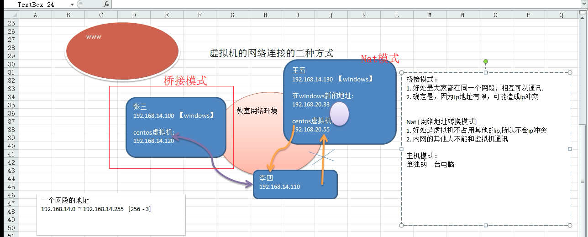

# linux目录结构

> linux一切皆文件

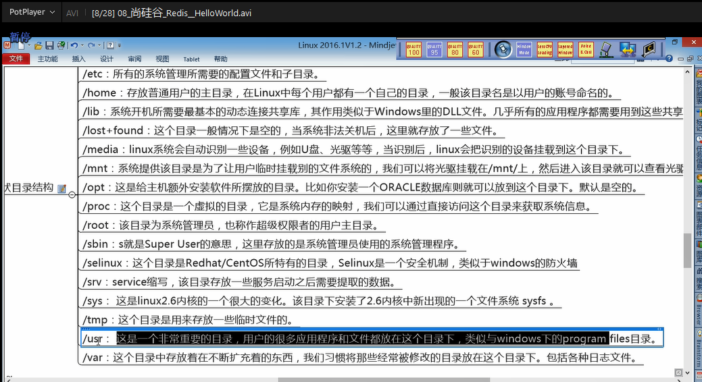

- /etc
  - 所有的系统管理所需要的配置文件和子目录 my.conf
- /usr
  - 用户的很多应用程序和文件都放在这个目录下，类似于Windows下的program files目录
- /media
  - linux系统会自动识别一些设备，例如U盘、光驱等等，当识别后，linux会把识别的设备挂载到这个目录下
- /mnt
  - 系统提供该目录是为了用户临时挂载别的文件系统的，可将外部的存储挂载在/mnt上，然后进入该目录就可以查看里的内容了
- /opt
  - 这是给主机额外安装软件所摆放的目录。如安装oracle数据库
- /usr/local
  - 这是另一个给主机额外安装软件所安装的目录，一般是通过编译源码方式安装的程序
- /var
  - 不断扩充的东西，包括各种日志文件

# 相关命令 

https://blog.csdn.net/zhangliao613/article/details/79021606

## 返回上一次所在目录

- cd -

## 系统 

- 关机与重启
  - **sync：把内存的数据同步到磁盘**
  - reboot：重启linux系统
  - halt：直接使用，效果等效于关机
  - shutdown
    - shutdown -h now：立即关机
    - shutdown -h 10：表示10分钟后关机
    - shutdown -r now ：立即重启

- 用户登录和注销
  - su 用户名：切换用户
  - exit：返回到原来的用户
  - logout：注销

- 用户管理
  - useradd [可选项] 用户名：添加用户
    - useradd -d 指定目录 新的用户名：给新创建的用户指定家目录 
    - useradd -g 用户组 用户名
  - passwd 用户名：为该用户设置或修改密码
  - userdel 用户名：删除用户
    - userdel -r 用户名：删除用户时，把用户的家目录都删除
  - id 用户名：查询用户信息
  - whoami / who am i ：查看当前用户
  - last：查看最近的登录历史记录
  - who：查看当前在线
  - groupadd  组名：增加组
- groupdel 组名：删除组
  - usermod -g 用户组 用户名：修改用户的组
  - init[0 1 2 3 4 5 6]：切换运行级别
- usermod -d 目录名 用户名 ：修改该用户登录的初始目录
  
- 系统磁盘分区

  - lsblk：查看当前系统的分区情况

    - lsblk -f

    - 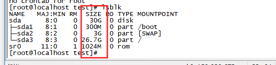

    - 挂载的经典案例

      > 需求是：给linux系统增加一个新的硬盘，并且挂载到/home/newdisk
      >
      > 步骤：
      >
      > - 虚拟机添加硬盘
      > - 分区：fdisk /dev/sdb
      > - 格式化：mkfs -t ext4 dev/sdb1
      > - 挂载：先创建一个/home/newdisk，然后挂载，mount /dev/sdbq /home/newdisk
      > - 设置可以自动挂载：（永久挂载，当你重启系统，仍然可以挂载到/home/newdisk）：vim /etc/fstab
      > - 查看磁盘挂载情况：cat /ect/fstab：下图是关联其它服务器挂载
      > - 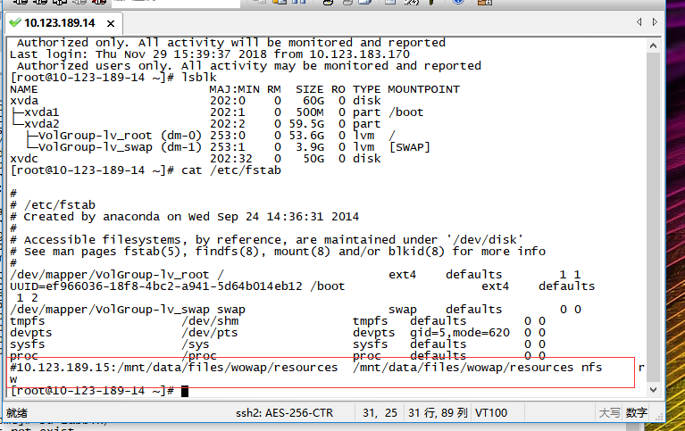:
      >
      > 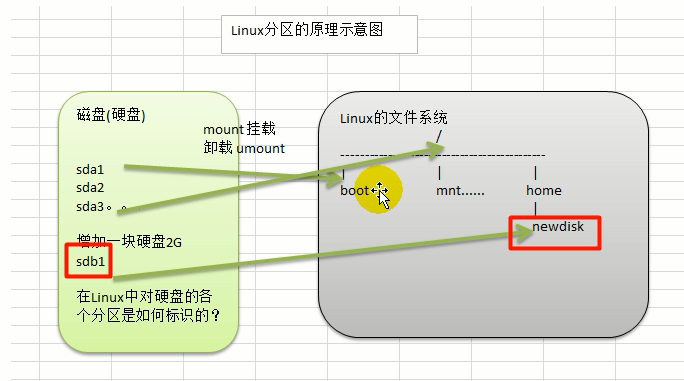
      >
      > 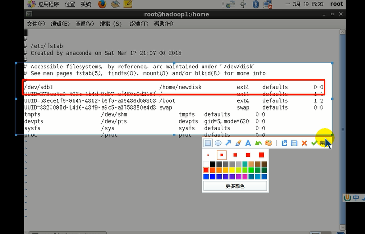
      >
      > 

    - 卸载

      - umount 设备名称 或 挂载目录：umount /newdisk

- uname：查看自己的内核

  - uname -r：（内核版本号、硬件架构、主机名称和操作系统类型等）

    2.6.32-573.el6.x86_64

  - cat /etc/redhat-release 
    CentOS release 6.7 (Final)

- 开放端口：

  - vim /etc/sysconfig/iptables
    - 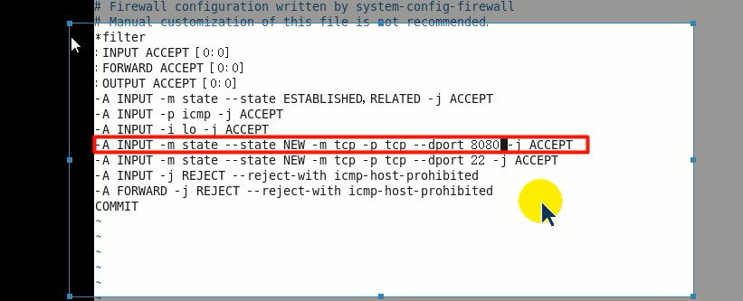
    - 重启防火墙：service iptables restart

- 查看CPU

  https://blog.csdn.net/zhangliao613/article/details/79021606

  - 查看CPU个数：cat /proc/cpuinfo|grep "physical id"|uniq|wc -l
  - 查看CPU核数：cat /proc/cpuinfo|grep "cpu cores"|uniq
  - 查看CPU型号：cat /proc/cpuinfo|grep "model name"|uniq

- 查看内存总数

  - cat /proc/meminfo |grep MemTotal
  
  - free -m :查看内存使用量和交换区使用量
  
  - free -h ：查看内存，显示单位为G
  
  - uptime：查看系统运行时间、用户数、负载
  
  - fdisk -l：查看所有分区
  
  - last：查看用户登录日志
  
  - dmidecode |grep -A16 "Memory Device$"：查看内存条数
  
  - 查看进程cpu和内存占用率排序
  
    - ps -aux | sort -k4,4n
  
      ps auxw --sort=rss（+rss 正序，-rss倒序）
  
      ps auxw --sort=%cpu
  
       - %cpu 进程的cpu占用率
         %mem 进程的内存占用率
         vsz 进程所使用的虚存的大小
         rss 进程使用的驻留集大小或者是实际内存的大小
       - https://www.linuxprobe.com/linux-sort-max-mc.html
       - ps -eo pid,lstart,etime,cmd | grep mongo：查看启动时间、运行时间
       - ps aux | sort -k4,4nr | head -n 10 ：查看内存占用前10名的程序
  
  - 

## vi/vim 

- 三种常见模式

  - 正常模式

    - 可使用快捷键
    - 相关快捷键
      - 复制当前行：yy、5yy（拷贝当前行向下的5行）、粘贴：p
      - 删除当前行：dd、5dd（删除当前行向下的5行）
      - 查找某个单词：命令行下：/关键字，回车查找，输入n就是查找下一个查找的结果（按N定位到上一个）
      - 设置文件的行号：命令行下：:set nu；取消文件的行号：:set nonu
      - 跳到文档的最末行：G；最首行：gg
      - 撤销输入动作：u
      - 跳转到指定行号：
        - 显示行号:set nu
        - 输入行数
        - 输入shift+g
      - a：在光标后一位开始插入
      - A：在改行的最后插入
      - I：在该行的最前面插入
      - v：进入字符选择模式，选择完成后，按y复制，按p粘贴
      - Ctrl+v：进入块选择模式，选择完成后，按y复制，按p粘贴
      - shift+v：进入行选择模式，选择完成后，按y复制，按p粘贴
      - 查找并替换：%s/sad/888888（效果：查找文件中所有sad，替换成888888)


  - 插入模式/编辑模式

    - 按i即可进入编辑模式

  - 命令行模式

    - 按 ：或者 / 可进入到命令行模式


    - 提供相关命令，完成读取、存盘、替换、离开vim、显示行号等的动作

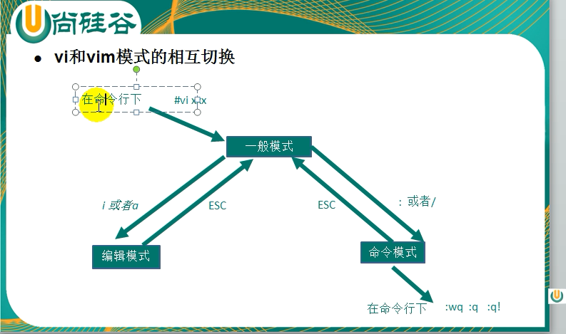


## 帮助指令

- man ：获得帮助信息
  - man [命令或配置文件]
    - man ls
- help：获得shell内置命令的帮助信息

## 文件目录类 

- pwd：显示当前工作目录的绝对路径

- ls：查看目录或文件

  - -a：显示当前目录所有的文件和目录，包括隐藏的

  - -l：以列表的方式显示信息

  - ls -lh：以M的形式显示文件大小

    - 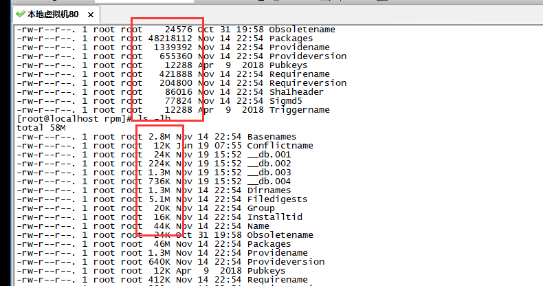

  - ls -ahl：查看文件的所有者

  - ls -l /home |grep "^-" |wc -l：查看系统某个文件夹下的文件个数

    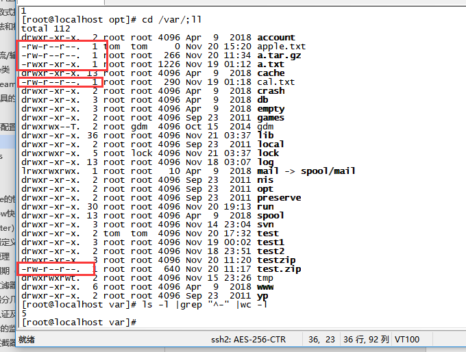

  - ls -lR /home |grep "^-" |wc -l：查看系统某个文件夹及子目录下的文件个数

    - ls -lR /home |grep "^d" |wc -l：查看系统某个文件夹及子目录下的目录个数
- 

- ll 

  - ll -rt ：按时间排序
    - -t：降序
    - -t|tac 升序
  - ll -Sh：按大小排序

- cd：切换目录

  - cd ~或者cd   ：回到自己的家目录
  - cd..：回到当前目录的上一级目录
  - 绝对路径：/home
  - 相对路径：../home

- mkdir ：创建目录

  - -p：创建多级目录：mkdir -p test/dog（同时创建了test目录和其  内的dog目录）

- rmdir：删除空目录

- rm  ：删除文件或目录

  - -r：递归删除整个文件夹
  - -f：强制删除不提示

- touch：创建空文件

  - 可一次性创建多个文件，touch test.txt test2.txt

- cp ：拷贝文件到指定目录

  - -r：递归复制整个文件夹
  - 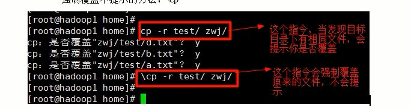

- mv：移动文件与目录或重命名

  - mv oldNameFile newNameFile：重命名
  - mv /movefile /targetFolder ：移动文件到指定目录

- cat：查看文件内容

  - -n：显示行号
  - |more：cat -n /etc/profile |more

- more：按页显示文本文件的内容

  - space：代表向下翻一页(b：向上翻一页)
  - Enter：代表向下翻一行
  - q：代表立刻离开more，不再显示该文件内容
  - Ctrl+F ：向下滚动一屏
  - Ctrl+B：返回上一屏
  - =：输出当前行的行号
  - :f：输出文件名和当前行的行号

- less：用来分屏查看文件内容

  - 空格键：向下翻一页
  - 上下键：向上向下翻动
  - q：离开less这个程序
  - /查找内容：向下查找
  - ?查找内容：向上查找

- ">"指令和>>指令：输出重定向和追加

  - 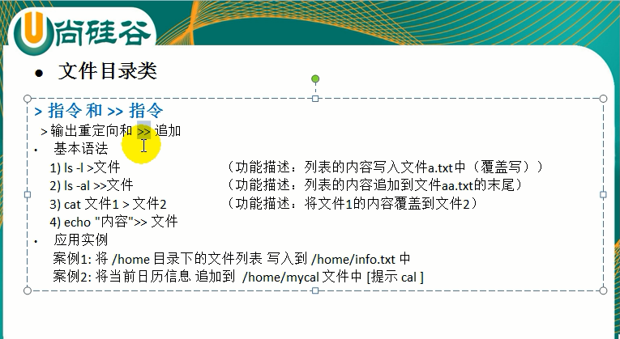
    - 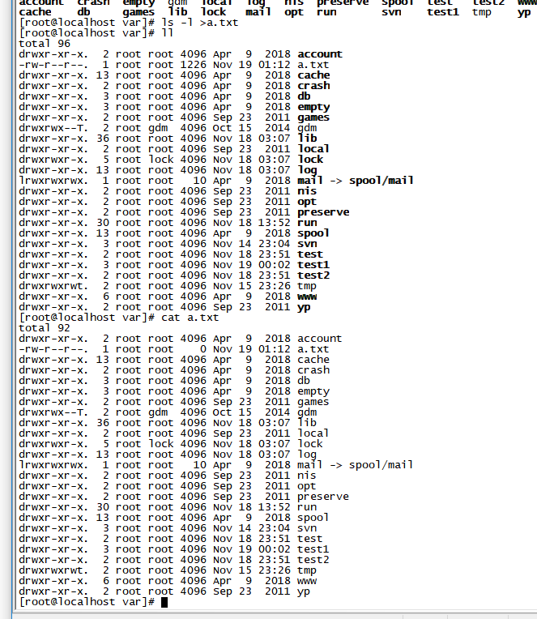


  - 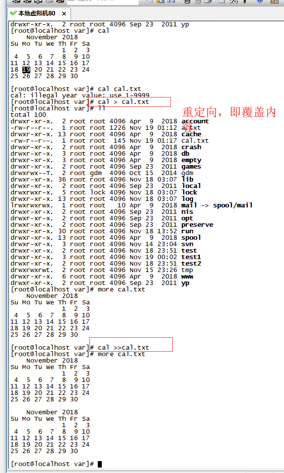

- echo：输出内容到控制台

  - 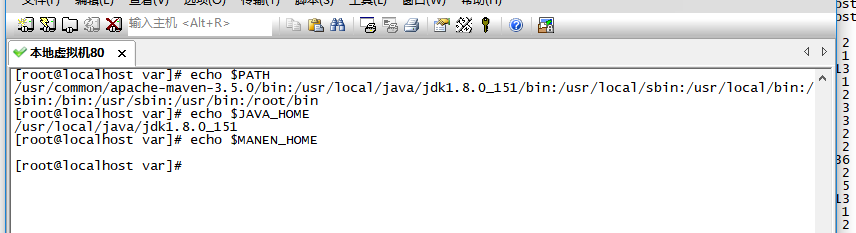 

- head：显示文件的开头部分内容，默认前10行

  - head 文件：查看文件头10行内容
  - head -n 5文件：查看文件头5行内。5可以是任意行数
  - 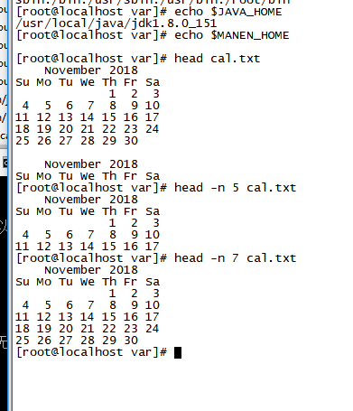

- tail ：输出文件中尾部的内容，默认后10行

  - tail 文件：查看文件后10行内容
  - tail -n  5 文件：查看文件后5行内容，5可以是任意行数
  - **tail -f 文件：实时追踪该文件的所有更新** 

- ln：软链接（符号链接），主要存放了链接其他文件的路径

  - ln -s  ：给原文件创建一个软链接，类似Windows里的快捷方式

- history：查看已执行过历史命令，也可以执行历史指令

  - history 10 ：查看后10个命令

  - !200：执行第200行的命令

    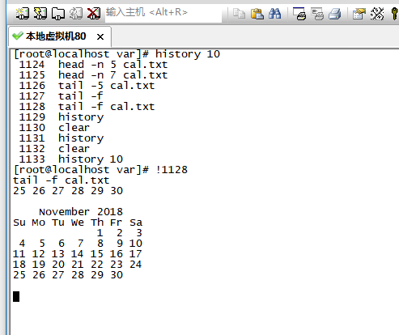

- tree：以树状显示目录结构

  - 
  - 

## 时间日期类 

- date：显示当前日期
  - 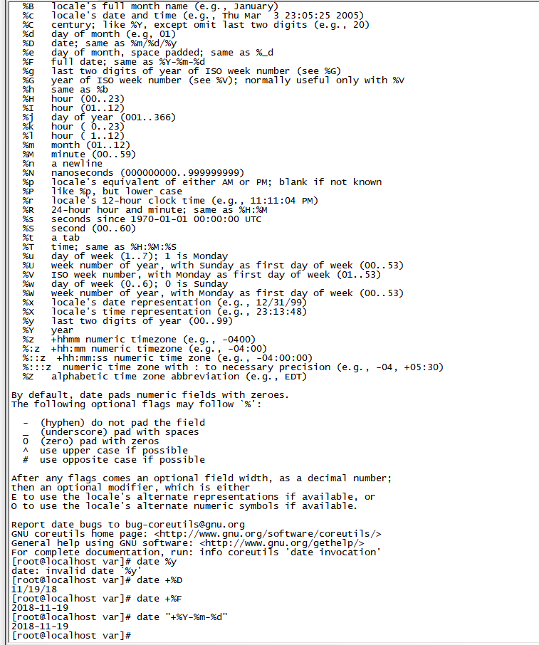
  - date -s：设置日期，字符串时间
    - 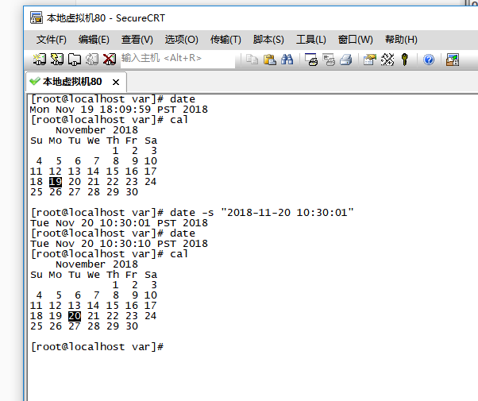
- cal：查看日历指令
  - cal 2020：显示2020年一整年日历

## 搜索查找类 

- find指令：将从指定目录向下递归地遍历其各个子目录，将满足条件的文件或者目录显示在终端

  - find [搜索范围]   +[选项]

    - -name：按名称

      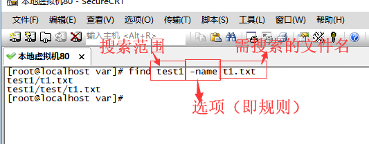

      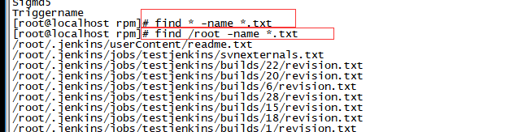

      

    - -user：按用户拥有者

    - -size：按文件大小

      - +n：大于、-n：小于 、n：等于

      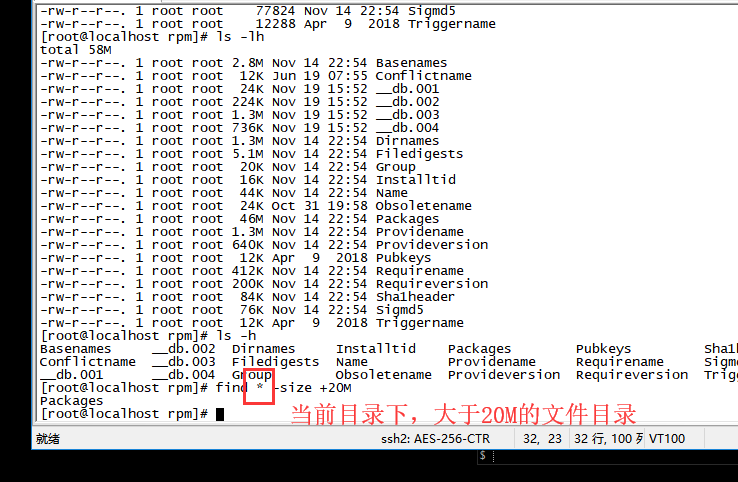

    - -mtime：修改时间

      - -mtime +2 ：2天前

- locate指令：快速定位文件路径

  - 特殊说明：由于locate指令基于数据库进行查询，所以第一次运行前，必须使用updatedb指令创建locate数据库
    - 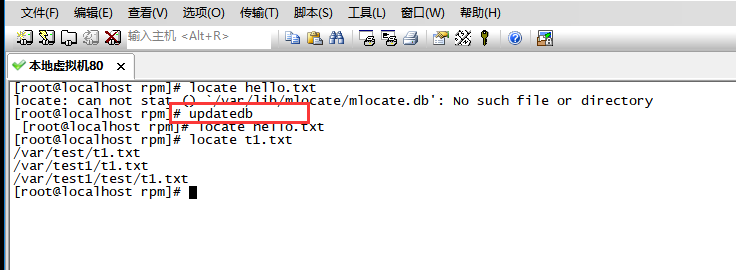

- grep：指令和管道符号|

  - 文件内过滤查找，管道符“|”，表示将前一个命令的处理结果输出传递给后面的命令处理
  - grep [选项]查找内容 源文件
    - -n：显示匹配行及行号
    
    - -i：忽略字母大小写
    
    - 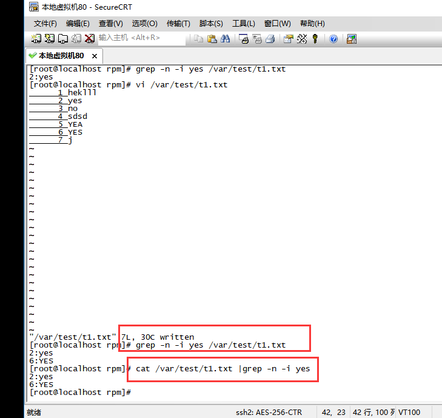
    
    - ```less
      #grep -A 5 'parttern' filename //打印匹配行的后5行
      #grep -B 5 'parttern' filename //打印匹配行的前5行
      #grep -C 5 'parttern' filename //打印匹配行的前后5行
      #grep -5 'parttern' filename //打印匹配行的前后5行 
      #tail -n 5 filename 查看文件最后5行内容
      #head -n 5 filename 查看文件前5行内容
      sed -n '5,10p' 查看文件5-10行内容 
      tac filename |grep -B 5 'parttern' filename //从后往前输出
      tac error.log |more
      ```
    
    - 


## 压缩和解压缩类 

- gzip/gunzip：

  - gzip：压缩
  - gunzip：解压缩
  - 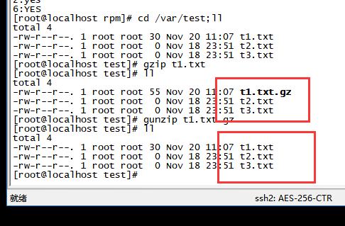

- zip/unzip

  - zip：压缩

    - -r：递归压缩，即 压缩目录

      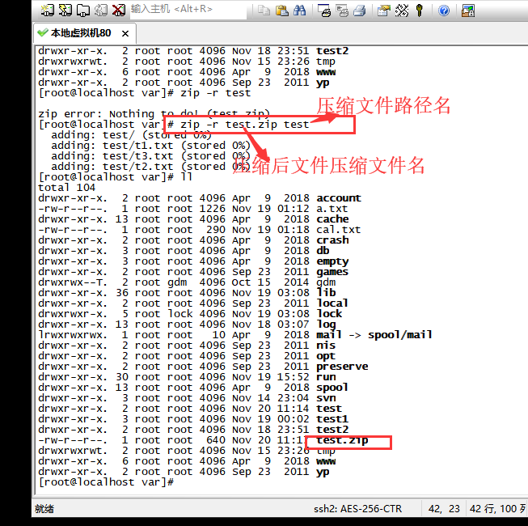

      

  - unzip：解压缩

    - -d：指定解压缩文件的存放目录
    - 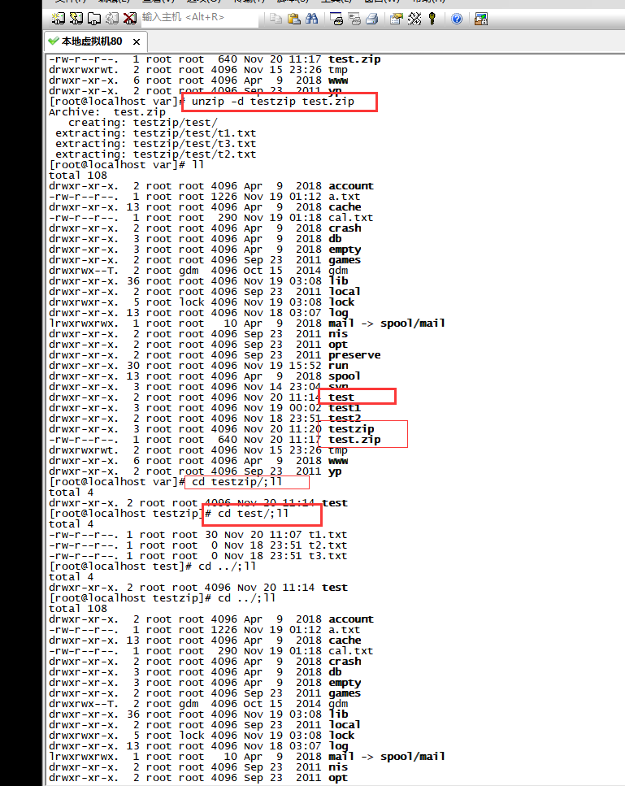
    - 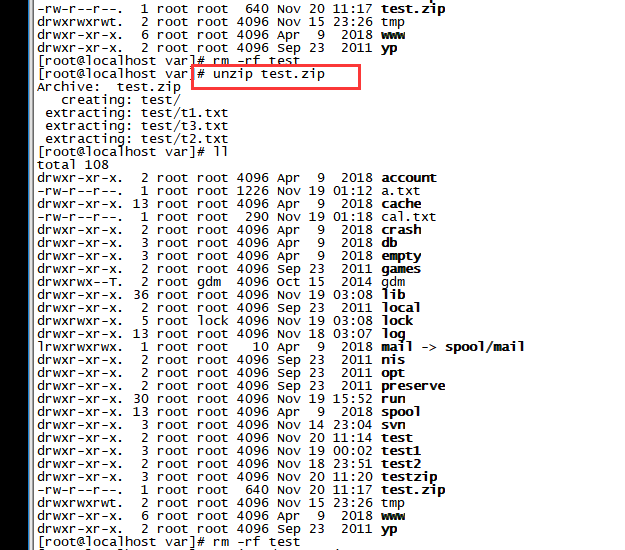 

- tar：打包指令，最后打包后的文件时.tar.gz的文件

  - -c：产生.tar打包文件

  - -v：显示详细信息

  - -f：指定压缩后的文件名

  - -z：打包同时压缩

  - -x：解压.tar

  - tar -zcvf：压缩

  - tar -zxvf：解压

    - tar -zxvf a.tar.gz -C /opt/：指定解压到的目录

  - 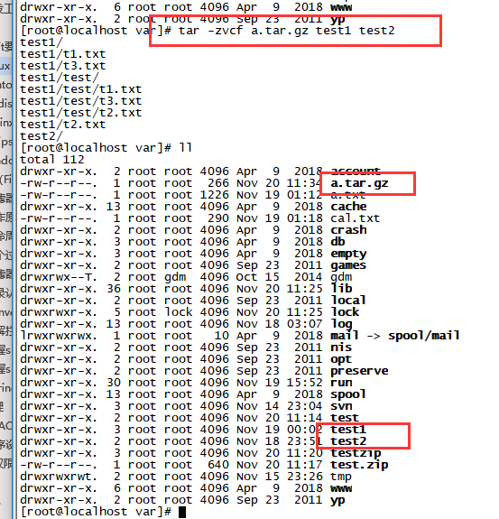

  - 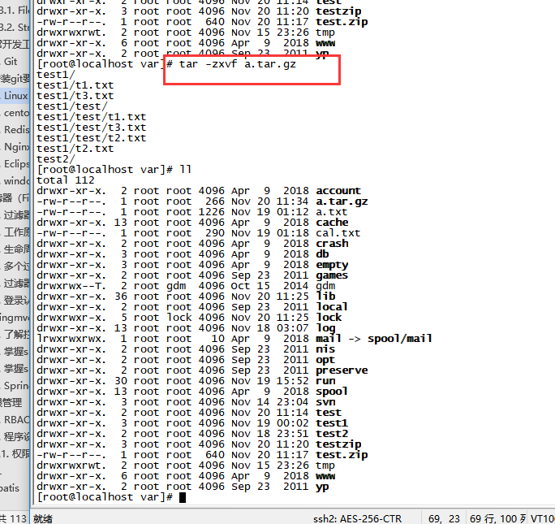

    

## 组管理和权限管理类 

- **chown：修改文件所有者**
  - **chown 用户名 文件名：修改文件所有者**
  - **chown 用户名:所在组 文件名：修改用户的所有者和所在组**
  - **-R：如果是目录，则使其下所有子文件或目录递归生效**
- **chgrp：修改文件所在组** 
  - **chgrp 组名 文件名：修改文件所在组**
  - **-R：如果是目录，则使其下所有子文件或目录递归生效**


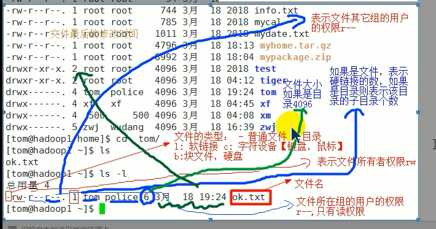

- **chmod ：修改文件或目录的权限**

  - **u：所有者；g：所有组；o：其他人；a：所有人（u、g、o的总和）**

  - **+、-、=变更权限**

  - **chmod u=rwx,g=rx,o=x 文件目录名**

  - **chmod o+w 文件目录名**

  - **chmod a-x 文件目录名** 

  - **r=4；w=2；x=1；通过数字变更权限，rwx=4+2+1=7**

  - **chmod u=rwx,g=rx,o=x 文件目录名 相当于**

    **chmod 751** 


## 定时任务调度类crontab 

- crontab ：定时任务的设置

  - crontab [选项]

    - -e：编辑crontab定时任务
    - -l：查询crontab任务
    - -r：删除当前用户所有的crontab任务，即终止任务调度
      - service crond restart：重启任务调度
    - 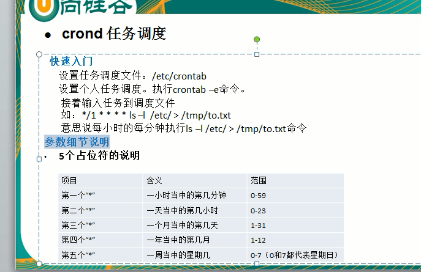
    - 
    - 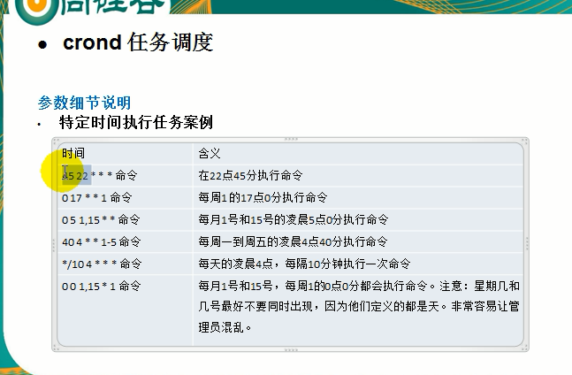

  - > - crontab -e
    > - */1 * * * * ls -l /etc >> /var/test/t.txt
    > - 保存退出后，在每一分钟都会自动的调用此命令
    >
    > 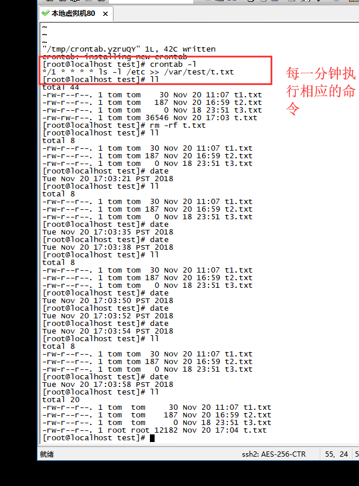
    >
    > 应用实例：
    >
    > 
    >
    > 

    > #!/bin/bash
    > curl http://10.123.104.135:8883/test/community/attendance/generatedRecord?appid=8Q8W0f\&secered=B8UL5f6AvW 
    > echo "$(date '+%Y-%m-%d %H:%M:%S')" >> /usr/local/community-crondtab/log/test.txt
    >
    > crontab -l 
    >
    > crontab -e
    >
    > 1 8 1 * *  /mnt/data/files/crontab/cron01.sh
    > 3 8 1 * *  /mnt/data/files/crontab/cron02.sh
    > 5 8 1 * *  /mnt/data/files/crontab/cron03.sh
    > 7 8 1 * *  /mnt/data/files/crontab/cron04.sh

## 磁盘查询情况 

- df  -h：查看当前系统磁盘使用情况
- du -h /目录：查询指定目录的磁盘使用情况，默认为当前目录
  - -s：指定目录占用大小汇总
  - -h：带计量单位
  - -a：含文件
  - --max-depth=1：子目录深度
  - -c：列出明细的同时，增加汇总量
  - 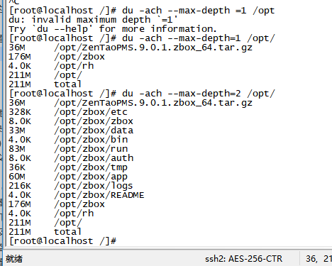
- iotop：IO读写情况（实时检测磁盘使用情况）（可能需安装yum install iotop）

## 查看网络IP和网关 

- ifconfig：
- ip addr：
- ping：测试主机之间网络连通性
- curl ifconfig.me：获取本机外网ip地址
- lsof
  - https://www.cnblogs.com/sparkbj/p/7161669.html

## 进程管理 

- ps：查看目前系统执行的进程

  - ps -aux |grep xxx：查看目前系统执行的进程
    - 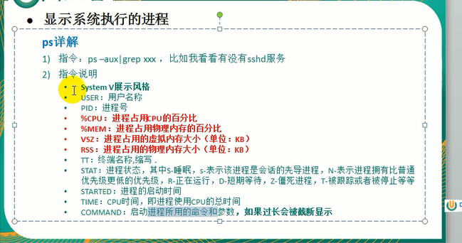 
  - ps -ef：以全格式显示当前所有的进程，查看进程的父进程
    - 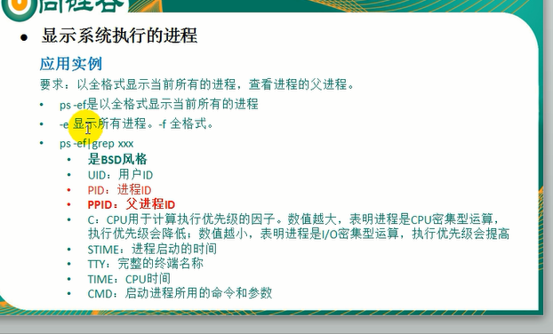 


  - -a：显示当前终端的所有进程信息
  - -u：以用户的格式显示进程信息
  - -x：显示后台进程运行的信息
  - 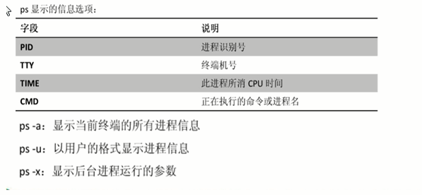

- kill：终止进程

  - kill 进程号：杀死进程


  - killall 进程名称：通过进程名称杀死进程

  - -9：强迫进程立即停止

  - > 案例1：踢掉非法登录用户
    >
    > - ps -aux |grep sshd
    > - kill -9 116536
    > - 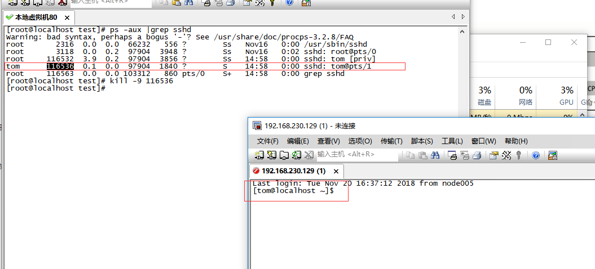
    >
    > 案例2：强制杀掉一个终端
    >
    > - ps -aux | grep bash
    > - 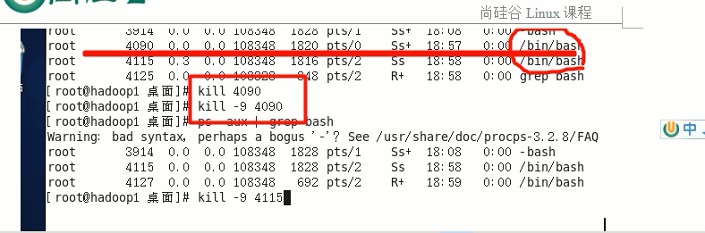 

  - 查看进程运行的完整路径方法

    
      - ll /proc/PID
    
  - pstree：查看进程树

    - -p：显示进程的PID
    - -u：显示进程的所属用户

### 服务管理 

- service 服务名 start | stop|restart|reload|status
- 在centOS 7.0 后不再使用service，而是systemctl 
- chkconfig：可以给每个服务的各个运行级别设置自启动/关闭
  - chkconfig --list|grep xxx：查看服务
  - chkconfig 服务名 --list：查看对应服务名的自启动/关闭
  - chkconfig --level 5 服务名 on/off：修改服务的运行级别对应的自启动/关闭
    - chkconfig重新设置服务后自启动或关闭，需要重启机器reboot才能生效
  - chkconfig iptables off /on：在所有运行级别下，关闭/开启防火墙
  - 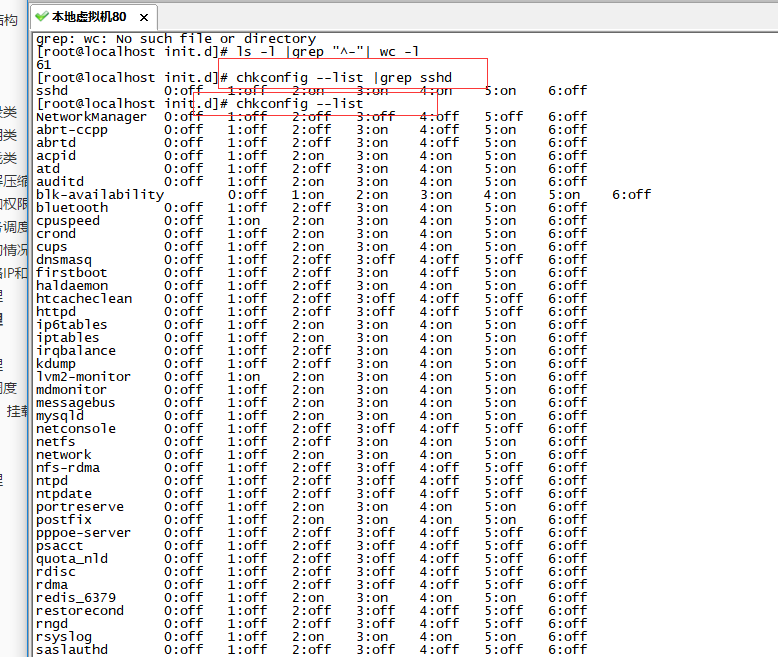
  - 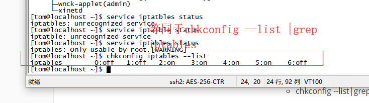  

### 进程监控 

- top [选项]：动态监控进程

  - -d 秒数：指定top命令每隔几秒更新，默认是3秒在top命令的交互模式当中可以执行的命令

  - -i：使top不显示任何闲置或者僵死进程

  - -p：通过指定监控进程ID来仅仅监控某个进程的状态

  - 交互操作的使用：

    - top
    - P /M /N/q
    - 
    - 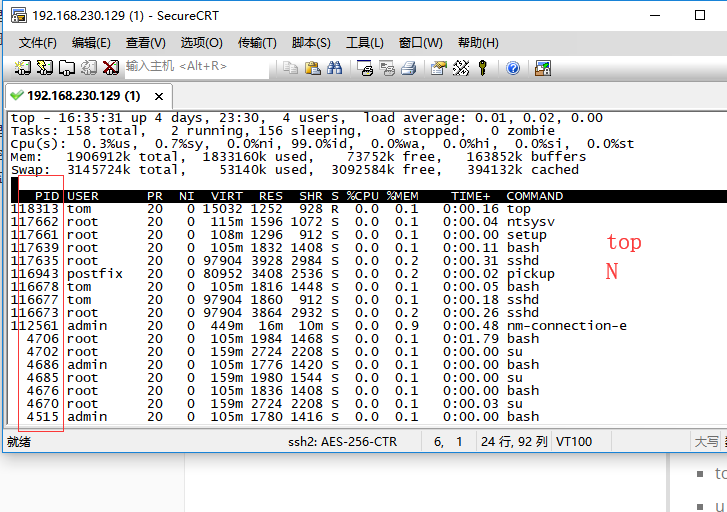 

  - 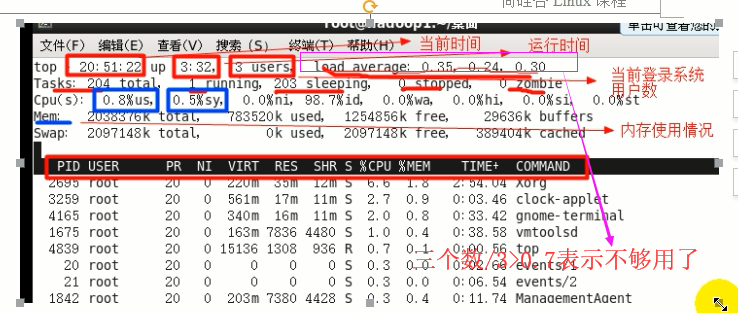

  - >  案例1：监视特定用户
    >
    >  - top ->回车键
    >  - u：输入“u”回车，再输入用户名，即可
    >
    >  案例2：终止指定的进程
    >
    >  - top
    >  - k：输入“k”回车，再输入要结束的进程ID号
    >
    >  案例3：指定系统状态更新的时间（每隔10秒自动更新，默认为3秒）
    >
    >  - top -d 10

- netstat：监控网络状态

  - netstat -anp：查看所有的网络服务
  - netstat -anp |grep sshd：查看了sshd服务的网络服务情况
  - netstat -tunlp：查看端口占用情况
  - netstat -lntp：查看所有监听端口
  - netstat -antp：查看所有已经建立的连接


  - -an：按一定顺序排序输出
  - -p：显示哪个进程在调用
  - 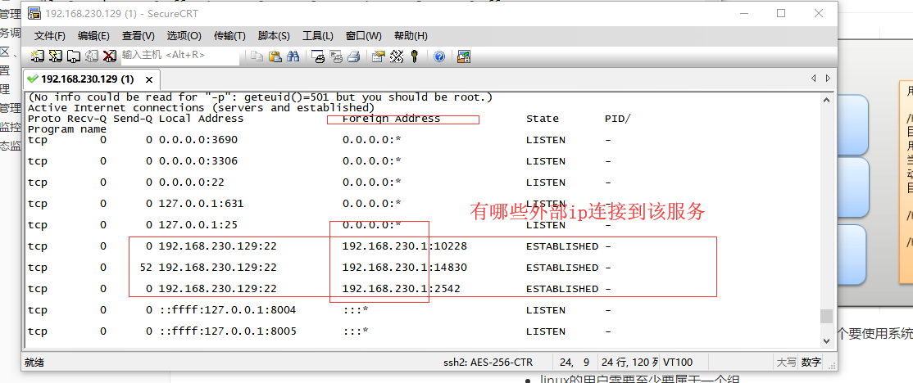
  -   

## rpm与yum

- rpm
  - rpm -qa |grep xxx：查询已安装的rpm列表
  - rpm -q 软件包名：查询软件包是否安装
  - rpm -qi 软件包名：查询软件包信息
  - rpm -ql 软件包名：查询软件包中的文件
  - rpm -qf 文件全路径名：查询文件所属的软件包
  - rpm -e RPM包的名称：卸载rpm包
  - rpm -e --nodeps 软件包名：强制删除软件包
  - rpm -ivh 软件包.rpm包：安装
    - i = install ：安装
    - v=verbose：提示
    - h =hash：进度条
- yum
  - yum list|grep xx软件列表：查询yum服务器是否有需要安装的软件
  - yum install xxx：下载安装指定的yum包
- 


# 用户管理 

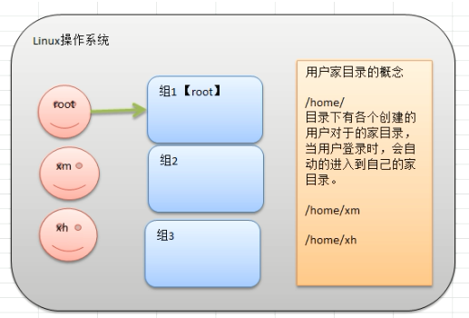

- linux 系统是一个多用户多任务的操作系统，任何一个要使用系统资源的用户，都必须首先向系统管理员申请一个账号，然后以这个账号的身份进入系统


- linux的用户需要至少要属于一个组

- 用户组

  - 类似于角色，系统可以对有共性的多个用户进行统一的管理

- 用户和组的相关文件
  - /etc/passwd文件
  - /etc/shadow文件
  - /etc/group文件

- LINUX系统运行级别

  /etc/inittab

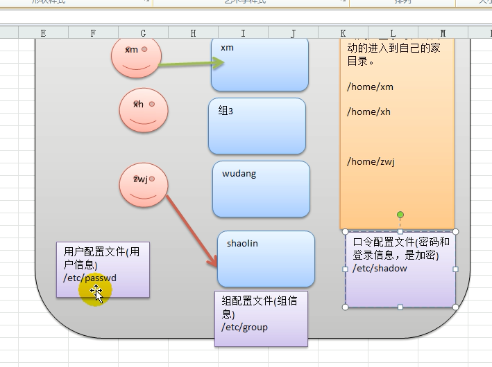

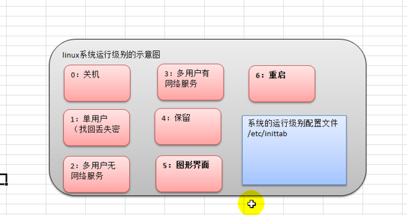

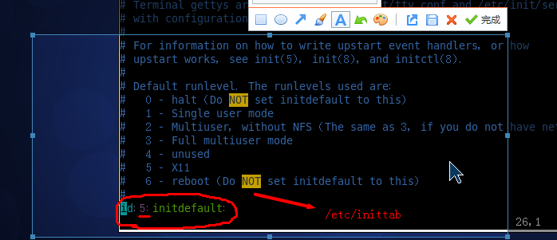

- 如何找回root密码：

  - 进入到单用户模式，然后修改root密码。因为进入单用户模式，root不需要密码就可以登录

    - 开机->在引导页时输入：回车键->看到一个界面时输入：e->看到一个新的界面，选中第二行（kernal编辑内核）再输入e->在这行最后输入 ：1，再输入：回车键->再次输入：b，就会进入到单用户模式，这时，就可使用passwd指令来修改root密码

      （远程是不能修改密码的，所以不存在任何人都可修改密码的现象）

- linux的用户需要至少要属于一个组
- 用户组

  - 类似于角色，系统可以对有共性的多个用户进行统一的管理
- 用户和组的相关文件
  - /etc/passwd文件
    - cat /etc/passwd|grep -v nologin|grep -v halt|grep -v shutdown|awk -F":" '{ print $1"|"$3"|"$4 }'|more：查看用户列表
  - /etc/shadow文件
  - /etc/group文件


> 在linux中的每个用户必须都属于一个组，不能独立于组外 
>
> 在linux中每个文件有所有者、所在组、其它组的概念
>
> 其它组：除文件的所有者和所在组的用户外，系统的其它用户都是文件的其它组

## 权限管理 

 

d：标识节点类型（d：文件夹	-：文件	l：链接）

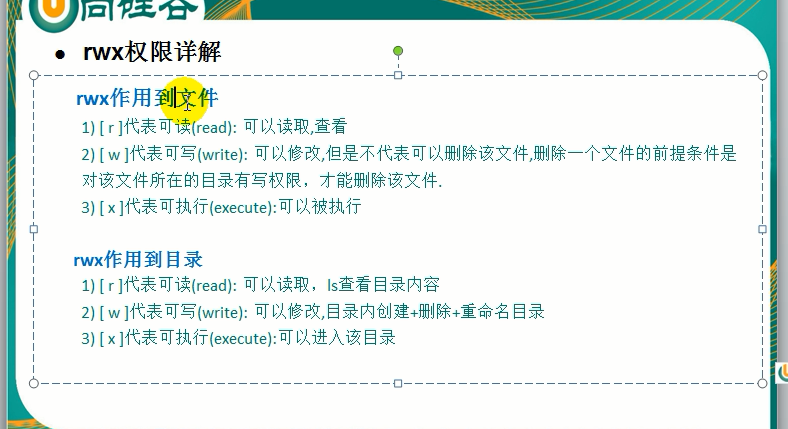


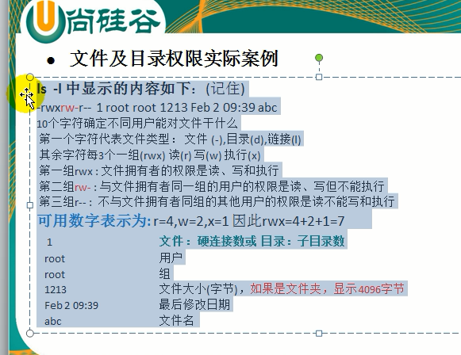

# 定时任务调度crontab 

- 任务调度：是指系统在某个时间执行的特定的命令或程序
- 任务调度分类：
  - 系统工作：有些重要的工作必须周而复始地执行。如病毒扫描等
  - 个别用户工作：个别用户可能希望执行某些程序，比如对mysql数据库的备份

 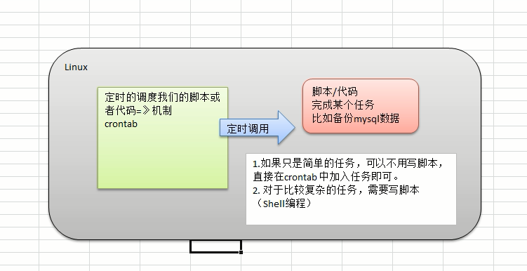

# 磁盘分区 、挂载

- 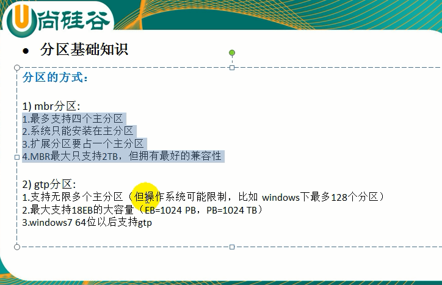
- 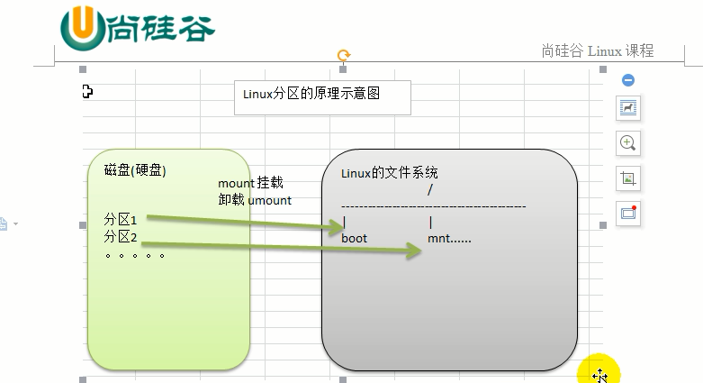
- 
- 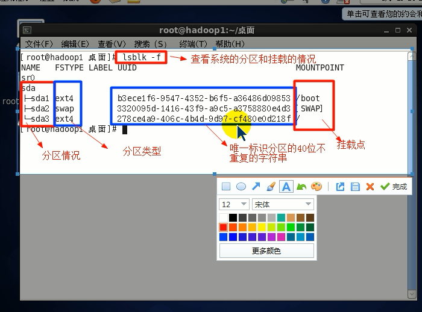
- 

# 网络配置 

- 虚拟机的网络连接的三种方式 
  - 桥接模式
    - 好处：大家都是在同一个网段，相互可通讯
    - 缺点：因为ip地址有限，可能造成ip冲突
    - （虚拟机用的也是同网段ip，大家相互之间可通讯）
  - Nat模式（网络地址转换模式）
    - 好处：虚拟机不占用其他ip，不会ip冲突
    - 缺点：内网的其他人不能和虚拟机通讯
  - 仅主机模式（单独的一台电脑）
  -  


Nat网络地址转换模式：

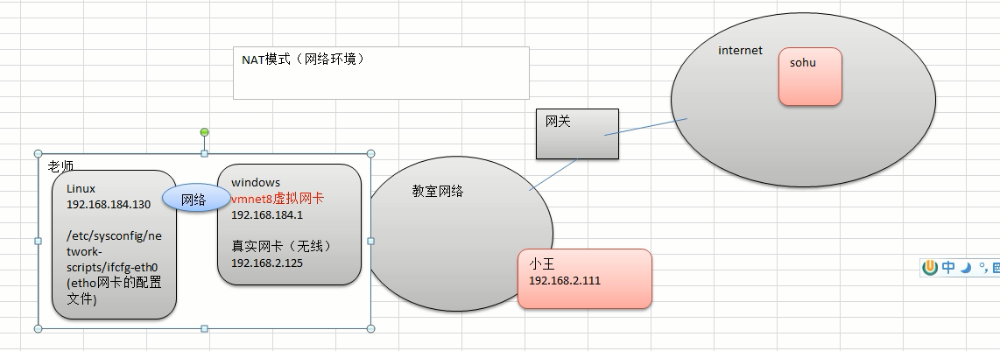 

- 查看虚拟网络编辑器

  - 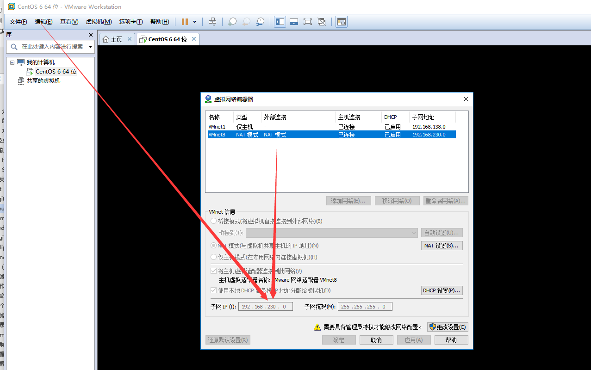
  - 

- 可修改及查看网关

  - 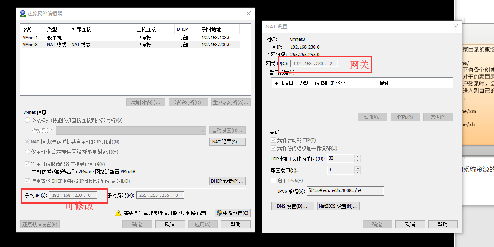

- 查看Windows环境中的VMnet8网络配置（ipconfig）

- 网络环境配置

  - 第一种方法（自动获取）

    - 登录后，通过界面的来设置自动获取ip（linux启动后会自动获取ip，缺点每次自动获取的ip地址可能不一样）
    - 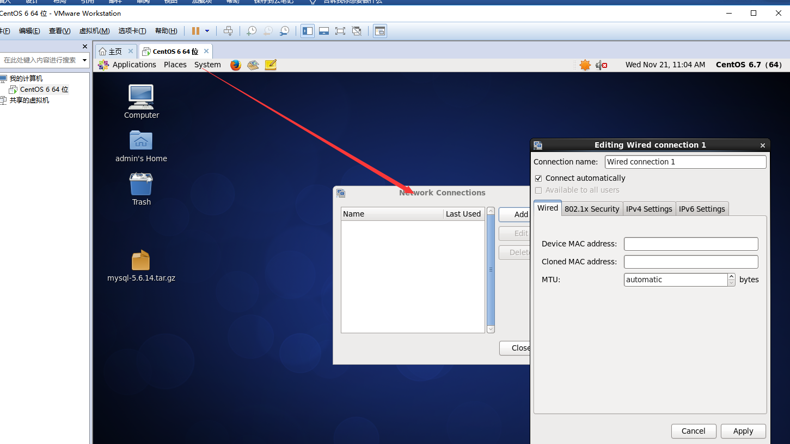

  - 第二种方法（指定固定的ip）

    - 直接修改配置文件来指定ip，并可以连接到外网（推荐），编辑 vi /etc/sysconfig/network-scripts/ifcfg-etho

    - 修改前：

    - 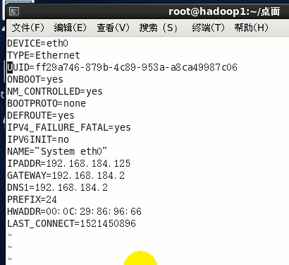

    - 修改后，要重启服务service network restart

      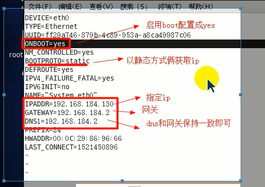

      

- 查看系统网络个数的方法

  - https://blog.csdn.net/wheat_ground/article/details/78561332

- 修改主机名

  - 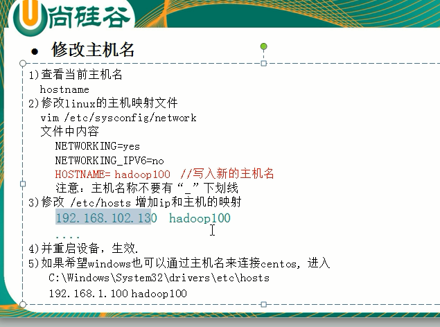


# 进程管理 

- 远程登录的连接，需检查sshd服务是否启动，22号端口是否开启

  - 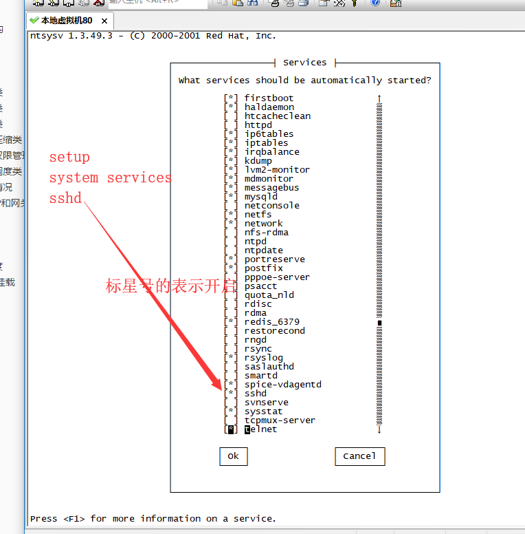

  

## 服务管理 

- 服务（service）本质就是进程，但是是运行在后台的，通常都会监听某个端口，等待其它程序的请求，比如（mysql、sshd、防火墙等），因此称为守护进程

- service 服务名 start | stop|restart|reload|status

- 在centOS 7.0 后不再使用service，而是systemctl 

- 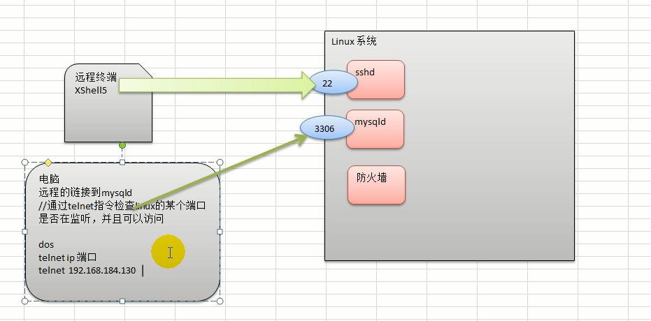

  - 关闭或启用防火墙后，立即生效。：telnet ip 端口
  - 这种方式（service 服务名 start | stop|restart|reload|status）只是临时生效，当重启系统后，还是回归以前对服务的设置
  - 如果希望设置某个服务自启动或关闭永久生效，要使用chkconfig指令

- 查看服务名：

  - 使用setup->system services
  - /ect/init.d/


  - 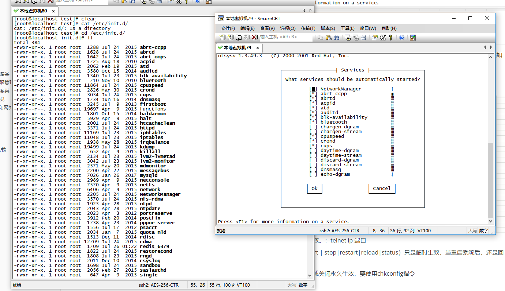
    -  centos7：查看服务名
      - systemctl list-unit-files
      - systemctl --type service
      - /usr/lib/systemd/system
      - systemctl enable service_name
      - systemctl disable service_name
- 服务运行级别

  - vi /etc/inittab：查看或者修改默认级别

## 进程监控 

### 动态监控进程 

- top与ps命令很相似。它们都用来显示正在执行的进程。top与ps最大的不同之处，在于top在执行一段时间可以更新正在运行的进程

# rpm 与yum 

- rpm，一种用于互联网下载包的打包及安装工具，它包含在某些linux分发版中。
- yum ,一个shell前端软件包管理器。基于rpm包管理，能够从指定的服务器自动下载rpm包并安装，可以自动处理依赖性关系，并且一次安装所有依赖的软件包

# J2EE

- 安装jdk
  - 
    - 保存/etc/profile后，需要注销用户，环境变量才能生效
      - 运行级别是3：logout


# shell  

> shell是一个命令行解释器，它为用户提供了一个向linux内核发送请求以便运行程序的界面系统级程序，用户可以用shell来启动、挂起、停止甚至是编写一些程序

- 脚本格式要求
  - 脚本以#!/bin/bash开头
  - 脚本需要有可执行权限

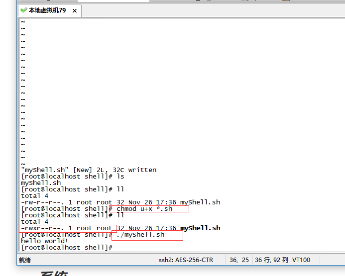

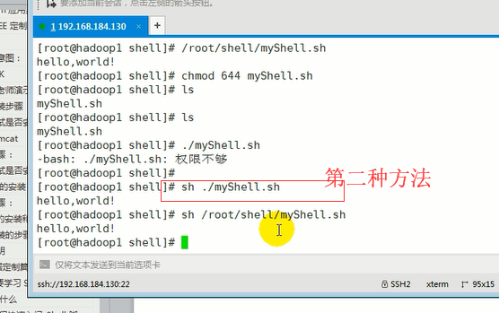

- 单行注释与多行注释
  - 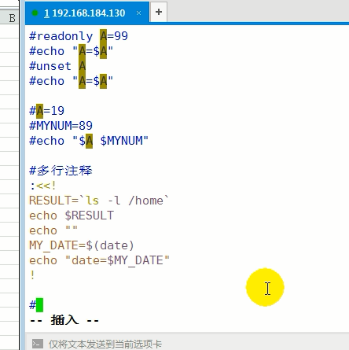 

## shell变量

- 系统变量

  - $HOME
  - $PWD
  - $SHELL
  - $USER
  - 显示当前shell中所有变量：set

- 用户自定义变量

  - 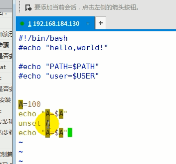 

    （结果是：A=100  A=）

    unset：销毁

  - 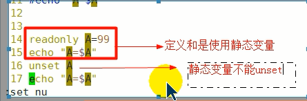 

  - 定义变量的规则

    - 变量名称可以由字母、数字和下划线组成，但是不能以数字开头
    - 等号两侧不能有空格
    - 变量名称一般习惯为大写

  - 将命令的返回值赋给变量（重点）

    - A=`ls -la’：反引号，运行里面的命令，并把结果返回给变量A
    - A=$(ls - la)：等价于反引号
    - 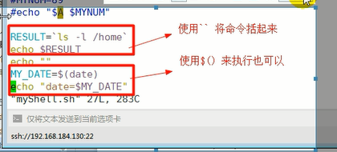 

### 设置环境变量

- export 变量名=变量值：（功能描述：将shell变量输出为环境变量）
- source配置文件：（功能描述：让修改后的配置信息立即生效）
- echo $变量名：（功能描述：查询环境变量的值）

### 位置参数变量 

> 当执行严格shell脚本时，如果希望获取到命令行的参数信息，就可以使用位置参数变量，比如：./myshell.sh 100 200 ，这个就是一个执行shell的命令行，可以在myshell脚本中获取到参数信息

$n（功能描述： n 为数字，代表命令本身，代表第一到第9个参数($1-$9)，10以上的参数需要用大括号包含：${10}）

​	- $0代表该脚本名称

$*（功能描述：这个变量代表命令行中所有的参数，把所有的参数看成一个整体）

$@（功能描述：这个变量也代表命令行中所有的参数，不过把每个参数区分对待）

$#（功能描述：这个变量代表命令行中所有参数的个数）

### 预定义变量 

> 就是shell设计者事先已经定义好的变量，可以直接在shell脚本中使用

$$ ：（功能描述：当前进程的进程号）

$!：（功能描述：后台运行的最后一个进程的进程号PID）

$?：（功能描述：最后一次执行的命令的返回状态，如果这个变量的值为0，证明上一个命令正确执行，如果这个变量的值为非0（具体是哪个数，由命令自己来决定），则证明上一个命令执行不正确了）


###  运算符 

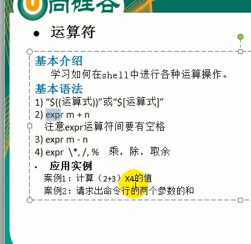

```shell
expr 'expr 2 + 3' \
```


 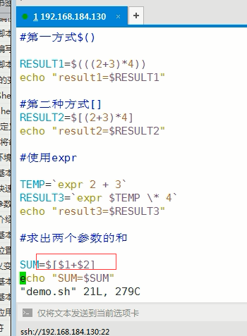


 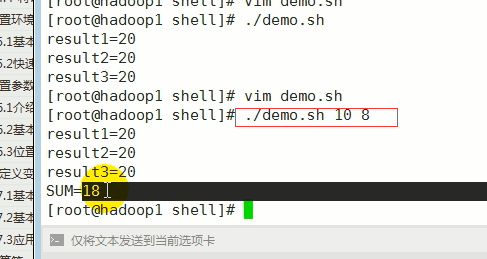

### 条件判断 

[ condition ] （注意condition前后要有空格）

非空返回true，可使用$?验证（0为true，>1为false） 

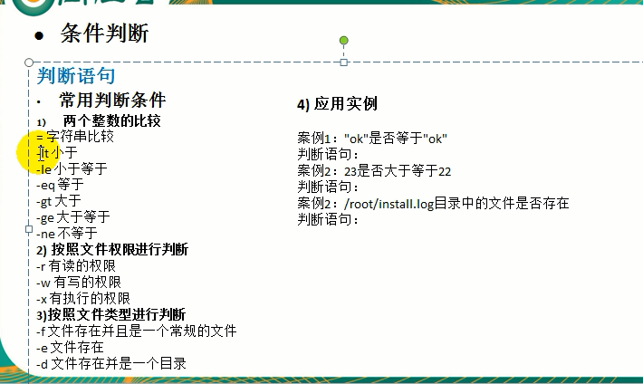

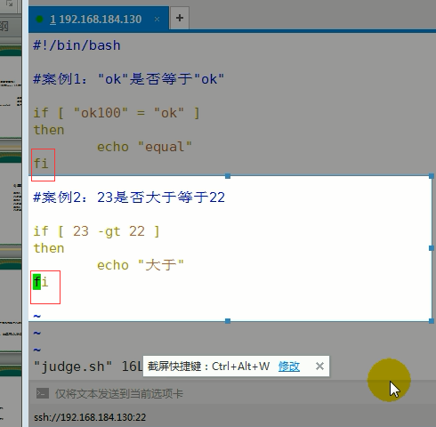

### 流程控制 

 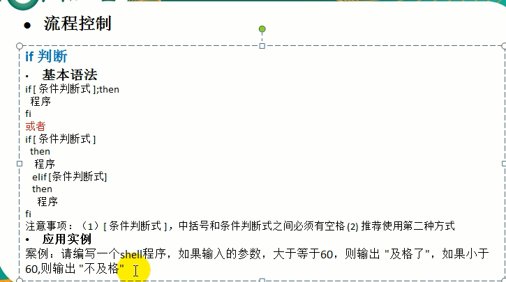


 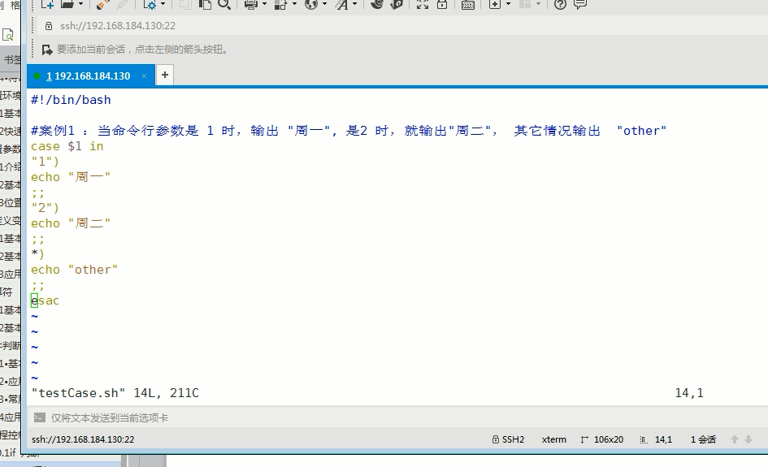

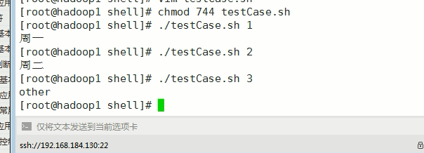


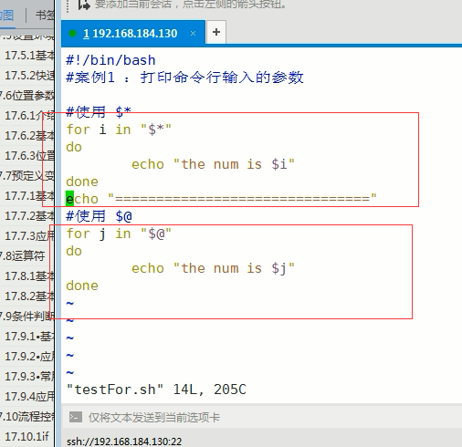

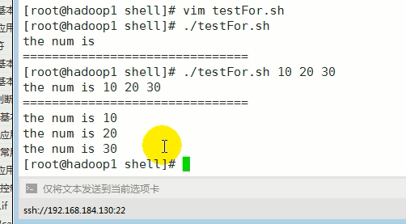

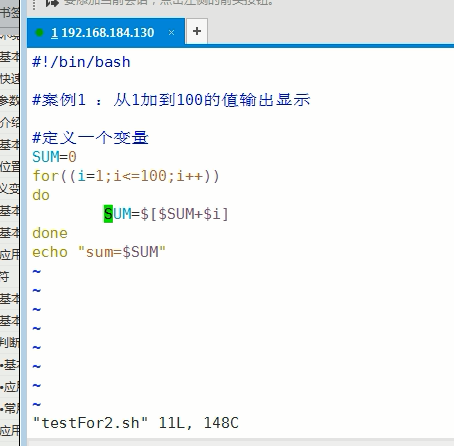


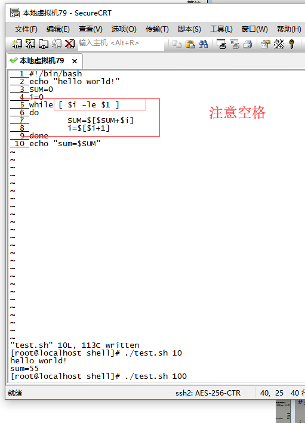

- read读取控制台输入
  - read(选项)(参数)
  - -p：指定读取值时的提示符
  - -t：指定读取值时等待的时间（秒），如果没有在指定的时间内输入，就不再等待了
  - 变量：指定读取值的变量名

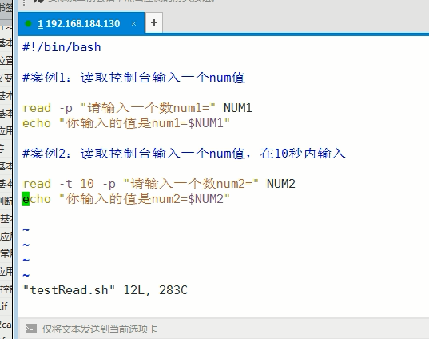

### 函数

#### 系统函数

- basename基本语法

  - 功能：返回完整路径最后/的部分，常用于获取文件名
    - basename [pathname][suffix
    - basename[string][suffix：（功能描述：basename命令会删掉所有的前缀包括最后一个（'/'））字符，然后将字符串显示出来
    - 选项：
    - suffix为后缀，如果suffix被指定了，basename会将pathname或string中的suffix去掉
    - 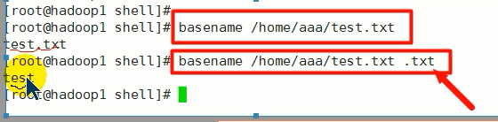

- dirname

  - 功能：返回完整路径最后/的前面的部分，常用于返回路径部分

  - dirname文件绝对路径（功能描述：从给定的包含绝对路径的文件名中去除文件名（非目录的部分），然后返回剩下的路径（目录的部分））

  - 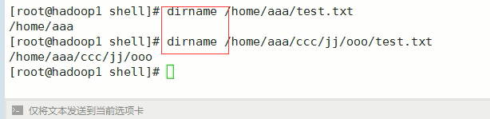

    

#### 自定义函数

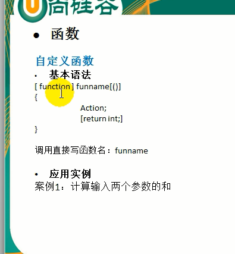

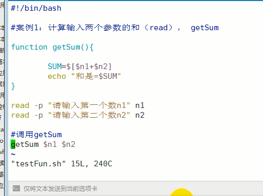

### shell综合案例 

- 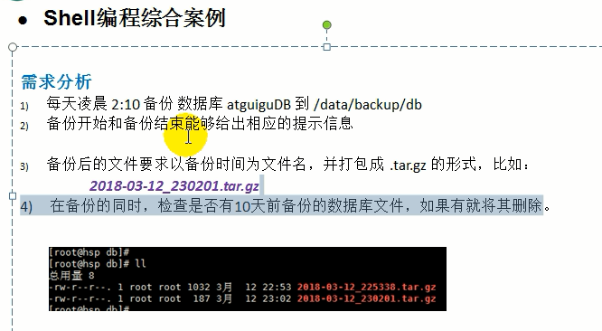

  - ```shell
    #!/bin/bash
    #完成数据库的定时备份
    #备份路径
    BACKUP=/data/backup/db
    #当前的时间作为文件名
    DATETIME=$(date +%Y_%m_%d_%H%M%S)
    #可以输出变量调试
    #echo "$DATETIME"
    echo "======开始备份===="
    echo "======备份路径是：$BACKUP/$DATETIME.tar.gz"
    
    #主机
    HOST=localhost
    #用户名
    DB_USER=root
    #密码
    DB_PWD=root
    #备份数据库名
    DATABASE=xiaozhang
    #创建备份路径
    #如果备份的路径文件夹存在，就使用，否则就创建
    [ ! -d "$BACKUP/$DATETIME" ] && mkdir -p "$BACKUP/$DATETIME"
    #执行mysql的备份数据库的指令
    mysqldump -u$DB_USER -p$DB_PWD --host=$HOST $DATABASE |gzip > $BACKUP/$DATETIME/$DATETIME.sql.gz
    #打包备份文件
    cd $BACKUP
    tar -zcvf $DATETIME.tar.gz $DATETIME
    #删除临时目录
    rm -rf $BACKUP/$DATETIME
    
    #删除10天前的备份文件
    find $BACKUP -mtime +10 -name "*.tar.gz" -exec rm -rf {} \;
    echo "======备份文件成功======"
    ```

### 上一条命令的值赋值给一个变量

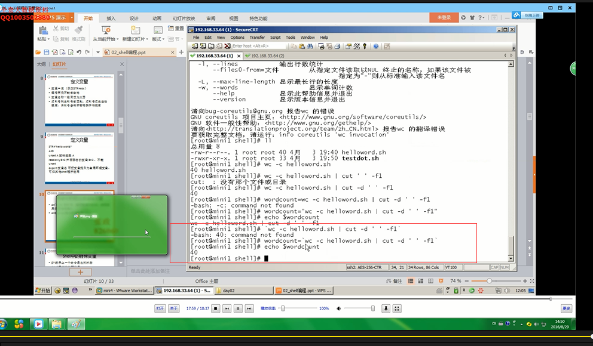

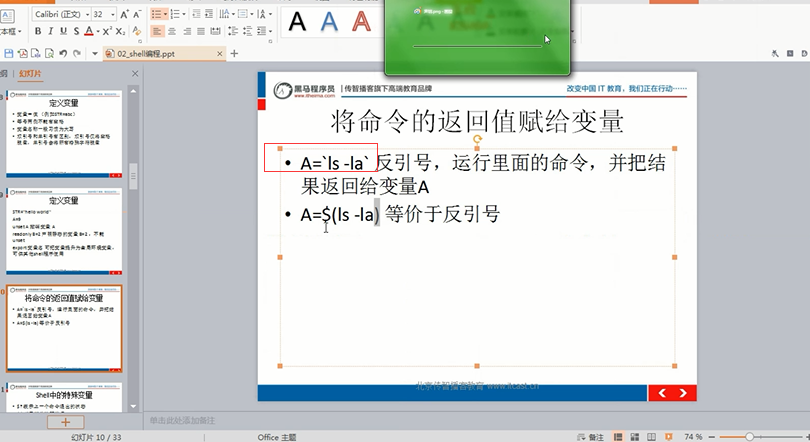

### shell中的特殊变量

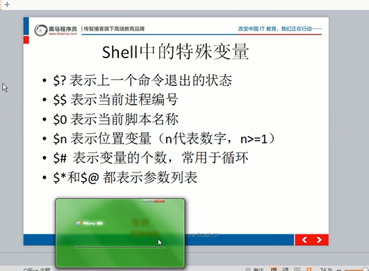


# 重启自启动

https://www.jb51.net/article/188646.htm

## **方法一：使用 crontab**

```shell
[root@localhost ~]# crontab -l
@reboot /usr/local/nginx/sbin/nginx -c /usr/local/nginx/conf/nginx.conf
```


## 方法二：使用systemd服务

```shell
[root@localhost ~]# cd /etc/systemd/system;ls
auto_run_custom_script.service  
[root@localhost ~]#vi auto_run_custom_script.service  
[Unit]
Description=Run a Custom Script at Startup
After=default.target

[Service]
Type=oneshot
RemainAfterExit=yes
ExecStart=/data_new/spring-cloud/auto_run_custom_script.sh

[Install]
WantedBy=default.target
~                             
[root@localhost ~]#systemctl daemon-reload
[root@localhost ~]#systemctl enable auto_run_custom_script.service  
[root@localhost ~]#journalctl -u auto_run_custom_script.service
[root@localhost ~]#reboot//重启
[root@localhost ~]#
```


# 坑

## 生产机器中了挖矿病毒

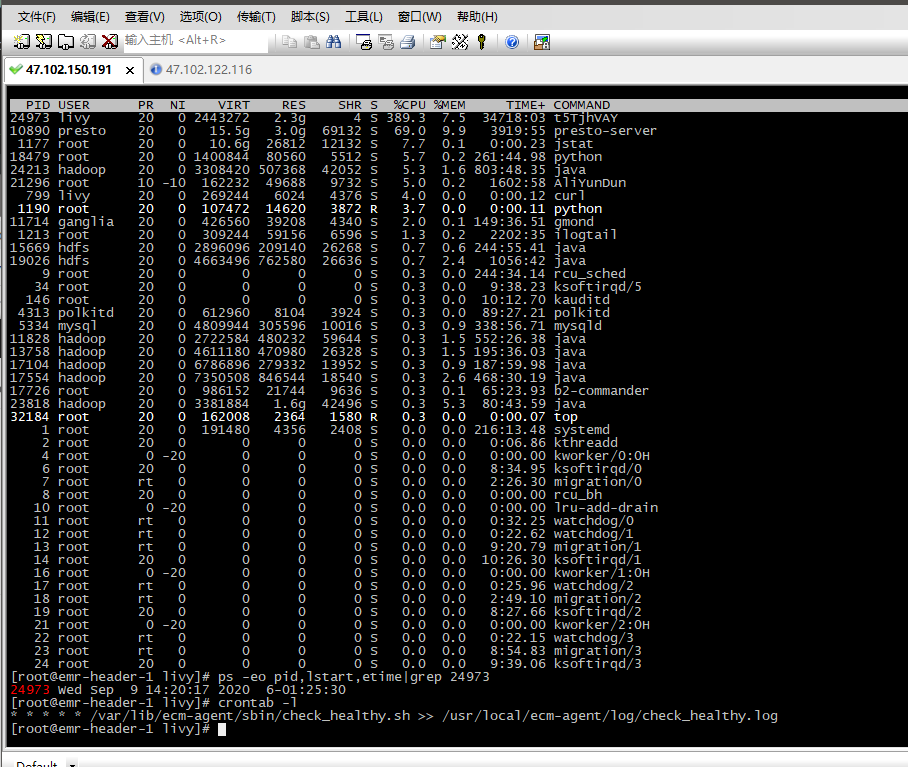

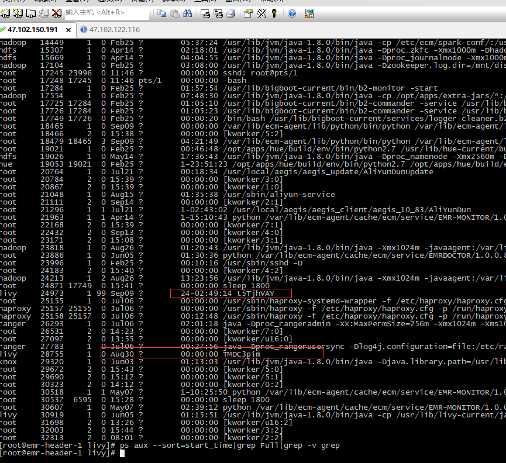

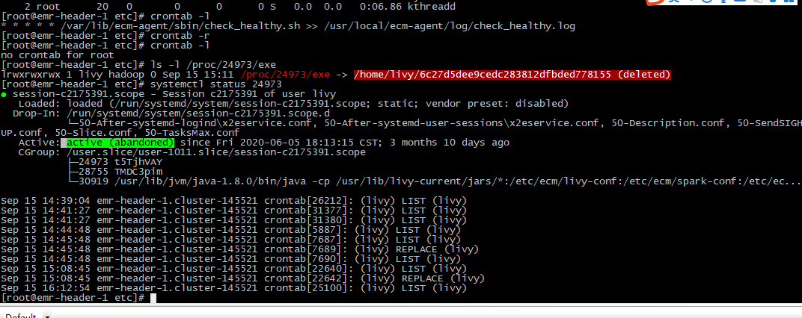

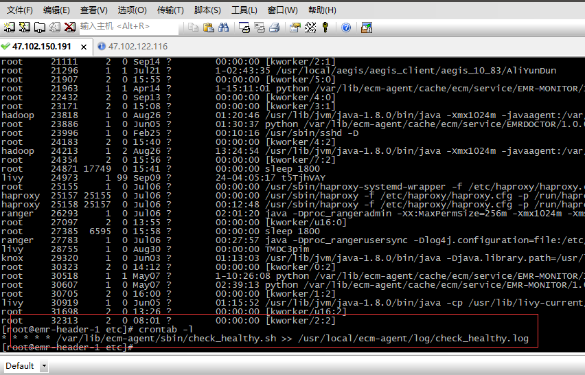

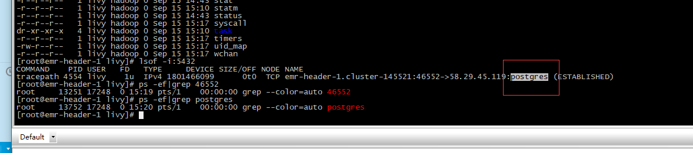

解决方案：

- 删掉定时器
  - crontab -r
- 停掉进程
  - kill -9
- 改密码

https://helpcdn.aliyun.com/knowledge_detail/41206.html

## linux下内存buff/cache占用过多问题解决

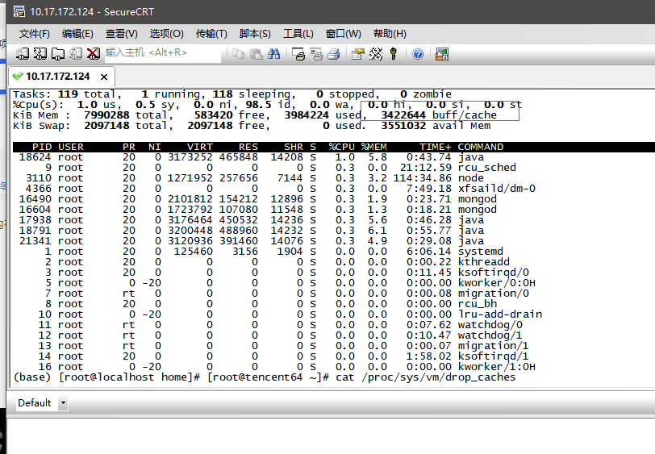

解决办法：

```java
//三次清除操作，可用内存明显增加
echo 1 > /proc/sys/vm/drop_caches
echo 2 > /proc/sys/vm/drop_caches
echo 3 > /proc/sys/vm/drop_caches
```


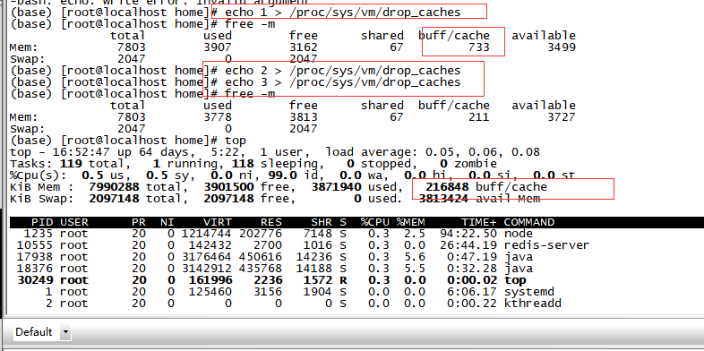


## 常用命令

> stat查看文件信息
> man帮助
> --help
> ls -h 
> cd -、. 、..、
> more 空格翻页、b向上分页、回车向下滚动一行、
> less 
> head显示文件头
> tail显示文件尾
> cp -a保留原文件信息、-r递归复制
> chmod u g o a u+x 、u-x、421 （777、755、644）
> chown 修改所有者  修改所有者和所属组chown root:root test.txt
> chgrp 修改所属组
> whereis
> which
> whoami
> useradd 、passwd、
> locate根据文件名搜索
> find -name、-iname、-size、-atime、-mtime、-ctime、-type
> eg：find . -size +2k -a -type f
> grep 在文件中查询符合条件的字符串 -i忽略大小写 、-n输出行号、-v取反、--color=auto、-A
> 通配符： ?匹配任意一个字符、*匹配0个或任意内容、[]匹配括号中任意一个字符、[-]、[^]匹配不是括号内发一个字符
> 正则：^匹配行首、$匹配行尾、？匹配一个字符重复0次或1次、*匹配前一个字符重复0次或任意多次、[]、[-]、[^]
> | 管道：文本流；
> netstat eg：netstat -an |grep 80 | wc -l
> ctrl+A 行头
> ctrl+E 行尾
> ctrl+U 删除或剪切光标之前的命令
> ctrl+Y 粘贴
> ctrl+L = clear
> ping -c 次数
> netstat -tunlp | grep 8080
> w
> who
> last 查看系统所有登陆过的用户信息
> lastlog 
> du -h --max-depth=1* 文件夹
> du -sh 当前文件夹总大小
> df -h 系统
> mount挂载
> unmount卸载
> ntpdate 不同机器的时间同步
>
> echo -e、-n
> history  !n调用第几行的命令
> 重定向>覆盖、>>追加、2>>错误信息、命令 >>文件 2>&1 错误信息和正确信息放到一个文件里、命令 >>文件1 2>>文件2 错误信息和正确信息分开两个文件

>
>
>shell：
>echo -e、-n
>history  !n调用第几行的命令
>重定向>覆盖、>>追加、2>>错误信息、命令 >>文件 2>&1 错误信息和正确信息放到一个文件里、命令 >>文件1 2>>文件2 错误信息和正确信息分开两个文件
>&&与
>||或 命令1 || 命令2：当命令1不正确，则命令2执行。当命令1正确，命令2就不会执行
>`命令`   等同于 $(命令)
>$变量名
>数据类型：默认字符串，计算时要指定类型
>declare 声明类型 -a数组、-i整数、-r只读、-、+、-x环境变量、-p显示类型，declare -i c=$a+$b
>d=$(expr $a + $b)
>let d=$a+$b
>需计算时用$(( ))、$[]
>数组打印：${变量名[*]}
>需拼接时，变量需用双引号包含“$变量名”或${变量名}
>env\set查询环境变量
>位置参数变量：$0代表命令本身，$1-$9代表参数，10以上用${10}、$*所有参数、$@、$#参数个数
>$?判断上条命令是否正确，0为正确，非0为不正确
>read 接收键盘输入 -p 、 -t、-n、-s
>[ 表达式 ]： 判断，权限、文件修改时间、是否是文件。。。-eq相等、-ne不相等、-gt大于、lt小于、-ge大于等于、-le小于等于、-z字符串是否为空、-n字符串是否为非空、==、!=、[ -z "$name" -a "$a" -gt 23]、-a逻辑与、-o逻辑或、！
>if [ 条件判断式 ]；then
>	程序 
>fi
>case $变量名  in
>"值1") 程序 ::
>esac
>for 变量 in 值1 值2 值3···
>do
>程序
>done
>for (( ; ; ))
>while [ 条件判断式 ]
>do
>程序
>done
>until 循环，与while相反
>exit 退出
>break
>continue
>判断y是否有值或空：x=${y-新值} 通过x的值判断y的值
>source使环境变量生效：/etc/profile、/ect/profile.d/*.sh、~/.bash_profile、~/.bashrc、/etc/bashrc
>基础：*  grep "aa*"至少包含一个a、. 匹配除了换行符外任意一个字符、^行首、$行尾、[]括号中指定的任意一个字符、[^]括号字符以外任意一个字符、\转义符 grep "\.$" 以.号结尾、\{n\}前面的字符出现n次、\{n,\}前面的字符出现不小于n次、\{n,m\}前面的字符至少出现n次，最多出现m次
>扩展：+前一个字符匹配一次或任意多次、？前一个字符匹配0或1次、| 、（）


>字符：
>cut列提取 -f列号、-d分隔符(不能用空格)、-c字符范围 eg：grep "/bin/bash" /etc/profile | grep -v "root" |cut -d ":"  -f 1
>awk：可用空格提取列、BEGIN、END、>=、<=、。。。、正则、
>printf ：awk的格式化输出 %m.nf输出浮点数(%8.2f：总共8位，2位小数，6位整数)、%ns、%ni、\n换行、\t Tab
>df -h | awk '{printf $4 $6}'
>sed修改字符串 sed 选项 '动作' 文件名 -e编辑、 a追加、c行替换、i插入、p打印、s字符替换 sed '2p' test.txt
>sort排序 -f忽略大小写、。。。
>uniq 删除重复行=sort -u
>wc统计命令 -l只统计行数、-w只统计单词数、-m只统计字符数

> vim  a、A、i、I、o、O、gg、G、^、$、:n、x、nx、dd、ndd、p、yy、nyy、撤销：u、反撤销ctrl+u、:set nu、:set nonu、:syntax on、:syntax off、查找：/、?、n、N、替换：:1,10s/old/new/g替换1到10行的所有old为new、:%s/old/new/g替换整个文件的old为new、注释：:1,10s/^/#/g注释1到10行、:1.10s/^#//g取消注释