# 同步、异步、阻塞、非阻塞

- **阻塞和非阻塞指的是执行一个操作是等操作结束再返回，还是马上返回。**

  **比如餐馆的服务员为用户点菜，当有用户点完菜后，服务员将菜单给后台厨师，此时有两种方式：**

  ·         **第一种：就在出菜窗口等待，直到厨师炒完菜后将菜送到窗口，然后服务员再将菜送到用户手中；**

  ·         **第二种：等一会再到窗口来问厨师，某个菜好了没？如果没有先处理其他事情，等会再去问一次；**

  **第一种就是阻塞方式，第二种则是非阻塞的。**

  　　**同步和异步又是另外一个概念，它是事件本身的一个属性。还拿前面点菜为例，服务员直接跟厨师打交道，菜出来没出来，服务员直接指导，但只有当厨师将菜送到服务员手上，这个过程才算正常完成，这就是同步的事件。同样是点菜，有些餐馆有专门的传菜人员，当厨师炒好菜后，传菜员将菜送到传菜窗口，并通知服务员，这就变成异步的了。其实异步还可以分为两种：带通知的和不带通知的。前面说的那种属于带通知的。有些传菜员干活可能主动性不是很够，不会主动通知你，你就需要时不时的去关注一下状态。这种就是不带通知的异步。**

  **对于同步的事件，你只能以阻塞的方式去做。而对于异步的事件，阻塞和非阻塞都是可以的。非阻塞又有两种方式：主动查询和被动接收消息。被动不意味着一定不好，在这里它恰恰是效率更高的，因为在主动查询里绝大部分的查询是在做无用功。对于带通知的异步事件，两者皆可。而对于不带通知的，则只能用主动查询。**

  　　但是对于非阻塞和异步的概念有点混淆，非阻塞只是意味着方法调用不阻塞，就是说作为服务员的你不用一直在窗口等，非阻塞的逻辑是"等可以读（写）了告诉你"，但是完成读（写）工作的还是调用者（线程）服务员的你等菜到窗口了还是要你亲自去拿。而异步意味这你可以不用亲自去做读（写）这件事，你的工作让别人（别的线程）来做，你只需要发起调用，别人把工作做完以后，或许再通知你，它的逻辑是“我做完了 告诉/不告诉 你”，他和非阻塞的区别在于一个是"已经做完"另一个是"可以去做"。

# Netty是什么

- netty是一个异步的、基于事件驱动（例如点击页面中的某个按钮，触发一个点击事件去调用一个方法或函数）的网络应用框架，用于快速开发可维护的高性能、高并发协议服务器和客户端。
- netty主要针对在TCP协议下，面向clients端的高并发应用，或者peer-to-peer场景下的大量数据持续传输的应用。
- netty本质是一个NIO框架，适用于服务器通讯相关的多种应用场景：dubbo、rocketmq

## 线程模型

> 目前存在的线程模型有：传统阻塞I/O服务模型、Reactor模式（反应器模式）（单Reactor单线程、单Reactor多线程、主从Reactor多线程）、

- Netty线程模式：主要基于主从Reactor多线程模型做了一定改进，其中主从Reactor多线程模型有多个Reactor

### 主从reactor多线程 

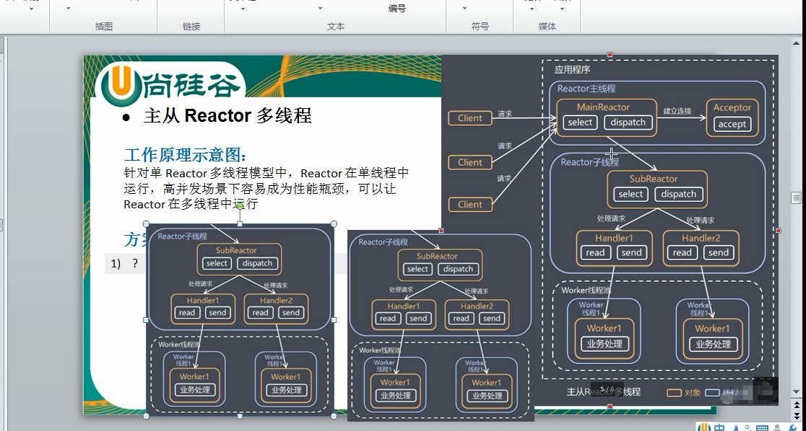

- 综合实例：NGINX主从reactor多线程模型、memcached主从多线程、Netty主从多线程模型的支持

#### 工作原理

- 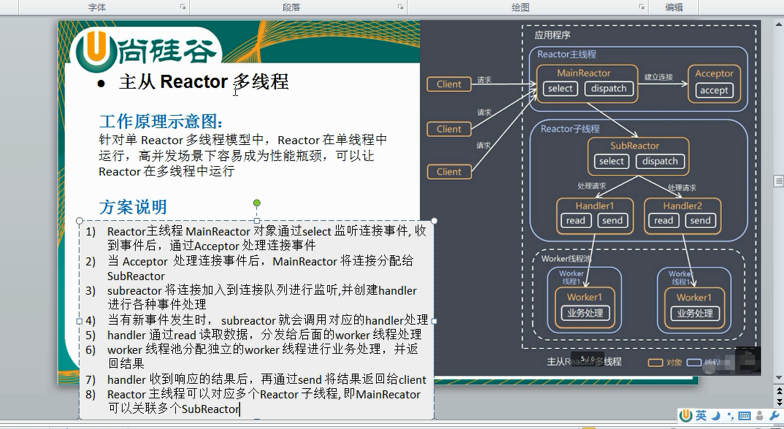

### 3种Reactor模式小结

### Netty模型

- Netty主要基于主从Reactors多线程模型做了一定的改进，其中主从Reactor多线程模型有多个Reactor

#### 工作原理

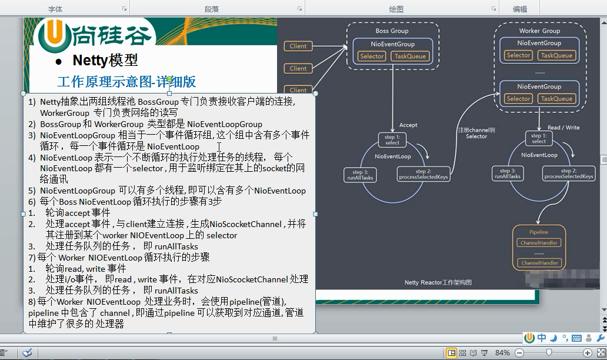

- Netty抽象出两组线程池，BossGroup专门负责接收客户端连接，WorkerGroup专门负责网络读写操作
- NioEventLoop表示一个不断循环执行处理任务的线程，每个NioEventLoop都有一个selector，用于监听绑定在其上的socket网络通道
- NioEventLoop内部采用串行化设计，从消息的读取--》解码--》处理--》编码--》发送，始终由IO线程NioEventLoop负责
  - NioEventLoopGroup 下包含多个NioEventLoop
  - 每个NioEventLoop中包含有一个Selector，一个taskQueue
  - 每个NioEventLoop的selector上可以注册监听多个NioChannel
  - 每个NioChannel只会绑定在唯一的NioEventLoop上
  - 每个NioChannel都绑定有一个自己的ChannelPipeline

## Netty的特点

- 高并发：Netty是基于NIO（非阻塞IO）开发是网络通信框架，对比于BIO（阻塞IO），它的并发性得到了很大提高。
- 传输快：Netty的传输依赖于零拷贝特性，尽量减少不必要的内存拷贝，实现了更高效率的传输
- 封装好：Netty封装了NIO操作的很多细节，提供了易于使用调用接口

## Netty默认情况起多少线程？何时启动？

> bossGroup和WorkerGroup含有的子线程（NioEventLoop）的个数

- Netty 默认是CPU处理器的两倍，bind完之后启动

## taskQueue自定义任务 

> 比如这里我们有一个非常耗时长的业务--》异步执行--》提交该channel对应的NIOEventLoop
>
> - 用户程序自定义的普通任务--》taskQueue
> - 用户自定义定时任务-->scheduleTaskQueue
> - 非当前Reactor线程调用Channel的各种方法

## 异步模型 

- 异步的：当一个异步过程调用发出后，调用者不能立刻得到结果。实际处理这个调用的组件在完成后，通过状态、通知和回调来通知调用者。
- Netty中的I/O操作时异步的，包括Bind、Write、Connect等操作会简单的返回一个ChannelFuture
- 调用者并不能立刻获得结果，而是通过Future-Listener机制，用户可以方便的主动获取或者通过通知机制获得IO操作结果
- Netty的异步模型是建立在future和callback的之上的。callback就是回调。重点说Future，它的核心思想是：假设一个方法fun，计算过程可能非常耗时，等待fun返回显然不合适。那么可以在调用fun的时候，立马返回一个Future，后续可通过Future去监控方法fun的处理过程（即：Future-Listener机制）

## Netty核心模块

### Bootstrap、ServerBootstrap

- Boostrap意思是引导，一个Netty应用通常由一个Bootstrap开始，主要作用是配置整个Netty程序，串联各个组件，Netty中Bootstrap类是客户端程序的启动引导类，ServerBootstrap是服务端启动引导类

### Future、ChannelFuture 

- Netty中所有的IO操作都是异步的，不能立刻得知消息是否被正确处理，但可以过一会等它执行完成或直接注册一个监听，具体的实现就是通过Future和ChannelFutures，他们可注册一个监听，当操作执行成功或失败时监听会自动触发注册的监听事件

### Channel 

- Netty网络通信的组件，能够用于执行IO操作
- 通过Channel可获得当前网络连接的通道状态
- 通过Channel可获得网络连接的配置参数（例如接收缓冲区大小）
- Channel提供异步网络IO操作（如建立连接、读写、绑定端口），异步调用意味着任何IO调用都将立即返回，并且不保证在调用结束时所请求的IO操作已完成
- 调用立即返回一个ChannelFuture实例，通过注册监听器到ChannelFuture上，可以IO操作成功、失败或取消时回调通知调用方

### Selector 

- Netty基于Selector对象实现IO多路复用，通过Selector一个线程可以监听多个连接的Channel事件。
- 当向一个Selector中注册Channel后，Selector内部的机制就可以自动不断地查询（Select）这些注册的Channel是否有已就绪的IO事件（例如可读、可写、网络连接完成等），这样程序就可以很简单地使用一个线程高效地管理多个Channel

### ChannelHandler及其实现类

- ChannelHandler是一个接口，处理IO事件或拦截IO操作，并将其转发到其ChannelPipeline（业务处理链）中的下一个处理程序
- ChannelHandler本身并没有提供很多方法，因为这个接口有许多的方法需要实现，方便使用期间，可以继承它的子类
- 
- ChannelPipeline提供了ChannelHandler链的容器。以客户端应用程序为例，如果事件的运动方向是从客户端到服务端的，那么我们称为这些事件为出站的，即客户端发送给服务端的数据都会通过pipeline中的一系列ChannelOutboundHandler，并被这些Handler处理，反之则称为入站的

### Pipeline和ChannelPipeline

- ChannelPipeline是一个Handler的集合，它负责处理和拦截inbound或者outbound的事件和操作，相当于一个贯穿Netty的链。（也可以理解为：ChannelPipeline是保存ChannelHandler的List，用于处理或拦截Channel的入站事件和出站操作）
- ChannelPipeline实现了一种高级形式的拦截过滤器模式，使用户可完全控制事件的处理方式，以及Channel中各个的ChannelHandler如何相互交互

### ChannelHandlerContext 

- 保存Channel相关的所有上下文信息，同时关联一个ChannelHandler对象
- 即ChannelHandlerContext中包含一个具体的事件处理器ChannelHandler，同时ChannelHandlerContext中也绑定了对应的pipeline和Channel信息，方便对ChannelHandler进行调用

### ChannelOption 

- Netty在创建Channel实例后，一般都需要设置ChannelOption参数
  - ChannelOption.SO_BACKLOG：对应TCP/IP 协议listen函数中的backlog参数，用来初始化服务器可连接队列大小。
  - ChannelOption.SO_KEEPALIVE：一直保持连接活动状态 

### EventLoopGroup和其实现类NioEventLoopGroup

- EventLoopGroup 是一组 EventLoop 的抽象，Netty 为了更好的利用多核 CPU 资源，一般会有多个 EventLoop 同时工作，每个 EventLoop 维护着一个 Selector 实例。
- EventLoopGroup 提供 next 接口，可以从组里面按照一定规则获取其中一个 EventLoop来处理任务。在 Netty 服务器端编程中，我们一般都需要提供两个 EventLoopGroup，例如：BossEventLoopGroup 和 WorkerEventLoopGroup。
- 通常一个服务端口即一个
  ServerSocketChannel对应一个Selector
  和一个EventLoop线程。BossEventLoop 负责接收客户端的连接并将
  SocketChannel 交给 WorkerEventLoopGroup 来进行 IO 处理，如下图所示
- 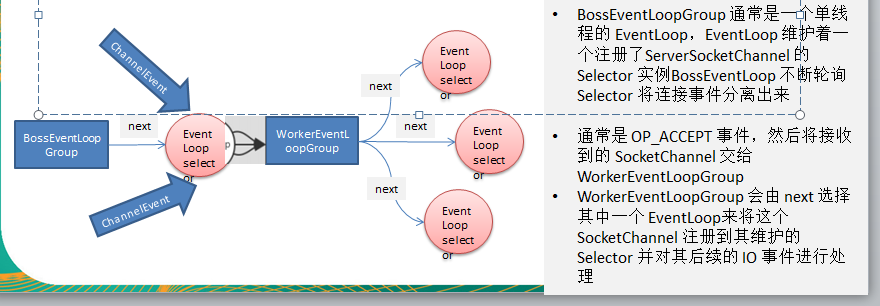
- 

### Unpooled 

- Netty 提供一个专门用来操作缓冲区（即Netty的数据容器）的工具类

## Netty心跳监测机制 

- IdlestateHandler是Netty提供的处理空闲状态的处理器
- IdlestateEvent：事件
- 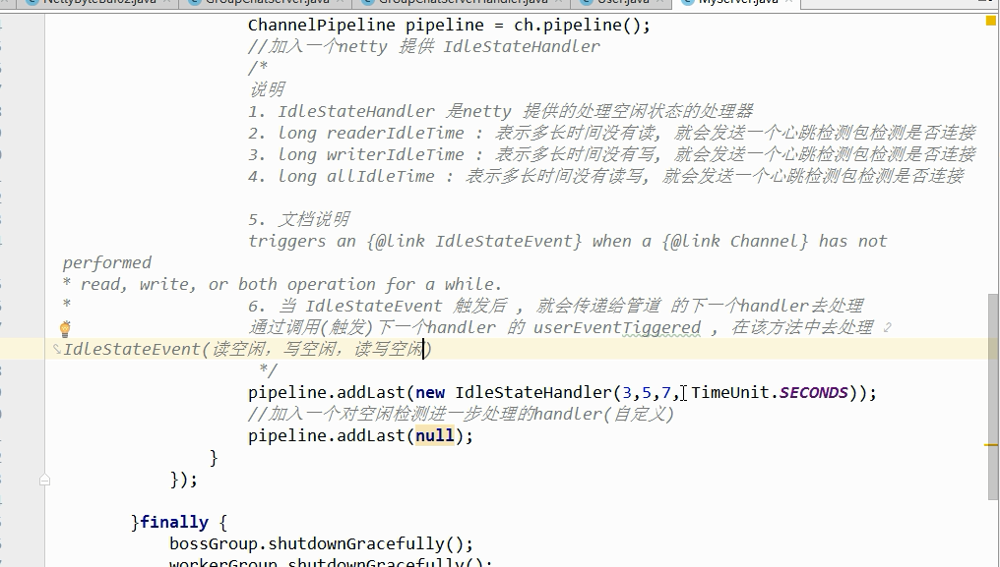

## Netty 通过WebSocket编程实现服务器和客户端长连接

- Http 数据传输过程中是分段
  - 这就是为什么，当浏览器发送大量数据时，就会发出多次HTTP请求
- WebSocket，数据是以帧（frame）形式传递
- WebSocketServerProtocolHandler核心功能是将HTTP协议升级为websocket协议，保持长连接

## Netty编码解码机制 

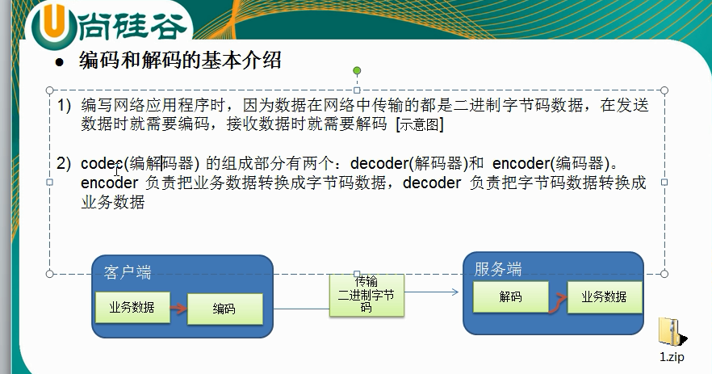

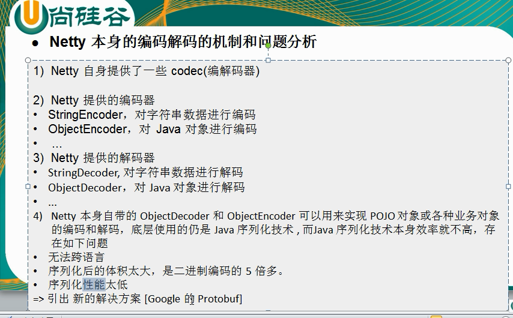

## Protobuf

- Protobuf是google发布的开源项目，全称Google Protocol Buffers ，是一种轻便高效的结构化数据存储格式，可以用于结构化数据串行化，或者说序列化。它很适合做数据存储或RPC数据交换格式
- - **目前很多公司HTTP+JSON--》tcp+protobuf** 
- Protobuf是以message的方式来管理数据的
- 支持跨平台、跨语言，即【客户端和服务端可以是不同的语言编写的】（目前支持绝大多数语言，例如C++ 、C#、java、Python等）
- 

## Netty入站与出站机制

- ChannelHandler充当了处理入站和出站数据的应用程序逻辑的容器。例如：实现ChannelInboundHandler接口（或ChannelInboundHandlerAdapter），你就可以接收入站事件和数据，这些数据会被业务逻辑处理。当要给客户端发送响应时，也可以从ChannelInboundHandler冲刷数据。业务逻辑通常写在一个或者多个ChannelInboundHandler中。ChannelOutboundHandler原理一样，只不过它是用来处理出站数据的。
- 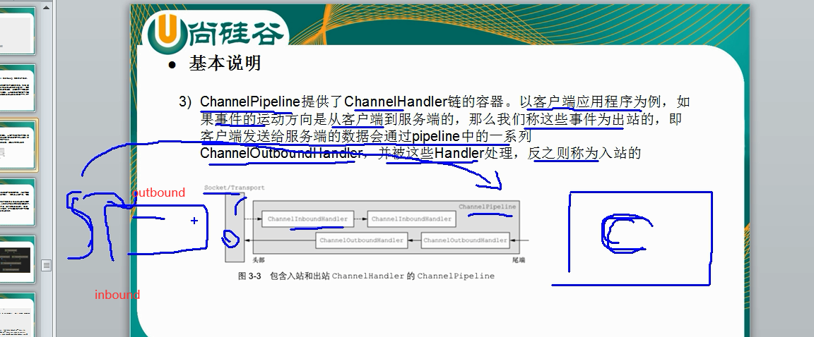
- 从websocket读取数据到channelpipeline-->inbound（解码）
- 从channelpipeline写数据到websocket-->outbound（编码）
- 

### 解码器ByteToMessageDecoder

### 解码器ReplayingDecoder

## Log4J整合到Netty 

- 添加log4j依赖
- 配置log4j.properties配置文件
- 

## TCP 粘包和拆包

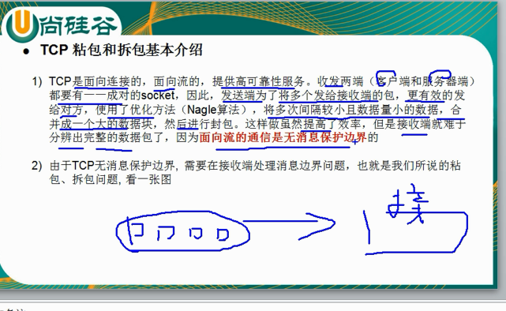

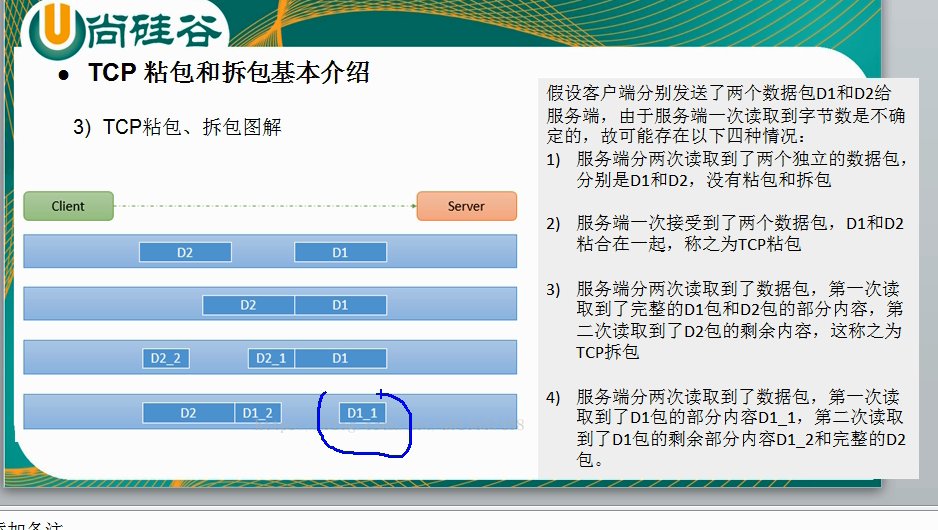

### 解决方案

## Netty 启动过程源码剖析

## RPC调用流程 

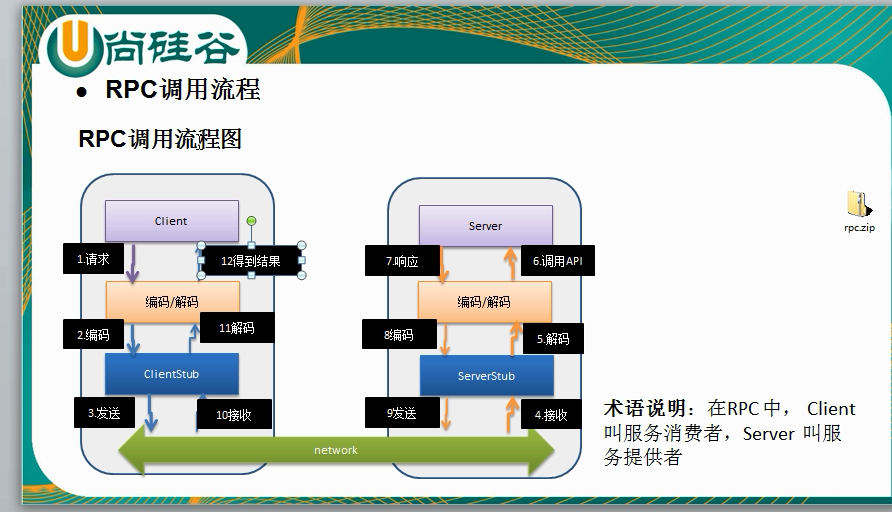

# BIO

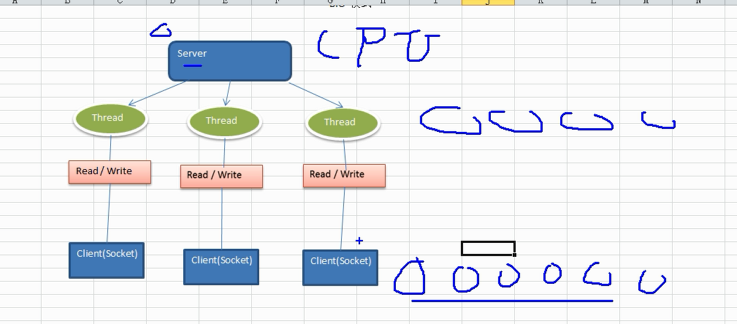

- 同步并阻塞（传统的阻塞型IO）：服务器实现模式为一个连接一个线程，即客户端有连接请求时服务器端就需要启动一个线程进行处理，如果这个连接不做任何事情会造成不必要的线程开销

- > 假如客户端很多，意味着服务端就会有很多线程，线程是有开销的，线程之间的切换，造成CPU压力大，还需要额外的去维护这些连接，而且还会造成阻塞，例如客户端读不到数据时，就一直阻塞在那里直到拿到数据为止。

# NIO

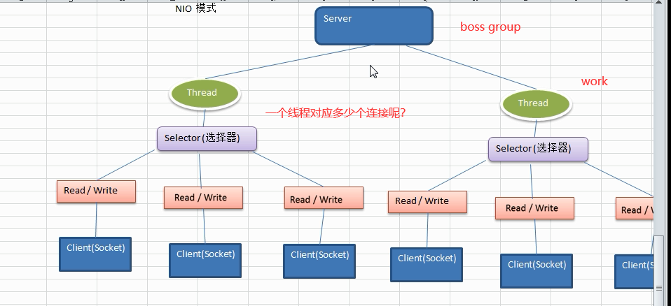

- 同步非阻塞：服务器实现模式为一个线程处理多个请求（连接），即客户端发送的连接请求都会注册到多路复用器上，多路复用器轮询到连接有I/O请求就进行处理。

## NIO三大核心部分：channel、buffer、selector

- Channel（通道）
- Buffer（缓冲区）
- Selector（选择器）

### 缓冲区Buffer

- 缓冲区buffer，本质上是一个可以读写数据的内存块，可以理解成是一个容器对象（含数组），该对象提供了一组方法，可以更轻松地使用内存块，缓冲区对象内置了一些机制，能够跟踪和记录缓冲区的状态变化情况。Channel提供从文件、网络读取数据的渠道，但是读取或写入的数据都必须经由Buffer
- 
- 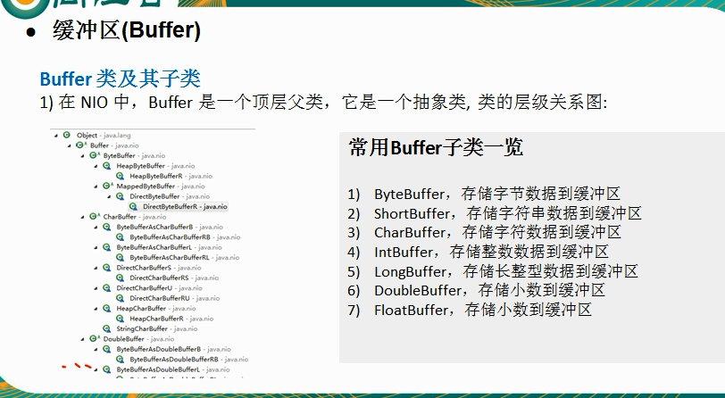

- 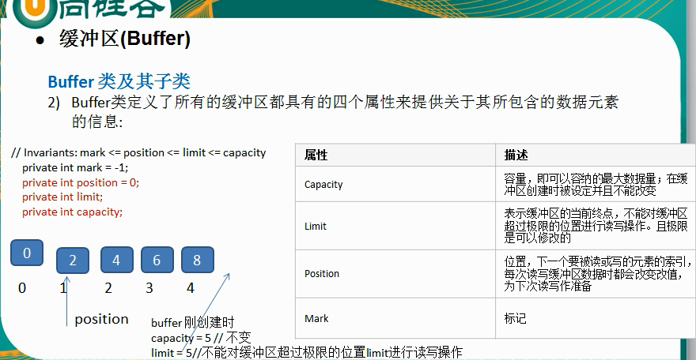
- 

### 通道Channel

#### NIO Channel和流的区别

- 通道Channel可以同时进行读写，流只能读或只能写
- 通道Channel可以实现异步读写数据
- 通道可以从缓冲读数据，也可以写数据到缓冲

#### 通道Channel基本介绍

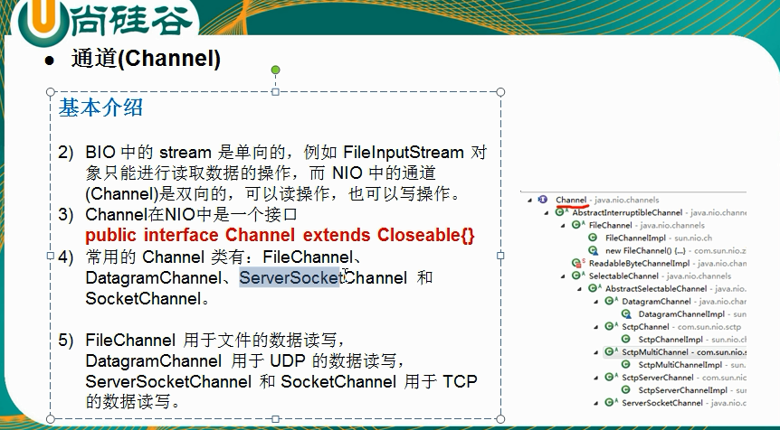

### 选择器Selector

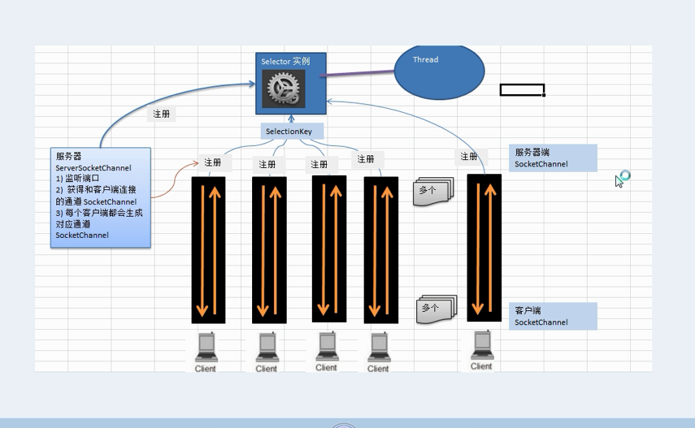

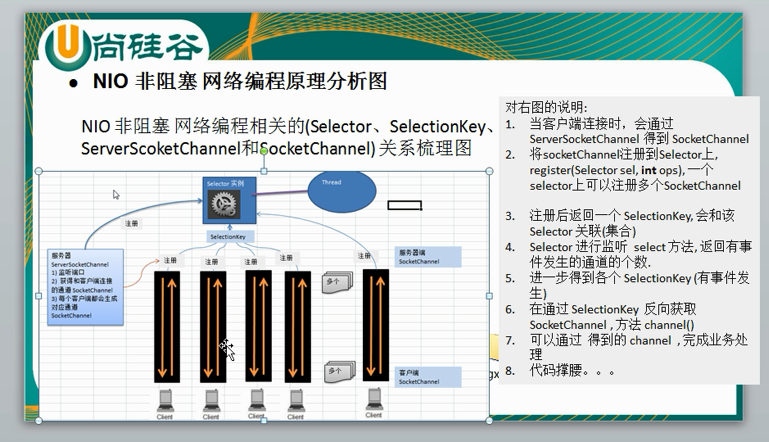

### NIO与零拷贝

> 零拷贝就是CPU拷贝次数为零 

- 零拷贝，是从操作系统的角度来说，因为内核缓冲区之间，没有数据是重复的（只有kernel buffer有一份数据）
- 零拷贝不仅带来更少的数据复制，还能带来其他的性能优势，例如更少的上下文切换，更少的CPU缓存伪共享以及无CPU校验和计算

# AIO 

- 异步非阻塞：AIO引入异步通道的概念，采用了Proactor模式，简化了程序编写，有效的请求才启动线程，它的特点是先由操作系统完成后才通知服务端程序启动线程去处理，一般适用于连接数较多且连接时间较长的应用。

# BIO、NIO、AIO应用场景及比较

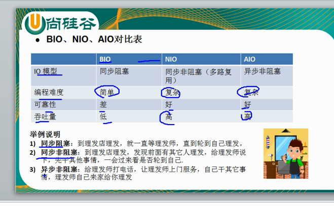

- 吞吐量：能否支持大并发

# Socket、TCP、UDP

## 什么是socket

- socket是应用层与TCP/IP 协议族通信的中间软件抽象层，它是一组接口。在设计模式中，socket其实就是一个门面模式，它把复杂的TCP/IP协议族隐藏在socket接口后面，对用户来说，一组简单的接口就是全部，让socket去组织数据，以符合指定的协议。

## IP、TCP/IP、UDP

**IP**：每个计算机都有对应的唯一标识即IP地址，IP地址格式为：255.255.255.255。目前是第4版本IPV4。

 **端口号**：端口号是网络应用程序的区分标识，有了端口号，计算机就知道将接受到的数据传给哪一个应用的程序，端口号范围065535，其中01023为系统所保留。

协议

： 

-  `TCP/IP协议:`   
            TCP：Transmission Control Protocol  ——传输控制协议
           IP：Internet Protocol——互联网协议
          TCP/IP协议是目前世界上最为广泛的协议，是以TCP/IP为基础的不同层次上多个协议的集合，也称:TCP/IP协议族或TCP/IP协议栈,包括运输层、网络层、链路层。它定义了电子设备如何连入Internet，以及数据如何在他们之间传输的标准。
-  `UDP协议:`
         UDP：User Data Protocol——用户数据报协议
         它是与TCP相对应面向非连接的协议，它不与对方建立连接，而是直接就把数据包发送过去。

### TCP和UDP协议比较 

| 协议类型     | TCP                  | UDP                |
| ------------ | -------------------- | ------------------ |
| 连接可靠性   | （三次握手）比较可靠 | 啥都不管就发       |
| 数据大小限制 | IO流无限制           | 数据包不能超过64k  |
| 传输效率     | 占用资源大，传输慢   | 占用资源少，传输快 |
| 应用案例     | FTP/SMTP传文件       | QQ聊天、飞秋聊天   |

### TCP 

#### TCP 协议如何保证可靠传输 

- 什么是可靠，所谓的可靠就是说发送方发送的数据到达接收方的时候不会发生错误，不会丢失，不会乱序。

- TCP为应用程序提供可靠的通信连接，因为他采用了三次握手协议，三次握手协议指的是在发送数据的准备阶段，服务器端和客户端之间需要进行三次交互。

  - 第一次握手：客户端发送SYN包到服务器，并进行SYN_SEND状态，等待服务器确认；

  - 第二次握手：服务器收到SYN包并确认，同时自己发送一个SYN+ACK包，此时服务器进入SYN_RECV状态

  - 第三次握手：客户端收到服务器的SYN_ACK包，向服务器发送确认包ACK，此包发送完毕，客户端和服务器进入established状态，完成三次握手

  连接建立后，客户端和服务器就开始进行安全可靠的数据传输了。

- 

## socket和TCP/UDP 的关系

## 基于TCP协议的Socket编程 

- 基于TCP协议实现的网络通信的类
  - ServerSocket类：用于表示服务器端Socket
  - Socket类：用于表示客户端Socket