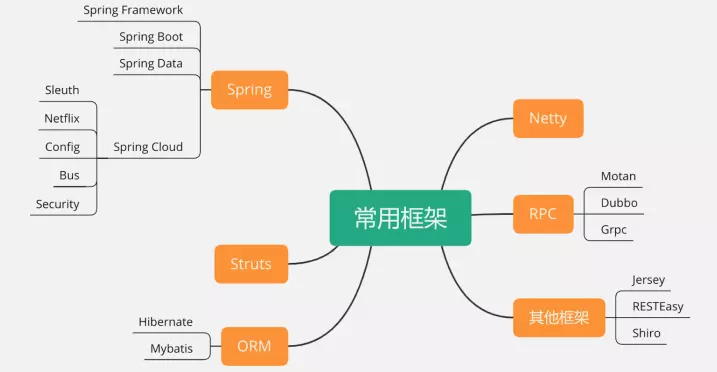
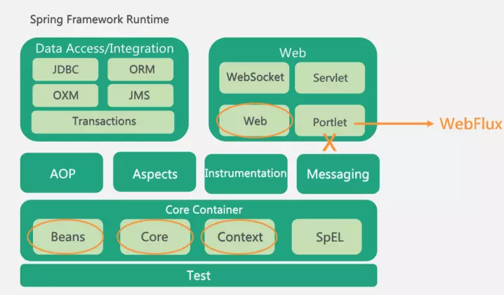
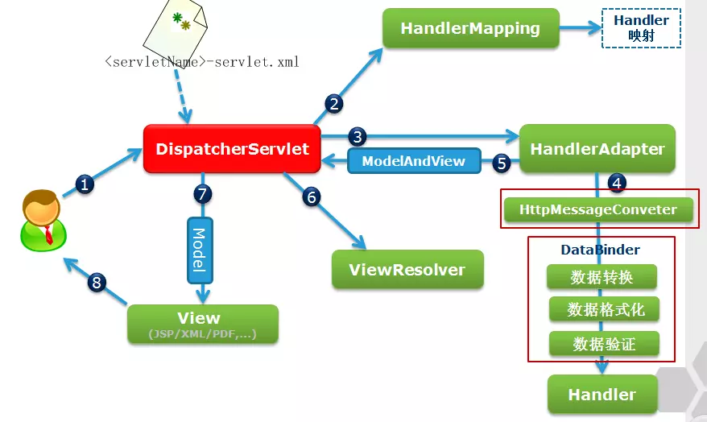
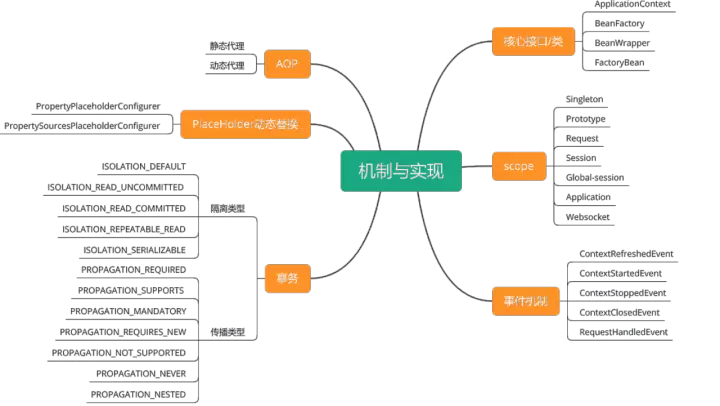
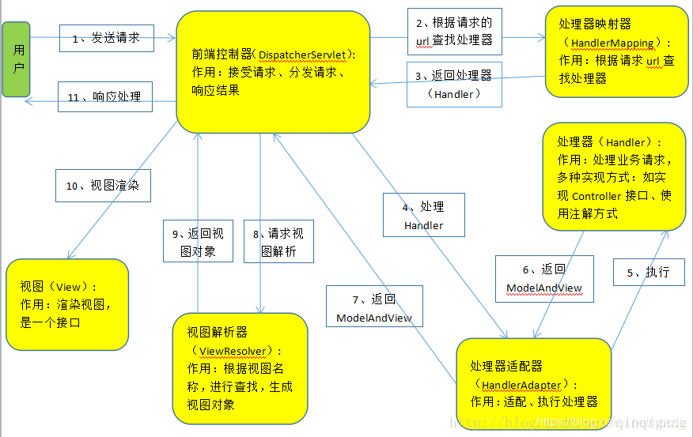
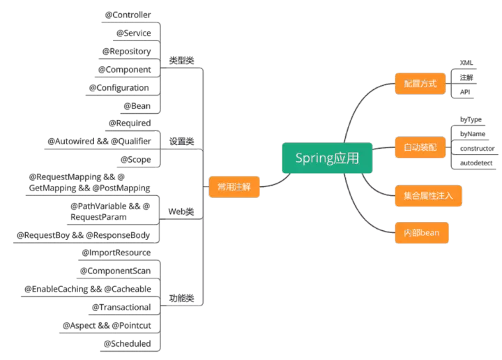
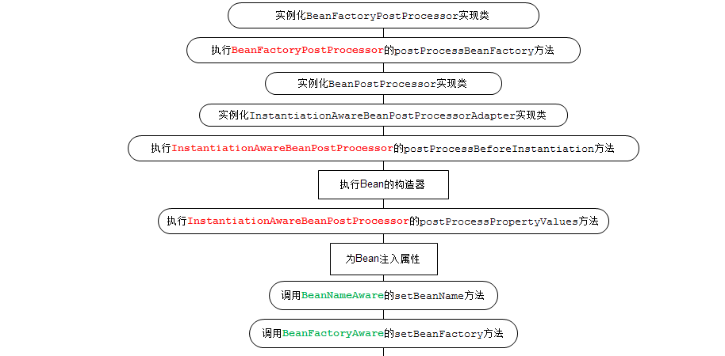

- spring framework

  - 包括了IOC依赖注入，Context上下文，bean管理，springmvc等众多功能模块，其它spring项目比如spring boot也会依赖spring框架。

  - > spring 有哪些不同的功能？
    >
    > - 容器：spring负责创建和管理对象（Bean）的生命周期和配置
    > - IOC：控制反转
    > - AOP：面向切面编程可以将应用业务逻辑和系统服务分离，以实现高内聚
    > - MVC：对web应用提供了高度可配置性，其它框架的集成十分方便
    > - 事务管理：提供了用于事务管理的通用抽象层。
    > - JDBC异常：spring 的JDBC抽象层提供了一个异常层次结构，简化了错误处理策略
- spring boot

  - 它的目标是简化spring应用和服务的创建，开发与部署，简化了配置文件，使用嵌入式web服务器，含有诸多开箱即用的微服务功能，可以和spring cloud联合部署
- spring data

  - 是一个数据访问及操作的工具集，封装了多种数据源的操作能力，包括jdbc、redis、mongodb等
- spring cloud

  - 分布式系统的开发，集成了服务发现，配置管理，消息总线，负载均衡，断路器，数据监控等各种服务治理能力。
- spring security

  - 主要用于快速构建安全的应用程序和服务，在springboot和spring security oauth2的基础上，可快速实现常见安全模型，如单点登录、令牌中继和令牌交换。

# IOC（控制反转）

> 假设公司有产品、研发、测试等岗位。如果是公司根据岗位要求，逐个安排人选，这就是正向流程。如果反过来，不用公司来安排候选人，而是由第三方猎头来匹配岗位和候选人，然后推荐，这就是控制反转。
>
> 在spring中，对象的属性是由对象自己创建的，就是正向流程；如果属性不是对象创建，而是由spring来自动进行装配，就是控制反转。这里的DI也就是依赖注入，就是实现控制反转的方式。

- Spring框架的核心是Spring容器。容器创建对象，将它们装配在一起，配置它们并管理它们的完整生命周期。
- spring中有多少种IOC容器？（区别？）
  - BeanFactory：就像一个包含bean集合的工厂类。它会在客户端要求时实例化bean。
  - ApplicationContext：此接口扩展了BeanFactory接口。它在Beanfactory基础上提供了一些额外的功能。
- Spring IOC的实现机制：
  - Spring 中的IOC的实现原理：工厂模式+反射机制

# context上下文和bean 

- 由spring创建的、用于依赖注入的对象，叫做一个bean

- spring创建并完成依赖注入后，所有的bean统一放在一个叫做context上下文中进行管理

- > - AppicationContext保存了IOC的整个应用上下文，可以通过其中的beanfactory获取到任意的bean；
  > - BeanFactory主要的作用是根据bean definition来创建具体的bean
  > - BeanWrapper是对bean的包装，一般情况下是在spring IOC内部使用，提供了访问bean的属性值、属性编辑器注册、类型转换等功能，方便IOC容器用统一的方式来访问bean的属性
  > - FactoryBean通过getObject方法返回实际的bean对象
  >
  > 

# AOP （面向切面编程）

- AOP以功能进行划分，对服务顺序执行流程中的不同位置进行横切，完成各服务共同需要实现的功能。
- AOP 的实现是通过代理模式，在调用对象的某个方法时，执行插入的切面逻辑。实现的方式有动态代理也叫运行时增强，比如jdk代理，CGLIB；静态代理是在编译时进行织入或类加载时进行织入。
- （关于AOP还需了解对应的Aspect、pointcut、advice等注解和具体使用方式）

# spring机制与实现 

## ？placeHolder动态替换

## 事务 

# spring应用相关 

- component和bean注解的区别如下：
  - @Component注解在类上使用表明这个类是个组件类，需要spring为这个类创建bean
  - @Bean注解使用在方法上，告诉spring这个方法将会返回一个bean对象，需要把返回的对象注册到spring的应用上下文中。

- 工作流程：
  - 用户发送请求至前端控制器DispatcherServlet，DispacherServlet是spring项目的入口
  - DispacherServlet收到请求调用HandlerMapping处理器映射器
  - 处理器映射器找到具体的处理器，生成处理器对象及处理器拦截器（如果有则生成）一并返回给DispacherServlet
  - DispacherServlet调用HandleAdapter处理器适配器
  - HandleAdapter经过适配器调用具体的处理器（Controller）
  - Controller执行完成返回ModelAndView
  - HandlerAdapter将controller执行结果ModernAndView返回给DispacherServlet
  - DispacherServlet将ModelAndView传给ViewResolve视图解析器
  - ViewResolve解析后返回具体VIew
- 

# spring常用的注入方式有哪些 

https://blog.csdn.net/a909301740/article/details/78379720

- setter属性注入
- 构造方法注入
- 注解方式注入
  - 描述依赖关系主要有两种：
    - @Resource
      - 默认以byName方式匹配与属性名相同的bean的id，如果没有找到就会以byType的方式查找，如果byType查找到多个的话，使用@Qualifier注解指定某个具体名称的bean
    - @Autowired
      - 默认是以byType的方式去匹配类型相同的bean，如果只匹配到一个，那么就直接注入该bean，无论要注入的bean的name是什么；如果匹配到多个，就会调用DefaultListablBeanFactory的determineAutowireCondidate方法来决定具体注入哪个bean

# spring框架中的单例bean是线程安全的吗

- spring作用域（scope）的配置区别：

  - 非线程安全：Singleton（默认）：spring容器只存在一个共享的bean实例

    （只需维护一个实例，可提高性能，加快访问速度）

    - @Scope(“prototype”)：让单例变成多例

  - 线程安全：prototype：每次对bean的请求都会创建一个新的bean实例

# spring bean的完整生命周期

- 从创建spring容器开始，直到最终spring容器销毁bean
- 
- 

# Spring缓存 

- 声明某些方法使用缓存
  - @Cacheable
    - value：指定cache名称
    - key：
    - condition：
- 配置spring对cache的支持

- （对于一个支持缓存的方法，spring会在其被调用后将其返回值缓存起来，以保证下次利用同样的参数来执行该方法时可以直接从缓存中获取结果，而不需要再次执行该方法。spring在缓存方法的返回值时是以键值对进行缓存的，值就是方法的返回结果，至于键的话，spring又支持两种策略，默认策略和自定义策略。需注意的是，当一个支持缓存的方法在对象内部被调用时是不会触发缓存功能的。）

# spring循环依赖及解决方式 

