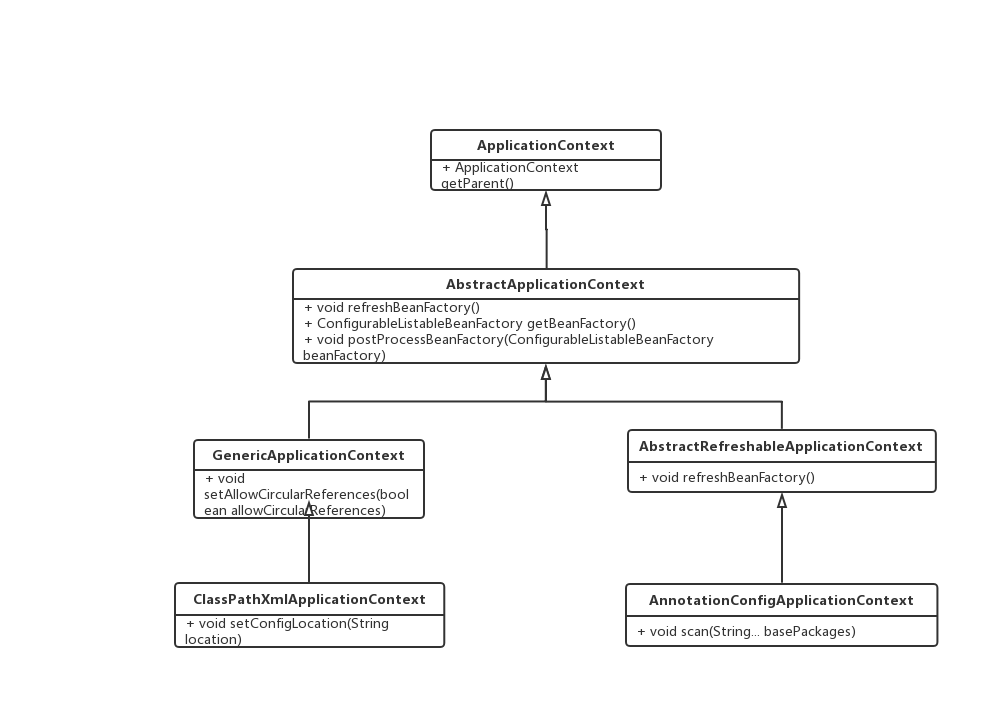
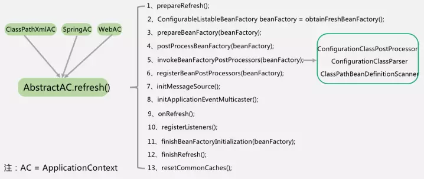

- spring framework

  - 包括了IOC依赖注入，Context上下文，bean管理，springmvc等众多功能模块，其它spring项目比如spring boot也会依赖spring框架。

  - > spring 有哪些不同的功能？
    >
    > - 容器：spring负责创建和管理对象（Bean）的生命周期和配置
    > - IOC：控制反转
    > - AOP：面向切面编程可以将应用业务逻辑和系统服务分离，以实现高内聚
    > - MVC：对web应用提供了高度可配置性，其它框架的集成十分方便
    > - 事务管理：提供了用于事务管理的通用抽象层。
    > - JDBC异常：spring 的JDBC抽象层提供了一个异常层次结构，简化了错误处理策略
- spring boot

  - 它的目标是简化spring应用和服务的创建，开发与部署，简化了配置文件，使用嵌入式web服务器，含有诸多开箱即用的微服务功能，可以和spring cloud联合部署
- spring data

  - 是一个数据访问及操作的工具集，封装了多种数据源的操作能力，包括jdbc、redis、mongodb等
- spring cloud

  - 分布式系统的开发，集成了服务发现，配置管理，消息总线，负载均衡，断路器，数据监控等各种服务治理能力。
- spring security

  - 主要用于快速构建安全的应用程序和服务，在springboot和spring security oauth2的基础上，可快速实现常见安全模型，如单点登录、令牌中继和令牌交换。


# IOC（控制反转）

> 假设公司有产品、研发、测试等岗位。如果是公司根据岗位要求，逐个安排人选，这就是正向流程。如果反过来，不用公司来安排候选人，而是由第三方猎头来匹配岗位和候选人，然后推荐，这就是控制反转。
>
> 在spring中，对象的属性是由对象自己创建的，就是正向流程；如果属性不是对象创建，而是由spring来自动进行装配，就是控制反转。这里的DI也就是依赖注入，就是实现控制反转的方式。

- Spring框架的核心是Spring容器。容器创建对象，将它们装配在一起，配置它们并管理它们的完整生命周期。
- spring中有多少种IOC容器？（区别？）
  - BeanFactory：就像一个包含bean集合的工厂类。它会在客户端要求时实例化bean。
  
  - ApplicationContext：此接口扩展了BeanFactory接口。它在Beanfactory基础上提供了一些额外的功能。
  
  - （spring创建并完成依赖注入后，所有的bean统一放在一个叫做context上下文中进行管理
  
  - > - AppicationContext保存了IOC的整个应用上下文，可以通过其中的beanfactory获取到任意的bean；
    > - BeanFactory主要的作用是根据bean definition来创建具体的bean
    > - BeanWrapper是对bean的包装，一般情况下是在spring IOC内部使用，提供了访问bean的属性值、属性编辑器注册、类型转换等功能，方便IOC容器用统一的方式来访问bean的属性
    > - FactoryBean通过getObject方法返回实际的bean对象
  
    ）
- Spring IOC的实现机制：
  
  - Spring 中的IOC的实现原理：工厂模式+反射机制

## IOC容器启动流程

> 使用Spring时，xml和注解是使用得最多的两种配置方式，虽然是两种完全不同的配置方式，但对于IOC容器来说，两种方式的不同主要是在BeanDefinition的解析上。而对于核心的容器启动流程，仍然是一致的。

- AbstractApplicationContext的refresh方法实现了IOC容器启动的主要逻辑，启动流程中的关键步骤在源码中也可以对应到独立的方法。接下来以AbstractApplicationContext的实现类ClassPathXmlApplicationContext为主，并对比其另一个实现类AnnotationConfigApplicationContext，解读IOC容器的启动过程。

  - ClassPathXmlApplicationContext和AnnotationConfigApplication都继承自AbstractApplicationContext

  

  - ApplicationContext接口，实现类AbstractApplicationContext
    - 无论哪种context，创建后都会调用到AbstractApplicationContext类的refresh方法。
    - 
      1. 对刷新进行准备，包括设置时间，设置激活状态、初始化context环境中的占位符，这个动作根据子类的需求由子类来执行，然后验证是否缺失必要的properties
      2. 刷新并获得内部的bean factory
      3. 对bean factory进行准备工作，比如设置类加载器和后置处理器、配置不进行自动配置的类型，注册默认的环境bean
      4. 为context的子类提供后置处理的bean factory的扩展能力。如果子类想在bean定义加载完成后，开始初始化上下文之前做一些特殊逻辑，可以重写这个方法
      5. 执行context中注册的bean factory后缀处理器
      6. 按优先级顺序在beanfactory中注册bean的后缀处理器，bean后置处理器可以在bean初始化前，后执行处理
      7. 初始化消息源，消息源用来支持消息的国际化
      8. 初始化应用事件广播器。事件广播器用来向applicationListener通知各种应用产生的事件，是一个标准的观察者模式
      9. 是留给子类的扩展步骤，用来让特定的context子类初始化其他的bean
      10. 把实现了ApplicationListener的bean注册到事件广播器，并对广播器中的早期未广播事件进行通知
      11. 冻结所有bean描述信息的修改，实例化非延迟加载的单例bean
      12. 完成上下文的刷新工作，调用LifecycleProcessor的onFresh()方法以及发布ContextRefreshedEvent事件
      13. 在finally中，执行第十三步，重置公共的缓存，比如ReflectionUtils中的缓存、AnnotationUtils中缓存等

# Beans（context上下文和bean）

-  什么是spring bean？

  - Bean由Spring IOC容器管理
  - 它们由Spring IOC容器实例化、配置、装配和管理
  - Bean是基于用户提供给容器的配置元数据创建
  - 是构成用户应用程序主干的对象

- spring 提供了哪些配置方式？

  - 基于xml配置

    - ```xml
      <bean id="studentbean" class="org.edureka.firstSpring.StudentBean">  <property name="name" value="Edureka"></property>  </bean>  
      ```

  - 基于注解配置

    - 默认情况下，Spring容器中未打开注解装配。启用：

      ```xml
      <beans>  <context:annotation-config/> 
      ```

      - 相关注解：@Component、@Controller、@Service、@Repository

  - 基于java API配置

    - Spring的java配置是通过使用@Bean和@Configuration来实现

- Spring支持集中bean scope？

  - Singleton：每个spring IOC容器仅有一个单实例
  - Prototype：每次请求都会产生一个新的实例
  - Request：每次HTTP请求都会产生一个新的实例，并且该bean仅在当前HTTP请求内有效
  - Session：每次HTTP请求都会产生一个新的bean，同时该bean仅在当前HTTP session内有效
  - Global-session：被限定于全局portletSession的生命周期范围内。
  - （仅当用户使用支持Web的ApplicationContext时，最后三个才可用）

- Spring bean容器的生命周期：？
  - Spring容器根据配置中的bean定义中实例化bean
  - SPring使用依赖注入填充所有属性，如bean中所定义的配置
  - 如果bean实现BeanNameAware接口，则工厂通过传递bean的ID来调用setBeanName()
  - 如果bean实现BeanFactoryAware接口，工厂通过传递自身的实例来调用setBeanFactory
  - 如果存在于bean关联的任何BeanPOSTProcessors，则调用preProcessBeforeInitialzation()方法
  - 如果为bean指定了init方法（<bean>的init-method属性，那么将调用它
  - 最后，如果存在于bean关联的任何BeanPOSTProcessors，则将调用postProcessAfterInitialization()方法
  - 如果bean实现DisposableBean接口，当spring容器关闭时，会调用destroy()
  - 如果为bean指定了destory方法（<bean>的destroy-method属性，那么将调用它

- ？什么是Spring装配 ？
- 自动装配有哪些方式？
  - no
    - 默认设置，表示没有自动装配。应使用显示bean引用进行装配
  - byName
    - 根据bean名称注入对象依赖项。
  - byType
    - 根据类型注入对象依赖项。
  - 构造函数
    - 通过调用类的构造函数来注入依赖项
  - autodetect
    - 首先容器尝试通过构造函数使用autowire装配，如果不能，则尝试通过byType自动装配

# AOP （面向切面编程）

- AOP的基本单元是Aspect（切面）

- AOP以功能进行划分，对服务顺序执行流程中的不同位置进行横切，完成各服务共同需要实现的功能。
- AOP 的实现是通过代理模式，在调用对象的某个方法时，执行插入的切面逻辑。实现的方式有动态代理也叫运行时增强，比如jdk代理，CGLIB；静态代理是在编译时进行织入或类加载时进行织入。
- （关于AOP还需了解对应的Aspect、pointcut、advice等注解和具体使用方式）
- Spring AOP 和AspectJ AOP有什么区别？
  - Spring AOP基于动态代理实现方式
  - AspectJ基于静态代理实现方式

# spring机制与实现 


## ？placeHolder动态替换

## 事务 

- Spring支持的事务管理类型
  - 声明式事务管理
    - 事务管理与业务代码分离。仅使用注解或基于XML的配置来管理事务
  - 程序化事务管理
    - 在编程的帮助下管理事务。


# spring应用相关 


- component和bean注解的区别如下：
  - @Component注解在类上使用表明这个类是个组件类，需要spring为这个类创建bean
  - @Bean注解使用在方法上，告诉spring这个方法将会返回一个bean对象，需要把返回的对象注册到spring的应用上下文中。


- 工作流程：
  - 用户发送请求至前端控制器DispatcherServlet，DispacherServlet是spring项目的入口
  - DispacherServlet收到请求调用HandlerMapping处理器映射器
  - 处理器映射器找到具体的处理器，生成处理器对象及处理器拦截器（如果有则生成）一并返回给DispacherServlet
  - DispacherServlet调用HandleAdapter处理器适配器
  - HandleAdapter经过适配器调用具体的处理器（Controller）
  - Controller执行完成返回ModelAndView
  - HandlerAdapter将controller执行结果ModernAndView返回给DispacherServlet
  - DispacherServlet将ModelAndView传给ViewResolve视图解析器
  - ViewResolve解析后返回具体VIew
- 

# spring常用的注入方式有哪些 

https://blog.csdn.net/a909301740/article/details/78379720

- setter属性注入
- 构造方法注入
- 注解方式注入
  - 描述依赖关系主要有两种：
    - @Resource
      - 默认以byName方式匹配与属性名相同的bean的id，如果没有找到就会以byType的方式查找，如果byType查找到多个的话，使用@Qualifier注解指定某个具体名称的bean
    - @Autowired
      - 默认是以byType的方式去匹配类型相同的bean，如果只匹配到一个，那么就直接注入该bean，无论要注入的bean的name是什么；如果匹配到多个，就会调用DefaultListablBeanFactory的determineAutowireCondidate方法来决定具体注入哪个bean

# spring框架中的单例bean是线程安全的吗

- spring作用域（scope）的配置区别：

  - 非线程安全：Singleton（默认）：spring容器只存在一个共享的bean实例

    （只需维护一个实例，可提高性能，加快访问速度）

    - @Scope(“prototype”)：让单例变成多例

  - 线程安全：prototype：每次对bean的请求都会创建一个新的bean实例

# spring bean的完整生命周期

- 从创建spring容器开始，直到最终spring容器销毁bean
- 
- 

# Spring缓存 

- 声明某些方法使用缓存
  - @Cacheable
    - value：指定cache名称
    - key：
    - condition：
- 配置spring对cache的支持

- （对于一个支持缓存的方法，spring会在其被调用后将其返回值缓存起来，以保证下次利用同样的参数来执行该方法时可以直接从缓存中获取结果，而不需要再次执行该方法。spring在缓存方法的返回值时是以键值对进行缓存的，值就是方法的返回结果，至于键的话，spring又支持两种策略，默认策略和自定义策略。需注意的是，当一个支持缓存的方法在对象内部被调用时是不会触发缓存功能的。）

# spring循环依赖及解决方式 

