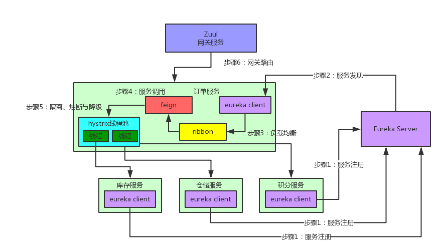
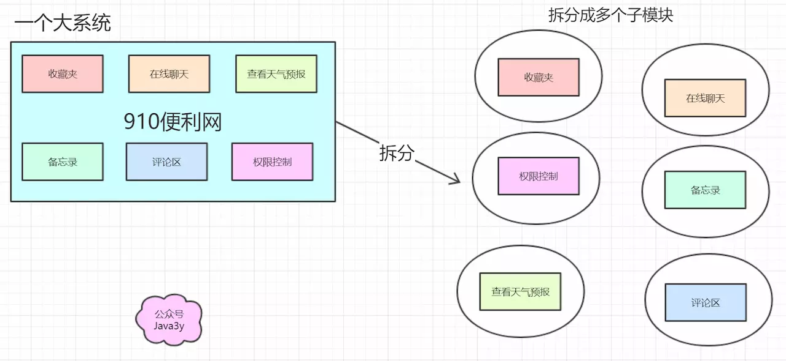
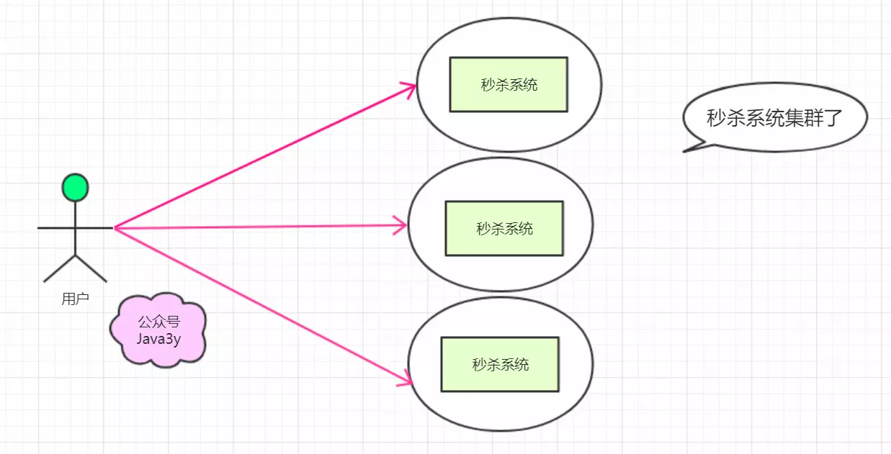
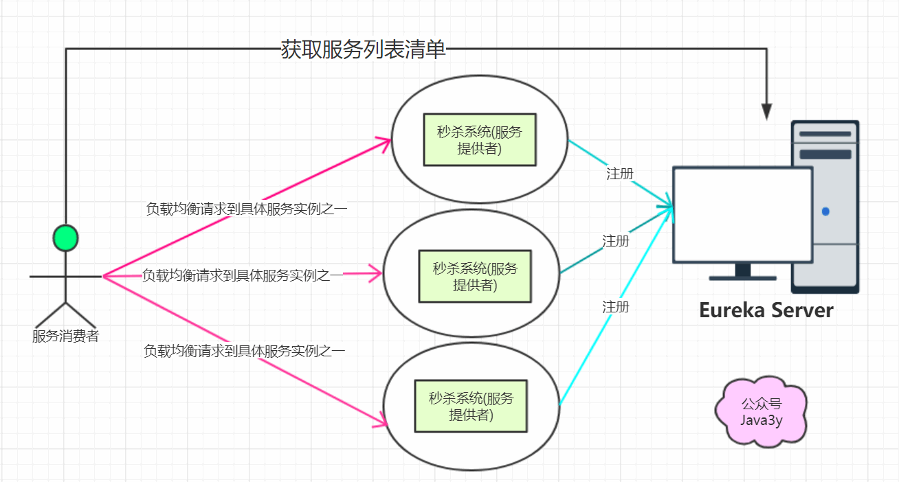
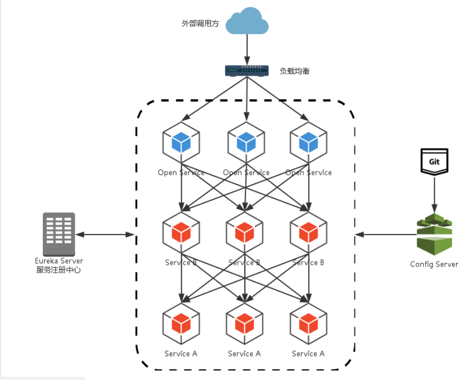

# spring-boot-actuator 

| HTTP方法 | 路径            | 描述                       | 鉴权  |
| -------- | --------------- | -------------------------- | ----- |
| GET      | /autoconfig     | 查看自动配置的使用情况     | true  |
| GET      | /configprops    | 查看配置属性，包括默认配置 | true  |
| GET      | /beans          | 查看bean及其关系列表       | true  |
| GET      | /dump           | 打印线程栈                 | true  |
| GET      | /env            | 查看所有环境变量           | true  |
| GET      | /env/{name}     | 查看具体变量值             | true  |
| GET      | /health         | 查看应用健康指标           | false |
| GET      | /info           | 查看应用信息               | false |
| GET      | /mappings       | 查看所有url映射            | true  |
| GET      | /metrics        | 查看应用基本指标           | true  |
| GET      | /metrics/{name} | 查看具体指标               | true  |
| POST     | /shutdown       | 关闭应用                   | true  |
|          | /trace          | 查看基本追踪信息           | true  |

# spring-cloud-config 

# spring-cloud-bus 

# spring-cloud-stream 

# spring-cloud-sleuth 

# spring-cloud-CLI

# 集群、分布式、微服务、SOA概念 

https://juejin.im/post/5b83466b6fb9a019b421cecc

- 集群：同一个业务，部署在多个服务器上（不同的服务器运行同样的代码，干同一件事）

- 分布式：一个业务分拆多个子业务，部署在不同的服务器上（不同的服务器，运行不同的代码，为了同一个目的）

  - > 有些模块的访问很低的（比如后台管理），那么可以：将每个模块抽取独立出来，访问量大的模块用好的服务器装着，没啥人访问的模块用差的服务器装着。这样的好处是：一、资源合理利用了（没人访问的模块用性能差的服务器，访问量大的模块单独提升性能就好了）二、耦合度降低了：每个模块独立出来，各干各的事（专业的人做专业的事），便于扩展

  - 特点：将系统功能拆分，模块之间独立，在使用的时候再将这些独立的模块组合起来就是一个系统了。

# 为什么需要springcloud 

- 拆分出多个模块以后，就会出现各种各样的问题，而springcloud提供了一整套的解决方案（这些模块是独立成一个子系统的（不同主机））
- springcloud的基础功能
  - 服务治理：springcloud eureka
  - 客户端负载均衡：spingcloud ribbon
  - 服务容错保护：springcloud hystrix
  - 声明式服务调用：springcloud feign
  - API网关服务：springcloud zuul
  - 分布式配置中心：springcloud config

# 引出Eureka 

- 子系统之间的通讯问题。（子系统与子系统之间不是在同一个环境下，那就需要远程调用，远程调用可能就会想到httpclient、webservice等等技术来实现）
- 那么代码中就显示通过IP地址调用，万一，调用IP地址变了，就需要手动更新调用IP地址了

## Eureka和zookeeper 区别 

- Zookeeper保证的是CP（一致性、容错性）；Eureka保证的是AP（可用性、容错性）
  - Eureka可以很好的应对因网络故障导致部分节点失去联系的情况，而不会像Zookeeper一样使得整个注册系统瘫痪
- Zookeeper有Leader和Follower角色，Eureka各个节点平等
- Zookeeper采用过半数存活原则，Eureka采用自我保护机制解决分区问题
- Eureka本质上是一个工程，而Zookeeper只是一个进程

## Eureka流程 

- 被调用服务Eureka Client组件：负责将这个服务的信息注册到Eureka Server中。即告诉Eureka server，自己在哪台机器上，监听着哪个端口。而Eureka Server是一个注册中心，里面有一个注册表，保存了各服务所在的机器和端口号。

- 调用服务也有Eureka Client组件，这个Eureka Client组件会找Eureka server问一下，被调用服务在哪台机器啊？监听着哪个端口啊？然后就可以把这些相关信息从Eureka Server的注册表中拉取到自己本地缓存起来。这时，调用服务就可以直接找自己本地的Eureka Client问一下被调用服务在哪台机器？监听哪个端口？收到响应后，紧接着就可以发送一个请求过去，调用被调用服务的那个接口。
  - Eureka Server：注册中心，里面有一个注册表，保存了各个服务所在的机器和端口号
  - Eureka Client：负责将这个服务的信息注册到Eureka Server中

# 引出RestTemplate和Ribbon

- > 三个秒杀系统合理摊分用户的请求（负载均衡），可能会想到nginx。
  >
  > 而springcloud 也支持负载均衡功能，只不过它是客户端的负载均衡，这个功能实现就是ribbon

- 负载均衡区分两种类型：

  - 客户端负载均衡：ribbon

    - 服务实例的清单在客户端，客户端进行负载均衡算法分配

      （客户端可以从eureka server中得到一份服务清单，在发送请求时通过负载均衡算法，在多个服务器之间选择一个进行访问）

  - 服务端负载均衡：nginx

    - 服务实例的清单在服务端，服务器进行负载均衡算法分配

## Ribbon是和Feign及Eureka紧密协作，流程如下

- > 被调用服务部署在多个机器上，Feign如何知道该请求哪台机器？
  >
  > Ribbon就是专门解决这个问题的。它的作用是负载均衡，会在每次请求时选择一台机器，均匀的把请求分发到各个机器上。
  >
  > Ribbon的负载均衡默认使用的最经典的Round Robin轮询算法。简单来说，就是如果调用服务对被调用服务发起10次请求，那就先让请求第一台机器，然后是第2台机器，第3台机器，第4台机器。。。接着再来一个循环，以此类推。

具体流程 ：

- 首先Ribbon会从Eureka Client里获取对应的服务注册表，也就知道了所有的服务都部署在哪台机器上，在监听哪些端口号
- 然后Ribbon就可以使用默认的Round Robin算法，从中选择一台机器
- Feign就会针对这台机器，构造并发起请求。

# 引出hystrix 

- > - 如果系统处于高并发的场景下，大量请求涌过来的时候，调用方服务的100个线程都会卡在请求的被调用方服务这块。导致调用方服务没有一个线程可以处理请求。
  > - 然后就会导致别人请求调用方服务的时候，发现调用方服务也挂了，不响应任何请求了。
  > - --》 这就是微服务架构中恐怖的服务雪崩问题。
  > - 多服务相互调用，要是不做任何保护的话，某一个服务挂了，就会引起连锁反应，导致别的服务也挂。比如积分服务挂了，会导致订单服务的线程全部卡在请求积分服务这里，没有一个线程可以工作，瞬间导致订单服务也挂了，别人请求订单服务全部会卡住，无法响应。

- > 在高并发的情况下，由于单个服务的延迟，可能导致所有的请求都处于延迟状态，甚至在几秒钟就使服务处于负载饱和的状态，资源耗尽，直到不可用，最终导致这个分布式系统都不可用，这就是“雪崩”。

- springcloud hystrix实现了断路器、线程隔离等一系列服务保护功能

  - 比如在5分钟内请求积分服务直接就返回，不要去走网络请求卡住几秒钟，这个过程，就是所谓的熔断。
  - 降级：每次调用积分服务，就在数据库里记录一条消息，说给某某用户增加了多少积分，因为积分服务挂了，导致没增加成功，这样等积分服务恢复了，你可以根据这些记录手工加一下积分，这个过程就是所谓的降级。

# 引出feign 

- > feign是一种声明式、模板块的http客户端。在springcloud中使用feign，我们可以做到使用http请求远程服务时能与调用本地方法一样的编码体验，开发者完全感知不到这是远程方法，更感知不到这是个http请求。

- @FeignClient，客户端，其中value为调用其它服务的名称

## Feign流程 

https://blog.csdn.net/weixin_40834464/article/details/88850523

- feign的一个关键机制就是使用了动态代理
  - 首先，如果你对某个接口定义了@FeignClient注解，Feign就会针对这个接口创建一个动态代理
  - 接着你要是调用那个接口，本质就是会调用Feign创建的动态代理（Feign动态代理实现InventoryService接口），这是核心中的核心
  - Feign的动态代理会根据你在接口上的@RequestMapping等注解，来动态构造出你要请求的服务地址
  - 最后针对这个地址，发起请求、解析响应

## 大坑 

- @EnableFeignClients("com.zhangbin.cloud.feign")要带上包路径，否则会报错

# 引出zuul 

- > 这样的架构会有两个比较麻烦的问题：
  >
  > - 路由规则与服务实例的维护问题：外层的负载均衡nginx需要维护所有的服务实例清单
  > - 签名校验、登录校验冗余问题：为了保证对外服务的安全性，我们在服务端实现的微服务接口，往往都会有一定的权限校验机制，但我们的服务是独立的，我们不得不在这些应用中都实现这样一套校验逻辑，这就会造成校验逻辑的冗余。

- Zuul，微服务网关：这个组件是负责网络路由的。如果前端、移动端要调用后端系统，统一从Zuul网关进入，由Zuul网关转发请求给对应的服务。

# 阿里分布式事务框架GTS 

## 什么是FESCAR 

- FESCAR是一种分布式事务解决方案，具有高性能和易用性的微服务框架

## FESCAR是怎么解决微服务中的分布式事务问题

- 在FESCAR项目中有3个基本组件
  - 事务协调员（TC）：维护全局和分支事务的状态，推动全局提交或回滚
  - 事务管理者（TM）：定义全局事务的范围：开始全局事务，提交或回滚全局事务
  - 资源管理器（RM）：管理分支事务处理的资源，与TC通信以注册分支事务和报告分支事务的状态，并驱动分支事务提交或回滚

- FESCAR管理分布式事务的典型生命周期
  - TM要求TC开始新的全局事务。TC生成表示全局事务的XID
  - XID通过微服务的调用链传播
  - RM将本地事务注册为XID到TC的相应全局事务的分支
  - TM要求TC提交或回滚XID的相应全局事务
  - TC在XID的相应全局事务下驱动所有分支事务以完成分支提交或rollbaking