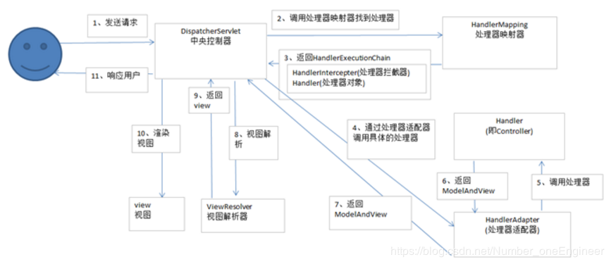

<http://www.luyixian.cn/news_show_261986.aspx>

# WebMvcConfigurer


> WebMvcConfigurationSupport：用它好像会导致springboot自动配置的内容失效：例如：UTF-8编码、表单校验等

```java

/**
 * 配置文件
 * @author zb
 * @date 2020/9/24 18:18
 */
@Configuration
public class WebConfig implements WebMvcConfigurer {

    /**
     * 统一系统编码
     * @param converters
     */
    @Override
    public void configureMessageConverters(List<HttpMessageConverter<?>> converters) {
        converters.add(new StringHttpMessageConverter(Charset.forName(StandardCharsets.UTF_8.name())));
    }

    /**
     * 全局日期转换器
     * @param registry
     */
    @Override
    public void addFormatters(FormatterRegistry registry) {
        registry.addConverter(new DateConverter());
    }

}
```

```java
package com.gzyouai.hummingbird.web.common.config;

import lombok.SneakyThrows;
import org.springframework.core.convert.converter.Converter;

import java.text.SimpleDateFormat;
import java.util.Date;

/**
 * 全局日期转换器
 * @author zb
 * @date 2020/9/24 17:41
 */
public class DateConverter  implements Converter<String,Date>{

    @SneakyThrows
    @Override
    public Date convert(String s) {
        SimpleDateFormat df = new SimpleDateFormat("yyyy-MM-dd HH:mm:ss");
        df.setLenient(false);
        return df.parse(s);
    }
}

```

