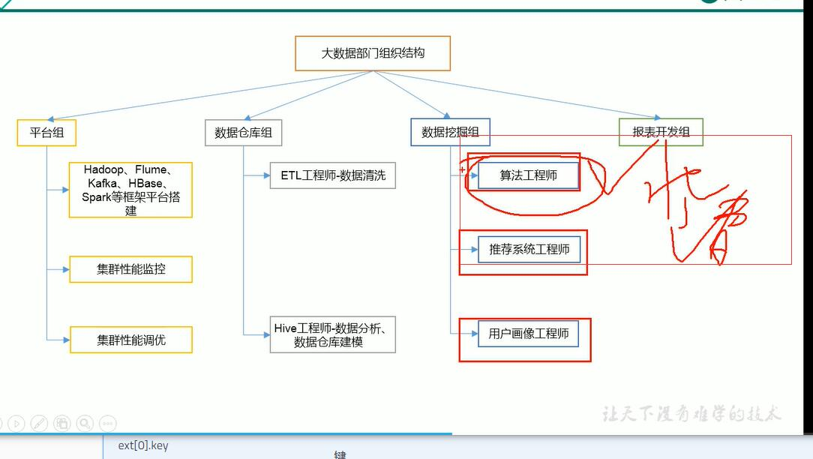

# 阿里云日志服务

## 步骤

https://help.aliyun.com/document_detail/54604.html

# OSS存储

> 日志服务--》数据处理--》oss投递

# EMR

https://help.aliyun.com/document_detail/43753.html?spm=a2c4g.11186623.6.569.7e216e3aUykFzW

# hadoop

> java-->linux-->shell-->hadoop-->hive-->kafka-->hbase-->spark-->flink
>
> scala