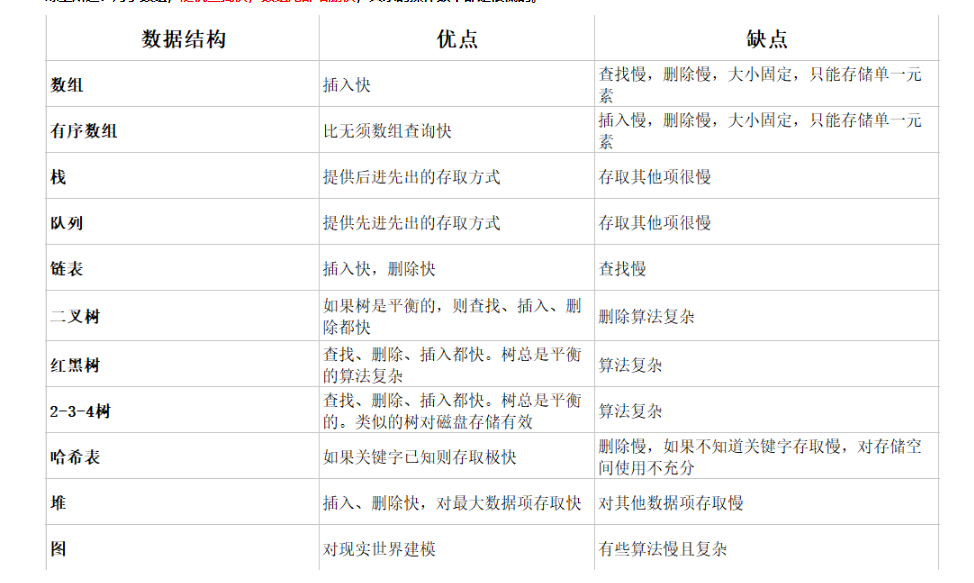

# 计算机基础 

- bit：二进制位（b）

- byte：字节(B)
  - 1B  = 8b

## 网络编程基础

- 网络编程就是使用IP地址或域名，和端口连接到另一台计算机上对应的程序，按照规定的协议（数据格式）来交换数据，实际编程中建立连接和发送、接收数据在语言级已经实现，做的更多的工作是设计协议，以及编写生成和解析数据的代码罢了，然后把数据转换成逻辑的结构显示或控制逻辑即可。

- 协议：传输数据的格式

# 线性结构

- 数组、队列、链表、栈

# 非线性结构

- 二维数组、多维数组、广义表、树结构、图结构

# 线性结构——数组Array

<https://blog.csdn.net/zh_android/article/details/89068754>

- 数组就是可以在**内存中存储多个元素**的结构，其中的**元素类型必须相同**，而且在**内存中是连续的**，数组的元素是通过数组的**下标访问**，不是从1开始，而是从0开始。
- 因为数组在存储数据时是按顺序存储的，存储数据的内存也是连续的，所以他的特点就是读取数据比较容易，插入和删除比较困难。简单解释是：在读取数据时，只需要告诉数组要从哪个位置（下标）取数据就可以了，数组就会直接把对应位置（下标）的数据取出来。
- 插入和删除比较困难是因为这些存储数据的内存是连续的，要插入和删除就需要变更整个数组中的数据的位置。
- 优点：
  - 按照索引（下标）查询速度快，遍历数组方便
- 缺点：
  - 数组只能存储一种类型的元素
  - 数组大小定义完之后固定，无法扩容
  - 添加和删除的操作慢，因为数组内存地址是连续的，需要移动其它元素
- 数组适用于频繁查询，对存储空间要求不大，而且很少删除和增加元素的情况。

# 线性结构——栈Stack

- 栈只允许在栈顶进行操作，栈底不允许操作。（相当于一个桶）
- 栈的特点是：先进后出，或后进先出。
- 在栈顶放入元素的操作时入栈，取出元素的操作时出栈

# 线性结构——链表Linked List

- 链表是存储单元上**不连续**的存储结构，数据元素的**逻辑顺序**是通过**链表的指针地址**来实现的。
- 每个元素包含两个节点。
  - 一个节点是存储元素的**数据域**
  - 一个节点是指向下一个节点的**指针域**。
- 所以根据指针的指向，可以形成不同的结构，例如：单链表、双向链表、循环链表
- 链表是由一系列的节点组成，这些节点不必在内存中连续，当添加和删除元素的时候，只需要改变相关节点的指针指向即可，效率很高。
- 优点：
  - 不需要初始化容量，可以任意增减元素
  - 添加或删除元素时，只需要改变前后两个元素的指针指向即可，删除和添加元素会很快
- 缺点：
  - 查找元素需要遍历链表来实现，很耗时
  - 链表存在大量的指针域，占用空间大

## 单链表

- 最后一个节点的指针域设置为空（NULL），作为链表的结束标志，表示它没有后继节点

## 双向链表

- 每个节点的指针域都有两个指针，分别指向它的后继和前驱，所以，从任意节点开始，都能方便的访问它的前驱节点和后继节点。

### 可是为什么市场上单链表的使用多余双链表呢？

从存储结构来看，每个双链表的节点要比单链表的节点多一个指针，而长度为n就需要 n*length（这个指针的length在32位系统中是4字节，在64位系统中是8个字节） 的空间，这在一些追求时间效率不高应用下并不适应，因为它占用空间大于单链表所占用的空间；这时设计者就会采用以时间换空间的做法，这时一种工程总体上的衡量。
https://blog.csdn.net/kangxidagege/article/details/80211225

## 循环链表

- 从单链表可知，最后一个节点的指针域指向NULL，当我们将尾指针指向头节点，那么就形成了一个循环链表

# 线性结构——队列Queue

- 队列类似于栈，不同的是队列是在一端增加元素，在另一端取出元素（相当于一根水管）
- 特点是：先入先出，后入后出
- 放入元素的操作被称为入队，取出元素的操作被称为出队

# 非线性结构——树Tree

# 各类数据结构比较

