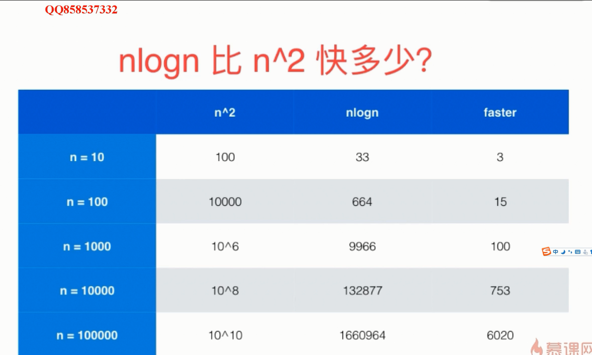
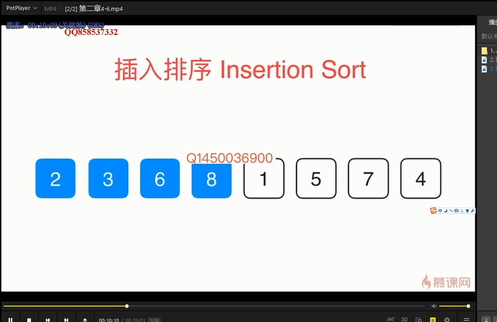
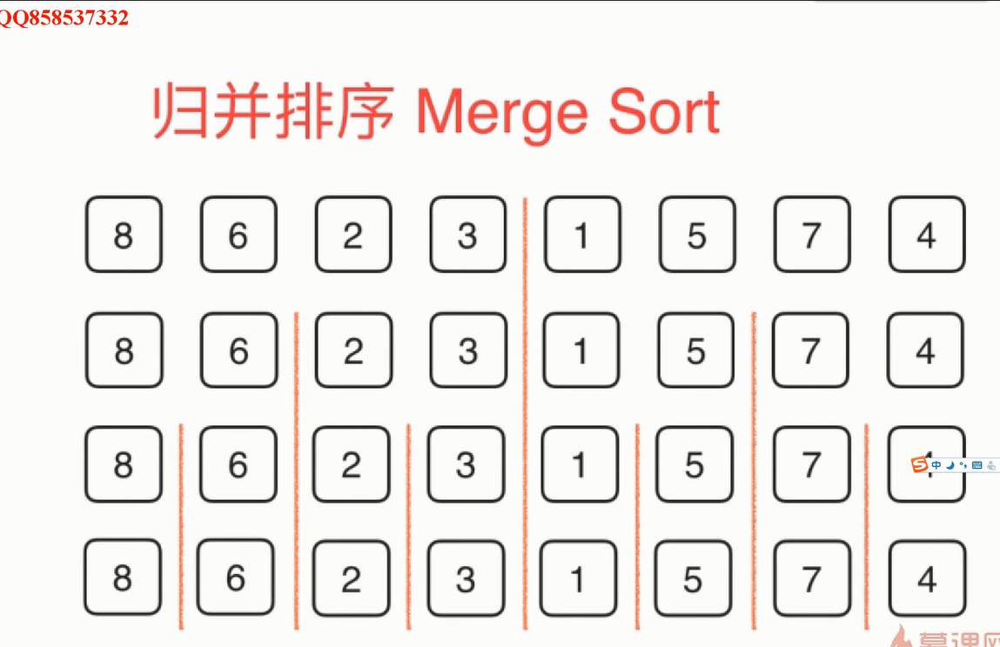
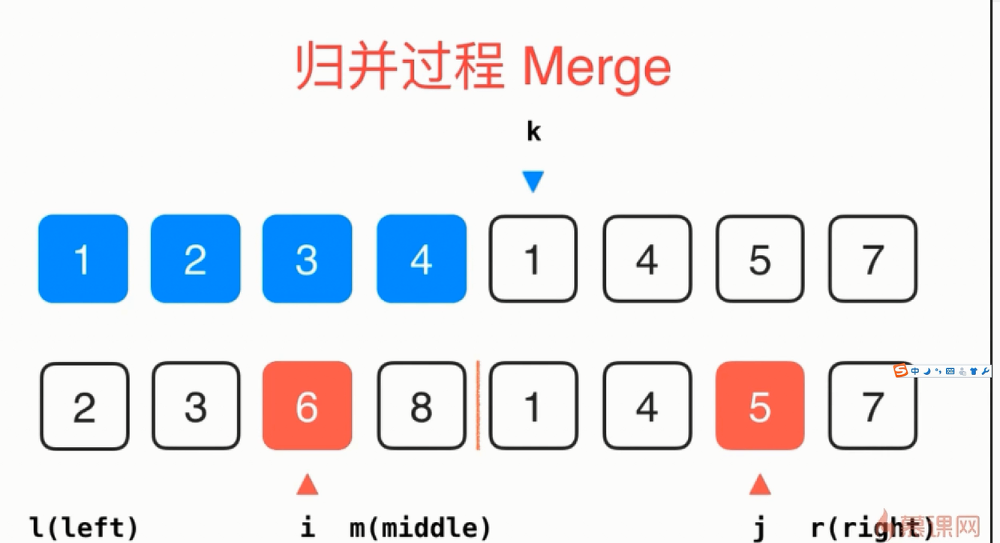
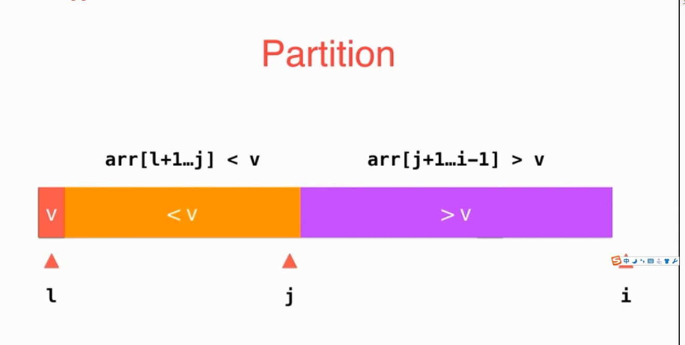
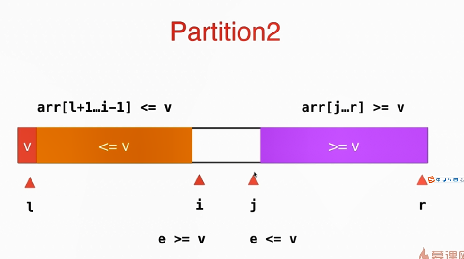
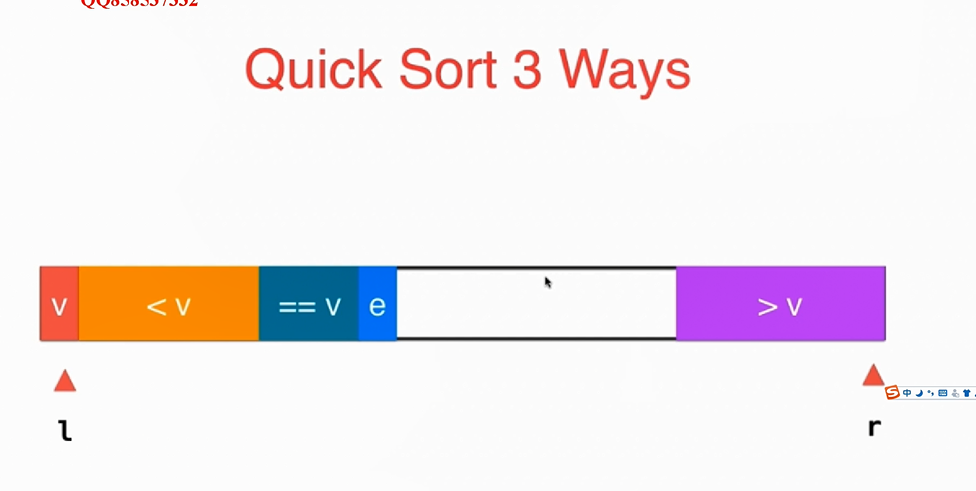
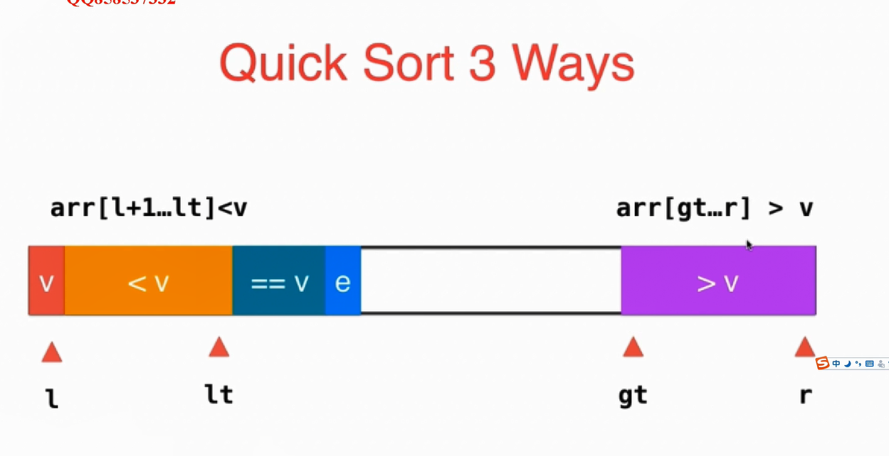
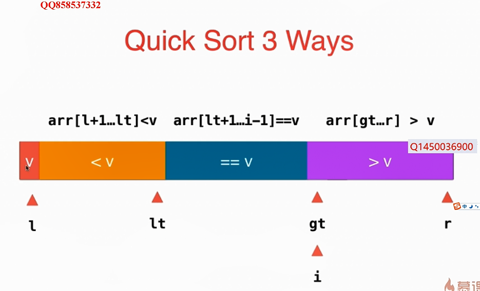

# 排序算法

  

## O（n^2）的排序算法

### 选择排序算法（selection sort）

算法的性能（执行时间）如下：

```java
	@Test
	public void test2() {
		selectSort(arr);
	}
	/**
	*选择算法排序 ：先选出最小的，然后填在对应的位置上,然后选出第二小的，放在第二个位置，依次类推
	*/
	private void selectSort(int[] arr) {
		for (int i = 0; i < arr.length - 1; i++) {
			for (int j = i + 1; j < arr.length; j++) {
				if (arr[i] > arr[j]) {
					int temp = 0;
					temp = arr[i];
					arr[i] = arr[j];
					arr[j] = temp;
				}
			}
		}
		// printArr(arr);
	}

/**
	 * 选择排序算法，对应数据所需要的时间
	 */
	@Test
	public void test3() { 
		int[] num = getNum(100000);
		long startTime = System.currentTimeMillis();
		selectSort(num);// 9 13 22 37 42 42 52 57 66 70
		// 1 25 27 29 42 46 57 58 67 98
		long endTime = System.currentTimeMillis();
		System.out.println(endTime - startTime);// 1000:5毫秒；10000：72毫秒 ；100000：2206毫秒
		// printArr(num);
	}

	@Test
	public void test4() {
		int[] num = getNum(1000);
		LocalDateTime startTime = LocalDateTime.now();
		selectSort(num);
		LocalDateTime endTime = LocalDateTime.now();
		System.out.println(Duration.between(startTime, endTime).toMillis());// 1000:7毫秒；10000：70毫秒 ；100000：2289毫秒
	}

```

### 插入排序算法（Insertion Sort）

**核心：内循环满足条件可提前终止** 

所以对于大部分有序的数据，插入排序算法效率快很多




```java
/**
	 * 插入排序：第一个位置不动，前一个位置与第一个位置对比，找到适合位置，然后后面一个在和前面的对比，直到找到合适位置，然后终止循环（类似扑克牌理牌一样）
	 * 
	 * @param arr
	 */
	private void insertionSort(int[] arr) {
		for (int i = 1; i < arr.length; i++) {
			for (int j = i; j > 0; j--) {
				if (arr[j] < arr[j - 1])
					swap(arr, j, j - 1);
				else
					break;
			}
		}
	}

	@Test
	public void test6() {
		insertionSort(arr);// 2 3 4 5 6 9 11 12
		printArr(arr);
	}

	@Test
	public void test5() {
		int[] num = getNum(NUM);
		LocalDateTime startTime = LocalDateTime.now();
		insertionSort(num);
		LocalDateTime endTime = LocalDateTime.now();
		System.out.println(Duration.between(startTime, endTime).toMillis());// 1000:4毫秒；10000：55毫秒 ；100000：4838 毫秒
	}
```

由上例子可知，100000数量的排序，选择排序算法的速度比插入排序算法快（原因是：插入排序算法，在遍历的同时也在交换位置，交换操作比较耗时）

优化策略：（一次交换变成三次赋值）


```java
@Test
	public void test7() {
		int[] num = getNum(NUM);
		LocalDateTime startTime = LocalDateTime.now();
		insertionSort2(num);
		LocalDateTime endTime = LocalDateTime.now();
		System.out.println(Duration.between(startTime, endTime).toMillis());// 1000:4毫秒；10000：31毫秒 ；100000：2349 毫秒
	}

	/**
	 * 优化插入排序算法
	 */
	private void insertionSort2(int[] arr) {
		for (int i = 1; i < arr.length; i++) {
			int temp = arr[i];
			int j;
			for (j = i; j > 0; j--) {
				if (temp < arr[j - 1]) {
					arr[j] = arr[j - 1];
				} else
					break;
			}
			arr[j] = temp;
		}
	}
```

```java
	@Test
	public void test8() {
		int[] num = getNum(NUM);
		int[] num1 = new int[NUM];
		int[] num2 = new int[NUM];
		for (int i = 0; i < num.length; i++) {
			num1[i] = num[i];
			num2[i] = num[i];
		}
		LocalDateTime startTime2 = LocalDateTime.now();
		insertionSort2(num2);
		LocalDateTime endTime2 = LocalDateTime.now();
		System.out.println("优化后插入算法insertionSort2:" + Duration.between(startTime2, endTime2).toMillis());// 1000:5毫秒；10000：26毫秒
		// ；100000：2727 毫秒

		LocalDateTime startTime1 = LocalDateTime.now();
		selectSort(num1);
		LocalDateTime endTime1 = LocalDateTime.now();
		System.out.println("选择算法selectSort:" + Duration.between(startTime1, endTime1).toMillis());// 1000:8毫秒；10000：75毫秒
		// ；100000：5953 毫秒

		LocalDateTime startTime = LocalDateTime.now();
		insertionSort(num);
		LocalDateTime endTime = LocalDateTime.now();
		System.out.println("插入算法insertionSort:" + Duration.between(startTime, endTime).toMillis());// 1000:5毫秒；10000：53毫秒
		// ；100000：4582 毫秒
	}
```


### 冒泡排序算法（Bubble Sort）


### 希尔排序算法（Shell Sort）

插入排序算法的延伸（思想差不多）


## O（n*log n）的排序算法

### 归并排序

核心：递归排序的过程


#### 使用递归实现自顶向下的归并排序

 





```java
/**
	 * 归并算法 递归使用归并排序，对arr[l...r]的范围进行排序
	 * （注意边界问题，l为开始位置，r为最后一个位置，前闭后闭）
	 * @param arr
	 */
	public void mergeSort(int[] arr, int l, int r) {
		if (l >= r)
			return;
		int mid = (l + r) / 2;
		mergeSort(arr, l, mid);//递归排序
		mergeSort(arr, mid + 1, r);
		if (arr[mid] > arr[mid + 1]) {// 判断是否是有序数据的排序，无序时才继续合并（优化1）
			merge(arr, l, mid, r);//合并排序
		}
      //对于小数据的排序可以用插入算法来排序（优化2）
  	 /** if(r-l<=15){
        insertionSort2(arr,l,r);
        return;
      }
      */
	}

	private void merge(int[] arr, int l, int mid, int r) {
		int[] aux = new int[r - l + 1];//临时复制出来的变量存放原来的数组
		for (int i = l; i <= r; i++)
			aux[i - l] = arr[i];//l是偏移量，而aux是要从0位置开始赋值
		int i = l, j = mid + 1;
		for (int k = l; k <= r; k++) {
			if (i > mid) {//判断i和j的范围是否满足
				arr[k] = aux[j - l];
				j++;
			} else if (j > r) { 
				arr[k] = aux[i - l];
				i++;
			} else if (aux[i - l] < aux[j - l]) {//判断左边右边那个数据比较小，小的填到对应的位置
				arr[k] = aux[i - l];
				i++;
			} else {
				arr[k] = aux[j - l];
				j++;
			}
		}
	}
```


 ```java
/**
	 * 归并算法mergeSort:24 
	 * 优化后插入算法insertionSort2:2820
	 * 选择算法selectSort:6741
	 * 插入算法insertionSort:5039
	 * 
	 */
	@Test
	public void test8() {
		int[] num = getNum(NUM);
		int[] num1 = new int[NUM];
		int[] num2 = new int[NUM];
		int[] num3 = new int[NUM];
		for (int i = 0; i < num.length; i++) {
			num1[i] = num[i];
			num2[i] = num[i];
			num3[i] = num[i];
		}
		LocalDateTime startTime3 = LocalDateTime.now();
		mergeSort(num3, 0, num3.length - 1);
		LocalDateTime endTime3 = LocalDateTime.now();
		System.out.println("归并算法mergeSort:" + Duration.between(startTime3, endTime3).toMillis());// 1000:1毫秒；10000：5毫秒
		// ；100000：25 毫秒

		LocalDateTime startTime2 = LocalDateTime.now();
		insertionSort2(num2);
		LocalDateTime endTime2 = LocalDateTime.now();
		System.out.println("优化后插入算法insertionSort2:" + Duration.between(startTime2, endTime2).toMillis());// 1000:5毫秒；10000：26毫秒
		// ；100000：2727 毫秒

		LocalDateTime startTime1 = LocalDateTime.now();
		selectSort(num1);
		LocalDateTime endTime1 = LocalDateTime.now();
		System.out.println("选择算法selectSort:" + Duration.between(startTime1, endTime1).toMillis());// 1000:8毫秒；10000：75毫秒
		// ；100000：5953 毫秒

		LocalDateTime startTime = LocalDateTime.now();
		insertionSort(num);
		LocalDateTime endTime = LocalDateTime.now();
		System.out.println("插入算法insertionSort:" + Duration.between(startTime, endTime).toMillis());// 1000:5毫秒；10000：53毫秒
		// ；100000：4582 毫秒
	}

 ```


#### 自底向上归并排序

```java
/**
	 * 自底向上归并排序
	 * 
	 * @param arr
	 */
	public void mergeSortBu(int[] arr) {
		int n = arr.length;
		for (int sz = 1; sz <= n; sz += sz) {
			for (int i = 0; i + sz < n; i += sz + sz) {
				merge(arr, i, i + sz - 1, (i + sz + sz - 1) < (n - 1) ? (i + sz + sz - 1) : (n - 1));
			}
		}
	}
```

```java
/**
	 * 归并算法mergeSort:24 优化后插入算法insertionSort2:2820 选择算法selectSort:6741
	 * 插入算法insertionSort:5039
	 * 
	 */
	@Test
	public void test8() {
		int[] num = getNum(NUM);
		int[] num1 = new int[NUM];
		int[] num2 = new int[NUM];
		int[] num3 = new int[NUM];
		int[] num4 = new int[NUM];
		for (int i = 0; i < num.length; i++) {
			num1[i] = num[i];
			num2[i] = num[i];
			num3[i] = num[i];
			num4[i] = num[i];
		}
		LocalDateTime startTime3 = LocalDateTime.now();
		mergeSort(num3, 0, num3.length - 1);
		LocalDateTime endTime3 = LocalDateTime.now();
		System.out.println("自顶向下归并算法mergeSort:" + Duration.between(startTime3, endTime3).toMillis());// 1000:1毫秒；10000：5毫秒
		// ；100000：25 毫秒

		LocalDateTime startTime2 = LocalDateTime.now();
		insertionSort2(num2);
		LocalDateTime endTime2 = LocalDateTime.now();
		System.out.println("优化后插入算法insertionSort2:" + Duration.between(startTime2, endTime2).toMillis());// 1000:5毫秒；10000：26毫秒
		// ；100000：2727 毫秒

		LocalDateTime startTime1 = LocalDateTime.now();
		selectSort(num1);
		LocalDateTime endTime1 = LocalDateTime.now();
		System.out.println("选择算法selectSort:" + Duration.between(startTime1, endTime1).toMillis());// 1000:8毫秒；10000：75毫秒
		// ；100000：5953 毫秒

		LocalDateTime startTime = LocalDateTime.now();
		insertionSort(num);
		LocalDateTime endTime = LocalDateTime.now();
		System.out.println("插入算法insertionSort:" + Duration.between(startTime, endTime).toMillis());// 1000:5毫秒；10000：53毫秒
		// ；100000：4582 毫秒

		LocalDateTime startTime4 = LocalDateTime.now();
		mergeSortBu(num4);
		LocalDateTime endTime4 = LocalDateTime.now();
		System.out.println("自底向上归并算法mergeSortBu:" + Duration.between(startTime4, endTime4).toMillis());// 1000:0毫秒；10000：2毫秒
		// ；100000：23 毫秒
	}
```

### 快速排序


 





```java
/**
	 * 快速排序算法:利用递归，对arr[l...r]部分进行快速排序
	 * 
	 * @param arr
	 */
	public void quickSort(int[] arr, int l, int r) {
		if (l >= r)
			return;
		int p = partition(arr, l, r);//1 2 3 4 6 5 7 8 p=3
		quickSort(arr, l, p - 1);//1 2 3
		quickSort(arr, p + 1, r); //6 5 7 8

	}

	/**
	 * 对arr[l,r]部分进行partition操作
	 * 
	 * @param arr
	 * @param l
	 * @param r
	 * @return 返回p ,使得arr[l...p-1]<arr[p];arr[p+1...r]>arr[p]
	 */
	private int partition(int[] arr, int l, int r) {
		int v = arr[l];
		// arr[l+1...j]<v;arr[j+1...i)>v
		int j = l;
		for (int i = l + 1; i <= r; i++) {
			if (arr[i] < v) {
				swap(arr, j + 1, i);
				j++;
			}
		}
		swap(arr, l, j);
		return j;
	}
```

```java
/**
	 * 快速算法quickSort:18
*自顶向下归并算法mergeSort:31
*优化后插入算法insertionSort2:3627
*选择算法selectSort:2864
*插入算法insertionSort:5559
*自底向上归并算法mergeSortBu:23
	 * 
	 */
@Test
public void test8() {
  int[] num = getNum(NUM);
  int[] num1 = new int[NUM];
  int[] num2 = new int[NUM];
  int[] num3 = new int[NUM];
  int[] num4 = new int[NUM];
  int[] num5 = new int[NUM];
  for (int i = 0; i < num.length; i++) {
    num1[i] = num[i];
    num2[i] = num[i];
    num3[i] = num[i];
    num4[i] = num[i];
    num5[i] = num[i];
  }
  LocalDateTime startTime5 = LocalDateTime.now();
  quickSort(num5, 0, num5.length - 1);
  LocalDateTime endTime5 = LocalDateTime.now();
  System.out.println("快速算法quickSort:" + Duration.between(startTime5, endTime5).toMillis());// 1000:1毫秒；10000：7毫秒
  // ；100000：18 毫秒
  LocalDateTime startTime3 = LocalDateTime.now();
  mergeSort(num3, 0, num3.length - 1);
  LocalDateTime endTime3 = LocalDateTime.now();
  System.out.println("自顶向下归并算法mergeSort:" + Duration.between(startTime3, endTime3).toMillis());// 1000:1毫秒；10000：8毫秒
  // ；100000：25 毫秒

  LocalDateTime startTime2 = LocalDateTime.now();
  insertionSort2(num2);
  LocalDateTime endTime2 = LocalDateTime.now();
  System.out.println("优化后插入算法insertionSort2:" + Duration.between(startTime2, endTime2).toMillis());// 1000:5毫秒；10000：26毫秒
  // ；100000：2727 毫秒

  LocalDateTime startTime1 = LocalDateTime.now();
  selectSort(num1);
  LocalDateTime endTime1 = LocalDateTime.now();
  System.out.println("选择算法selectSort:" + Duration.between(startTime1, endTime1).toMillis());// 1000:8毫秒；10000：75毫秒
  // ；100000：5953 毫秒

  LocalDateTime startTime = LocalDateTime.now();
  insertionSort(num);
  LocalDateTime endTime = LocalDateTime.now();
  System.out.println("插入算法insertionSort:" + Duration.between(startTime, endTime).toMillis());// 1000:5毫秒；10000：53毫秒
  // ；100000：4582 毫秒

  LocalDateTime startTime4 = LocalDateTime.now();
  mergeSortBu(num4);
  LocalDateTime endTime4 = LocalDateTime.now();
  System.out.println("自底向上归并算法mergeSortBu:" + Duration.between(startTime4, endTime4).toMillis());// 1000:0毫秒；10000：2毫秒
  // ；100000：23 毫秒

}
```


优化1：对于数量小的数组可做判断，然后用插入排序算法

#### 随机化快速排序

优化2：（可随机选择一个，而不是选择第一个，然后交换位置，原来代码不变 ）


#### 双路快速排序法




```java
	private int partition2(int[] arr, int l, int r) {
		int v = arr[l];
		// arr[l+1...i)<=v;arr(j...r]>=v
		int i = l + 1, j = r;
		while (true) {
			while (i <= r && arr[i] < v)
				i++;
			while (j >= l + 1 && arr[j] > v)
				j--;
			if (i > j)
				break;
			swap(arr, i, j);
			i++;
			j--;
		}
		swap(arr, l, j);
		return j;
	}
```


#### 三路快速排序法

 










### 二叉树 

- 二叉树整合了有序数组和链表的优点。在一个有序数组中，查找的时间复杂度为O(logN)，但是插入和添加操作的比较慢。在链表中，插入和删除操作的时间复杂度比较快，为O(1)，但是查找比较慢，时间复杂度为O(N)。
  - 二叉树结合了有序数组的查找块和链表的添加、删除快的优点
- 


