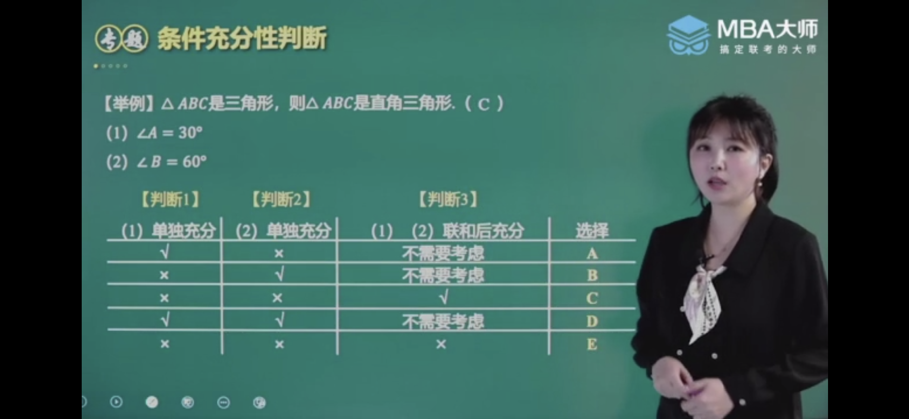
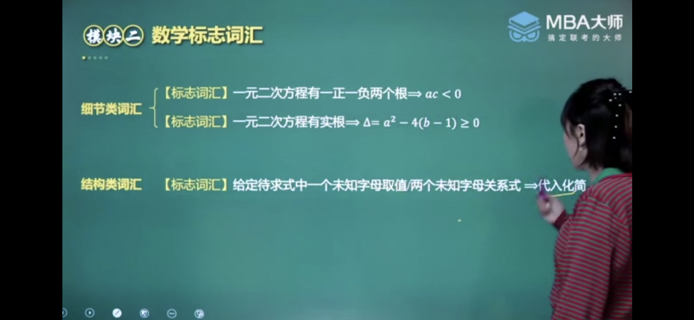
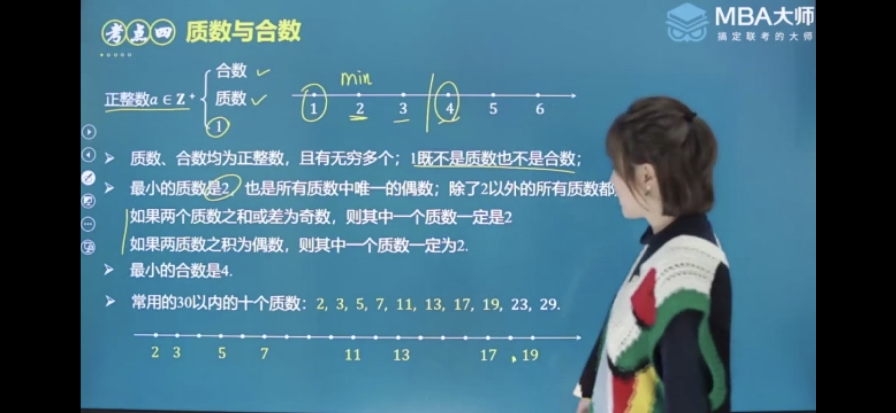
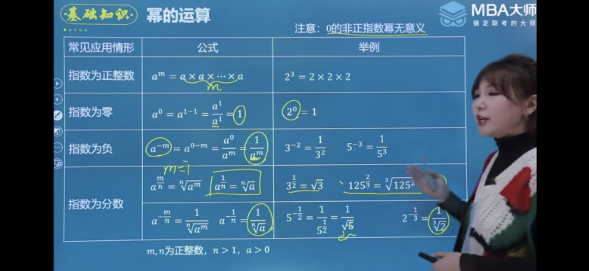

> 问题求解15题
>
> 条件充分性判断10题
>
> - <=55分钟
> - 总分75分：60~69分 

# 条件充分性判断

- **在大前提下，+条件，判断是否支持结论**

- **如果A成立，则B必然成立，则A就叫做B的充分条件**

- > A -->B ：条件是小的，结论是大的，就是充分的，所有都必然（所有的A都必然在B里面的）小圈推大圈
  >
  > - 联合时取重叠部分

# 数学标志词汇

# 第一章 应用题

## 比与比例：见比设k、能列乘法不列除法

两个数相除，又叫两个数的比，记为a:b 或a/b

> 正比：y=kx 比值为定值
>
> 反比：y=k/x 乘积为定值
>
> 注意：并不是x和y同时增大或减小才称为正比

### 两项间的比

### 三项间的比  

# 第二章 整数、有理数、实数

## 公式

- (a+b)(a-b)=a^2-b^2
- ab = (a,b)[a,b]

## 最大公因数（a,b）、最小公倍数[a,b]、ab = (a,b)*[a,b]

## 质数与合数

- 质数：除了1，另一个因数为本身，就是质数

## 奇数与偶数

## 分数与小数

### 错位相减

### 裂项相消

### 

## 有理数与无理数

- 无理数：无限不循环的数

### 实数与数轴

#### 整数与小数部分

### 二次根式

### 分母有理化

> 常用于化整求值

### 分子有理化

> 常用于比较大小

# 第三章 整式的运算

## 幂的运算

- a^m  * a^n = a^(m+n)
- a^m  /  a^n = a^(m-n)
- (ab)^n = a^n * b^n
- (a^m)^n = a^(m*n)

## 恒等变形

### 因式定理

### 余式定理

### 十字相乘

## 分式

分式的通分与化简