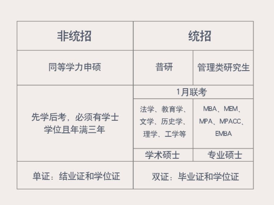
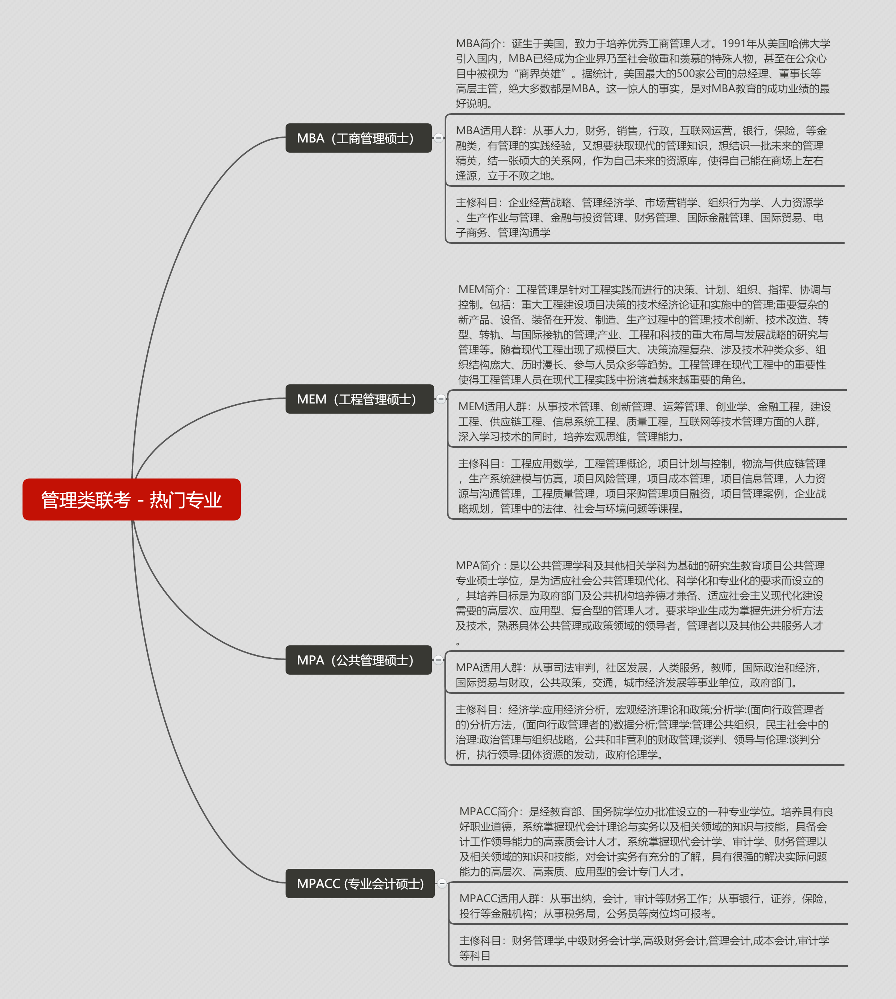
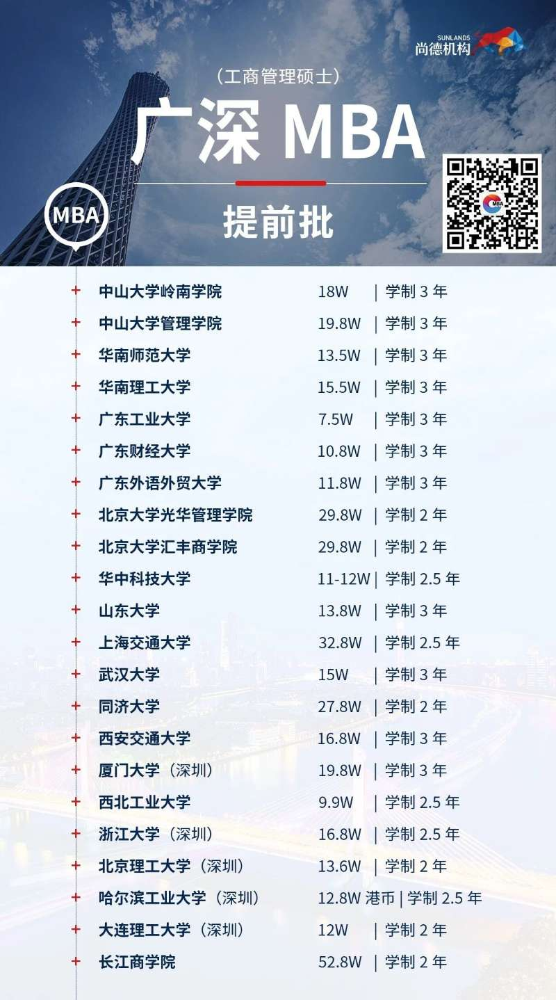
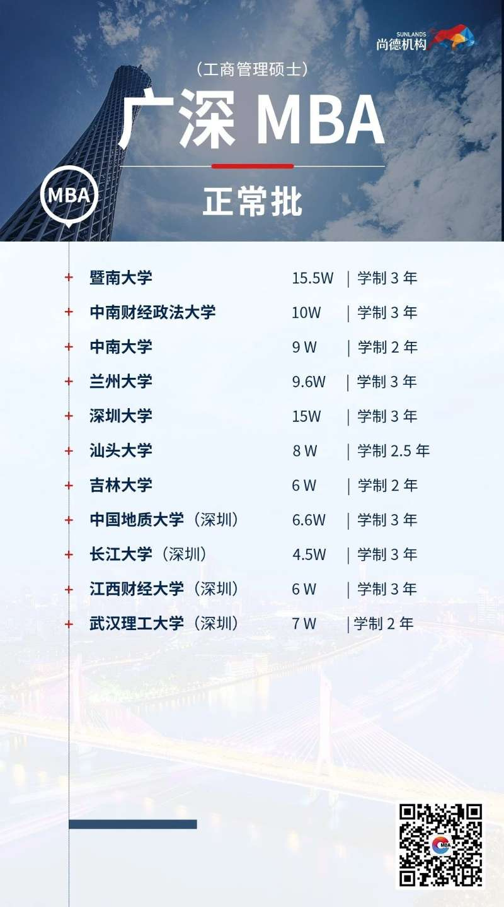
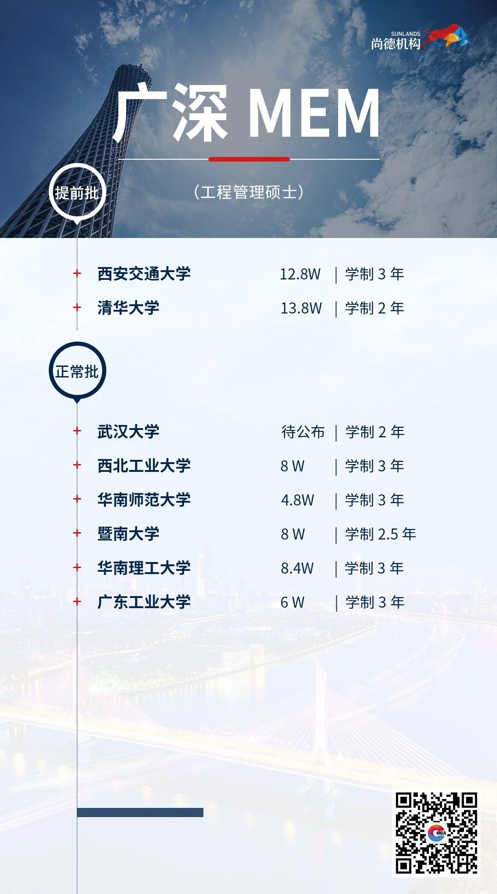
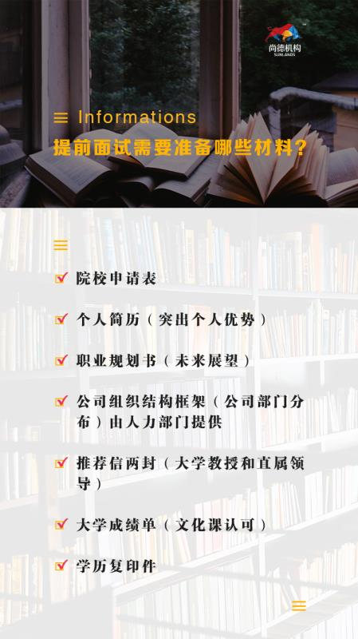
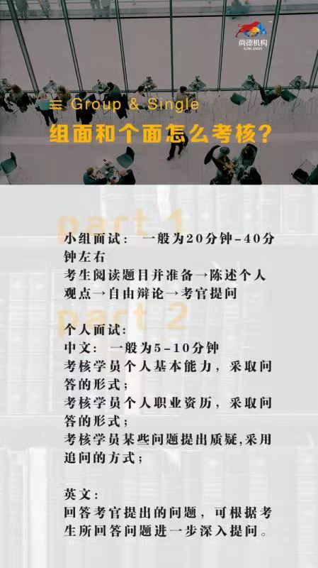
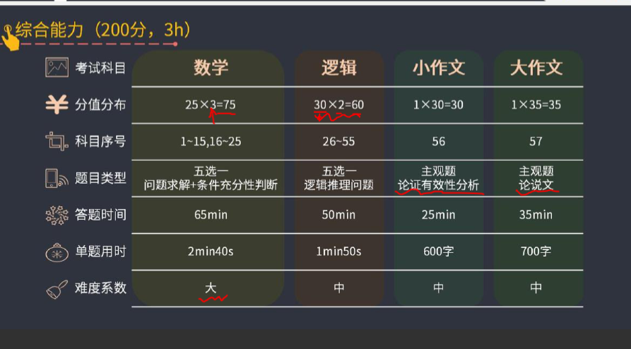
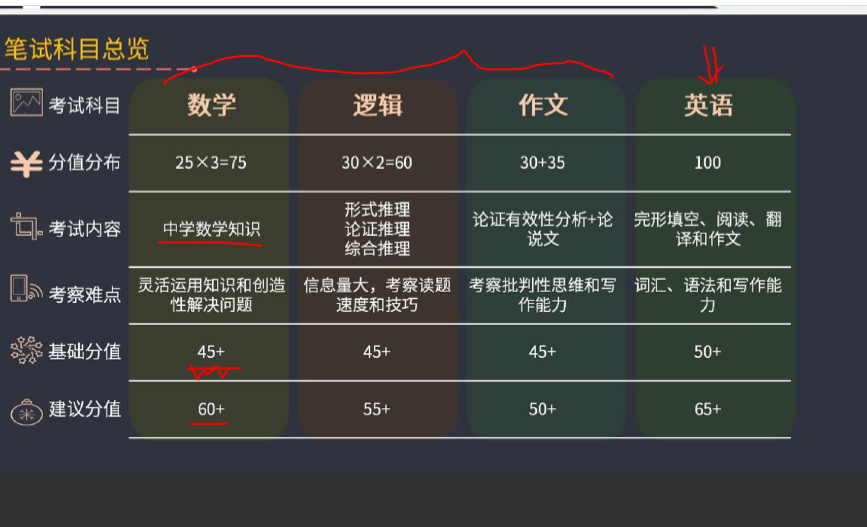

- 4-10月份提前面试
1. 10月报名：先填志愿再考试
2. 11月份现场确认
3. 12月份中打印准考证考试
4. 调剂
5. 3月份复试
6. 面试通过+笔试过线=直接录取

1. 提前面试学校、时间、备考条件、历年分数线
2. 考试科目总分300分上午3小时下午3小时：综合200分（数学75分，逻辑60分，写作65分）、英语100分（逻辑：46	数学：51	写作：43	英语：50=190）
	a. 数学25*3：问题求解、条件充分性判断
	b. 逻辑30*2选择题：
	c. 写作：600字论证有效性分析30分、700字论说文35分
	d. 英语二：

- 个人面试主要考核分为四个维度：（即学历背景，职业能力，管理认知，社会现象）对学员进行综合评定。职业能力包含（表达能力  抗压能力  决策能力 逻辑能力）
  - 管理类专门针对的在职人群 工作经验的人群。是开放式问答形式的考察，对您进行面试，3V1的面试，一般是人力总监，大学教授，500强高管。

> 往年提面时间
> 广州：
> 广工：6.18；6.30；10.8w √
> 中大岭南211：25.5w
> 中大管理211：25.5w
> 华南理工211：20w √
> 暨大211：20w √
> 广外：6.10；6.29；16.8w √
> 华师211：6.10；6.29；18w √
> 广财：6.12；7.14；13.8w √
>
>
> 深圳：
> 北大汇丰211：6.1；6.20；39.8w
> 北大光华211：4.15；5.23；39.8w
> 清华大学211：4.3；
> 同济211：6.4；6.19；36.8w
> 上海交通211：5.17；5.29；45.8w
> 浙江大学211：8.9；8.22；27.8w
> 西交211：无；7.11；18.8w √
> 北京理工211：8.10；8.23；18.6w √
> 哈工211：23.8w 
> 西工大211：16.8w √
> 武大211：19.8w √
> 大连理工211：16w √
> 华中科技大学211:15w √
>
>
> 山东大学：13.8w
> 厦门大学：19.8w

# 提前面试

## 材料

- 申请短文
- 背景材料
  - 教育：毕业院校、所学专业、大学获奖情况、参与社团活动情况、英语水平
  - 任职技术：业务相关资格证书、专业技能证书
  - 职业历程：（主要业绩）（对每一份工作细节的梳理及关联，以及对职业规划的影响、管理能力、公司价值）
- 职业规划
- 组织架构
  - 可以根据自己的经验画：自己的职能离官方架构图相差太远，可以自己画
- 推荐信
- 大学成绩单
- 学历复印件

## 面试

- 自荐（1~3分钟）
  - 个人基本信息（哪一年毕业于哪一所大学）
  - 工作简历（工作成绩，不能一概而论地介绍公司和工作职责）
  - 短期和中长期职业生涯规划
  - 申请MBA理由以及申请贵校MBA的理由

#### 武汉大学

- 政治面试
  - 一对一方式，考官提问、考生回答。面试时间不超过3分钟
  - 主要考察考生的思想素养，对党和国家方针政策的理解及运用政策分析和解决问题的能力
- 英语面试
  - 一对一方式，英语自我介绍，面试时间不超过2分钟
- 综合面试
  - 小组对小组方式，每小组约为15分钟。重点考察基础知识、组织和领导能力、团队协作能力等。

#### 华中科技大学

> 在制造业和供应链管理方面具有明显优势，是全国MBA“生产运作管理”教师培训负责单位

- 无领导小组讨论面试

#### 西北工业大学

#### 北京理工大学

#### 西安交通大学

- 网上个面

#### 中南大学

#### 中南财经政法大学

### 华南师范

#### 广东外语

#### 广东财经

#### 广东工业

### 自我介绍

​	各位老师，大家好！我叫张斌，29岁，2016年以云南省优秀毕业生及校优秀毕业生毕业于云南师范大学商学院电子信息科学与技术专业，双学位毕业于云南师范大学教育学专业，有5年IT行业经验，其中三年的技术，两年的管理经验，

### 提问

管理类（https://zhuanlan.zhihu.com/p/349260575）

（1）你们部门目前有几个人，是怎么分工的，怎么考核的？

（2）团队有多少人，是怎么管理的，团队成员对你的评价；

（3）举例说说如何在现有的基础上拓展业务；

（4）如何处理工作进程中突发状况

行业理解、公司战略类

（1）你们的公司企业文化是什么？

（2）公司的业务主要是什么，公司在行业里的优势劣势；

（3）你现在公司情况，未来发展可能会遇到的瓶颈；

职业规划类

（1）你的人生理想和你的人生规划是什么？

（2）你的工作调动是怎么考虑的，基于什么原因做的这种转换；

（3）想象一下15年后，别人会用什么词汇来形容你；

工作经历、业绩类

（1）你们公司在你这个专业只招一个人，为什么就选你了？你是非专业的；

（2）两次跳槽是不是逃避什么？

（3）你之前有过许多销售冠军的经历，为什么你会做的比别人好，相比其他销售你有什么独特的优势？

个人能力类

1）最有成就感的事情是什么？工作中作的不够好的一件事情？

（2）讲述最成功和失败的一件事；

（3）你的建议和思路及创新观点，如何让领导接受？

（4）平时有和同事发生冲突吗？最近一次发生冲突是什么情况，你如何处理的？

（5）你和下属在工作中会有什么问题吗，比如说你年纪轻、经验不足，你是怎么看的？

个人素养类

（1）你的弱点是什么？你的个人优势是什么？

（2）你认为自己的技能在哪方面最欠缺，什么课程可以弥补？

（3）平时怎么看待你的父亲的，你觉得父亲在做哪些抉择时最困难最有难度；

（4）在大学期间，可能有些同学会羡慕你的家庭环境，你是怎么理解的；

（5）请举一个生活中的例子说明的性格特点；

共性问题

（1）为什么选择读MBA呢，学了之后有哪些规划？

- **回答要点：**报考目的（职业瓶颈、创业动机、拓展视野、积累人脉）+报考院校的MBA项目特色/师资力量/院校文化

（2）MBA学习对你哪些方面有帮助请细说；

（3）推荐人和你是什么关系，和你很熟吗？请你花两分钟时间介绍一下你的推荐人；

（4）你的个人陈述挺好的是不是准备了很长时间；

（5）你为什么选择北大，对北大师资的看法；

个性问题

（1）当初是你自己要接班还是家族的意愿？

（2）如果风投投资家族的企业并计划明年上市，你怎么看，对你的挑战是什么？

（3）银行为什么信任你做融资？

专业问题

社会热点问题

（1）你说你是湖南人，那么湖南人的特点是什么？

（2）国企扮演的社会责任你怎么看？

（3）对碳排放有什么认识？

（4）你对共享知识经济的看法？

（5）什么是“一带”，什么是“一路”，“一带一路”政策与你的行业如何结合；

两难、压力类

（1）上司和你的下属发生冲突，上司要你开除下属，你会怎么做。举例说。

（2）如果有个大的投行挖你，并且有机会去美国纽约外派两年，但是你同时又收到了北大光华的通知书，你会怎么选择？

（3）这么年轻就达到了这个职位，是怎么达到的，你是怎么进入现在的单位的，是不是家里有关系？

抽题问题

> MBA面试经验 把常见问题回答出亮点 　
>
> 问题一：“请你自我介绍一下” 　
>
> 思路：
>
> 1、这是MBA面试的必考题目。
>
> 2、介绍内容要与个人简历相一致。
>
> 3、表述方式上尽量口语化。
>
> 4、要切中要害，不谈无关、无用的内容。
>
> 5、条理要清晰，层次要分明。
>
> 6、事先最好以文字的形式写好背熟。
>
>  问题二：“谈谈你的家庭情况” 　
>
> 思路：
>
> 1、家庭情况对于了解考生的性格、观念、心态等有一定的作用，这是面试单位问该问题的主要原因。
>
> 2、简单地罗列家庭人口。
>
> 3、宜强调温馨和睦的家庭氛围。
>
> 4、宜强调父母对自己教育的重视。
>
> 5、宜强调各位家庭成员的良好状况。
>
> 6、宜强调家庭成员对自己工作的支持。
>
> 7、宜强调自己对家庭的责任感。
>
>  问题三：“你有什么业余爱好?” 　
>
> 思路：
>
> 1、业余爱好能在一定程度上反映考生的性格、观念、心态，这是面试单位问该问题的主要原因。
>
> 2、最好不要说自己没有业余爱好。
>
> 3、不要说自己有那些庸俗的、令人感觉不好的爱好。
>
> 4、最好不要说自己仅限于读书、听音乐、上网，否则可能令面试官怀疑考生性格孤僻。
>
> 5、最好能有一些户外的业余爱好来“点缀”你的形象。
>
> 问题四：“你最崇拜谁?” 　
>
> 思路：
>
> 1、最崇拜的人能在一定程度上反映考生的性格、观念、心态，这是MBA面试官问该问题的主要原因。
>
> 2、不宜说自己谁都不崇拜。
>
> 3、不宜说崇拜自己。
>
> 4、不宜说崇拜一个虚幻的、或是不知名的人。
>
> 5、不宜说崇拜一个明显具有负面形象的人。
>
> 6、所崇拜的人人最好与自己所应聘的工作能“搭”上关系。
>
> 7、最好说出自己所崇拜的人的哪些品质、哪些思想感染着自己、鼓舞着自己。 
>
> 问题五：“你的座右铭是什么?” 　
>
> 思路：
>
> 1、座右铭能在一定程度上反映考生的性格、观念、心态，这是MBA面试官问这个问题的主要原因。
>
> 2、不宜说那些易引起不好联想的座右铭。
>
> 3、不宜说那些太抽象的座右铭。
>
> 4、不宜说太长的座右铭。
>
> 5、座右铭最好能反映出自己某种优秀品质。
>
> 6、参考答案——“只为成功找方法，不为失败找借口” 
>
> 问题六：你的主要优点主要体现在哪些方面 　
>
> 思路：
>
> 1、最好突出自己通过实际工作获得的领导能力和组织能力。
>
> 2、突出说明自己有很强的团队精神，可以借别人的话说出来。
>
> 3、将自己的优点与管理的领导、决策、沟通、协调能力相结合，可以通过平常的话说出来。
>
> 4、或者从工作态度的严谨性方面来说。
>
> 问题七：“谈谈你的缺点” 　
>
> 思路：
>
> 1、不宜说自己没缺点。
>
> 2、不宜把那些明显的优点说成缺点。
>
> 3、不宜说出严重影响所应聘工作的缺点。
>
> 4、不宜说出令人不放心、不舒服的缺点。
>
> 5、可以说出一些对于所应聘工作“无关紧要”的缺点，甚至是一些表面上看是缺点，从工作的角度看却是优点的缺点。
>
> 6、绝对不可以说自己没有经验。 　
>
> 问题八：“谈一谈你的一次失败经历” 　
>
> 思路：
>
> 1、不宜说自己没有失败的经历。
>
> 2、不宜把那些明显的成功说成是失败。
>
> 3、不宜说出严重影响所应聘工作的失败经历，
>
> 4、所谈经历的结果应是失败的。
>
> 5、宜说明失败之前自己曾信心白倍、尽心尽力。
>
> 6、说明仅仅是由于外在客观原因导致失败。
>
> 7、失败后自己很快振作起来，以更加饱满的热情面对以后的工作。 
>
> 问题九：“你为什么选择我们学校?” 　
>
> 思路：
>
> 1、面试官试图从中了解你读MBA的动机、愿望以及对读MBA的态度。
>
> 2、建议从学校、企业和职业发展目标这三个角度来回答。 　
>
> 问题十：“你就读我校的MBA有哪些可预见的困难?如何解决工作与学习之间的矛盾?” 
>
> 思路：
>
> 1、不宜直接说出具体的困难，否则可能令对方怀疑考生不行。
>
> 2、可以尝试迂回战术，说出考生对困难所持有的态度——“学习过程中出现一些困难是正常的，也是难免的，但是只要有坚忍不拔的毅力、良好的合作精神以及事前周密而充分的准备，任何困难都是可以克服的。” 　
>
> 问题十一：“在工作中与上级意见不一是的时候，你是如何处理的?” 　
>
> 思路：
>
> 1、一般可以这样回答“我会给上级以必要的解释和提醒，在这种情况下，我会服从上级的意见。”
>
> 2、如果你的职位处于中高层，可以这样回答：“对于非原则性问题，我会服从上级的意见，对于涉及公司利益的重大问题，我希望能向更高层领导反映。”         问题十二：“我们为什么要录取你?” 　
>
> 思路：
>
> 1、这往往是一种压力面试，关键一点是要冷静应答。
>
> 2、学校一般会录用这样的考生：基本符合条件、对参加MBA项目的学习有强烈需要、有足够的经验和信心。       
>
> 问题十三：“你希望与什么样的上级共事?” 　
>
> 思路：
>
> 1、通过考生对上级的“希望”可以判断出考生对自我要求的意识，这既上一个陷阱，又上一次机会。
>
> 2、最好回避对上级具体的希望，多谈对自己的要求。
>
> 3、如“做为刚步入社会新人，我应该多要求自己尽快熟悉环境、适应环境，而不应该对环境提出什么要求，只要能发挥我的专长就可以了。” 　
>
> 问题十四：“您在前一家公司的离职原因是什么?” 　
>
> 思路：
>
> 1、最重要的是：考生要使找面试官相信，考生在过往的单位的“离职原因”在此家面试单位里不存在。
>
> 2、避免把“离职原因”说得太详细、太具体。
>
> 3、不能掺杂主观的负面感受，如“太幸苦”、“人际关系复杂”、“管理太混乱”、“公司不重视人才”、“公司排斥我们某某的员工”等。
>
> 4、但也不能躲闪、回避，如“想换换环境”、“个人原因”等。
>
> 5、不能涉及自己负面的人格特征，如不诚实、懒惰、缺乏责任感、不随和等。
>
> 6、尽量使解释的理由为考生个人形象添彩。
>
> 7、如“我离职是因为这家公司倒闭。我在公司工作了三年多，有较深的感情。从去年始，由于市场形势突变，公司的局面急转直下。到眼下这一步我觉得很遗憾，但还要面对现实，重新寻找能发挥我能力的舞台。”

# 笔试

