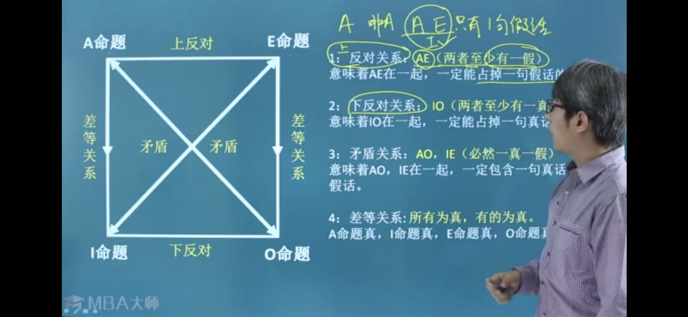
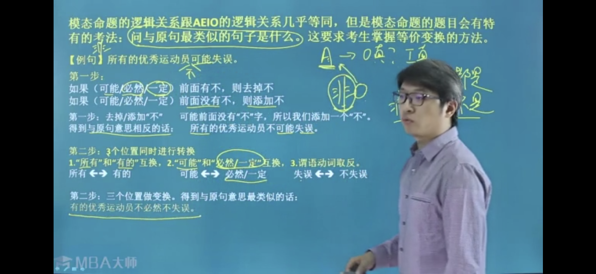
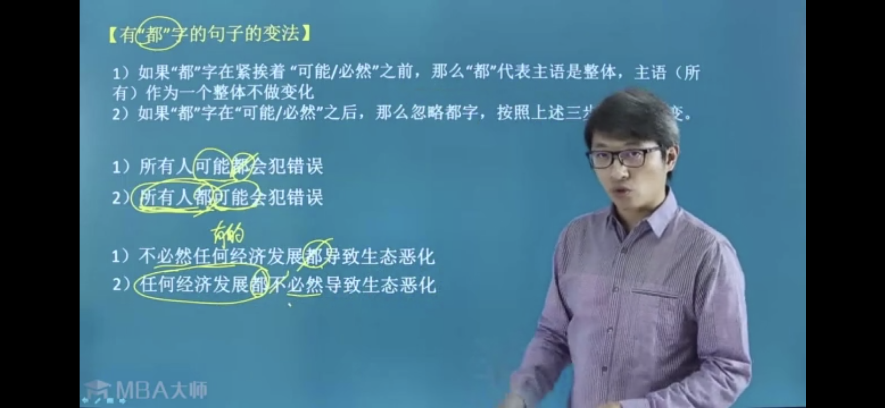

# 导学

逻辑出题思路分类：

- 形式逻辑（8~10道）：4个考点

  - 验证逻辑/命题的真假

  - 否定一边推另一边

  - 前真后假秒杀 

    

  - 事实真代入逻辑推事实真假

  - 连逻辑 判断逻辑真假

  

  - 通过矛盾给出事实真条件
  - 多元素一一对应

  

  - 真话假话
  - 两难推理与推矛盾

  

  - AEIO、模态命题、文氏图、不相容选言命题（2015年后废弃）

- 

- **论证推理（10~12道）**：7种套路

- 结构推出（2~3道）：5种排除法

- **分析推理（6~8道）**：2种出题套路

# 第二章 基础概念

## 逻辑非：和java 非同理

## 逻辑or：和java or同理

- A 或者B ，A和B至少有一个：A or B 
- A和B至多有一个去 = 至少有一个不去   非A or 非B

> 文字表述：或者

## 逻辑and：和java and同理

> 文字表述：也、逗号、并且、但是、又

## 推理

- 充分条件：如果A的发生一定能保证B的发生，那么A就叫做B的充分条件，逻辑表达式：**A-->B**

> **文字表述：如果A。。那么B。。、只要A。。。就B、若A。。则B。。、所有的A，都是B**

- 必要条件：**A <--B**
  - **谁是必须的，箭头指向谁**

> **文字表述：只要A。。才B、A对于B是必须的/不可缺少的、A是B的基础/必要条件/重要前提**

- 充要条件：

> 文字表述：当且仅当

### A-->B 什么情况下为假：A and 非B 前真 and 后假为假，其他情况逻辑都为真

- A and B 前真 and 后真： 真
- A and 非B 前真 and 后假 ：假
- 非A and B 前假 and 后真 ：真
- 非A and 非B 前假 and 后假： 真

### 特殊逻辑连词：除非A，否则B

- 非A-->B
- (否则)B，除非A

### 总结：优先级：才>如果（若）>除非

- 只看逻辑连词，不看语言文字

# 第三章 四个考点

## 对逻辑关系加"非"

- 非（非A） = A

- 非（A or B） = 非A and 非B

- 非（A and  B ）=非A or 非B 

- 非（A-->B） = A and 非B

## or 和 -->  的转换

- A or B = 非A-->B = 非B-->A
- 非A or 非B = A -->非B = B-->非A
- 非A or B =  A -->B  = 非B-->非A
-  A or 非B = 非A-->非B = B-->A
- 非（非A or B） = 非（A-->B）= A and 非B

## A-->B 成立，它的逆否命题 非B--> 非A，也同时

> A -->B : A是B的子集

## A -->B 成立，加上B-->C成立，可以得到A-->C 成立

### 逻辑思维误区一：逻辑真与事实真的区别

- 事实真：给出的条件能够唯一确定事实情况

>  A真，非A真，A and B为真，

- 逻辑真：给出了两者关系，但不能唯一确定事实的情况

> A -->B 为真：有三种情况为真，只有Aand 非B为假

### 逻辑思维误区二，A-->B 和B-->A 的区别

### 逻辑思维误区三：为什么看起来是逻辑真，却得出事实真

#### 逻辑为误区四：A-->B 为真，为什么有时看起来非A却能推出非B（推不出的 ）

# 第四章 秒杀思路 前真 and 后假

> - **题干问法：以下哪个选项一定为假，以下哪个选项能推翻上述论证，最能削弱，以下哪项是不可能的**，
> - 题干通过逻辑连词，给出A-->B

# 第五章 秒杀思路 OR 的逻辑

- A 和B 中只要有一个为真，A or B的逻辑就为真
- 仅仅给出A or B为真的情况下，有三种可能，所以不能确定A 和B的真假
- 在A or B为真的情况下，增加非A为真的条件能够得到B 为真，增加非B为真的情况，可以得到A为真
- 能够区分A or B（非A-->B ）：至少有一个，与非A or 非B（A-->非B）：至多有一个/至少有一个不去，这两者的不同

## 相容性选言命题 VS 不相容选言命题

### 相容性选言命题两个分支可以同时为真 A or B

### 不相容性选言命题两个分支必须一真一假 

> 文字表述：要么A，要么B、

# 第七章 AEIO 和模态命题

## AEIO 

> 只有整体真才能推出部分真

## 模态命题

# 考点套路

## 推矛盾和两难推理

https://wenku.baidu.com/view/4e2ab9dd73fe910ef12d2af90242a8956becaaf3.html

- ## 推矛盾特征：

  - 题干通过逻辑连词给出数个逻辑关系
  - 选项给出的均为事实的真假
  - 题干往往会给出A、B两者不能共存这类条件

  > - B 和非B不能同时为真，同时为真会产生矛盾
  > - 题干给出A和B不能共存的条件，那么如果推出，A和B同时为真，会产生矛盾
  > - 题干给出A-->非B，那么如果推出，A和B同时为真，会产生矛盾

- 套路一：A-->B ，和A-->非B同时为真的情况下。如果A为真，那么会导致B和非B同时为真的情况，产生矛盾。

- 套路二：题干首先给出条件A和B不能共存的条件又给出C-->A，C-->B的条件。那么如果C为真，会导致两个不能共存的命题同时为真，产生矛盾。所以C一定为假。

-  套路三：题干首先给出条件A-->非B的条件，那么意味着A和B不能同时为真，也可以表述为，非A or 非B一定为真，非A or 非B一定得选一个。

- ## 两难推理

## 真话假话

### 解决步骤

- 优先找出矛盾的论述，通过矛盾来判断其它的论述的真假
  - **A-->B 和 A and非B 矛盾**
  - **两者至少有一个 和两个一个都没有矛盾**
    - **即：（A  or B ）和（非A and 非B）矛盾；**
    - **（A and B）和（非A or 非B）矛盾**
  - **当主语完全相同的时候，陈述相反的话互相矛盾**
  - **“有些是” 和“所有都不是”矛盾（IE矛盾），“有些不是”和“所有都是”矛盾（AO）矛盾。“可能是” 和“必然不”矛盾，“必然” 和“可能不”矛盾。** 
- 如果找不到矛盾的两句话，那么就找同真同假的论述
- 如果同真同假的两句话也找不到，那么就直接把选项代入验证题干论述的真假

# 快速排除技巧

- 当选项为逻辑前件假推出某命题时，可直接排除。
  - 即：题干给出条件A-->B，选项给出，非A-->任意信息，均为错误选项
- 当选项为逻辑后件真推出某命题时，可直接排除
  - 即：题干给出条件A-->B，选项给出B-->任意信息，均为错误选项
- 当题干给出的条件分别为两个没有联系的逻辑之中，可以直接排除
  - 即：题干给出条件，A-->B，C-->D，选项给出A-->C ，或者A-->D，均为错误选项
- 当题干给出and的关系，而选项建立了逻辑关系，可以直接排除。
  - 即：题干给出A and B，那么A-->B，或者B-->A 均可直接排除

## 